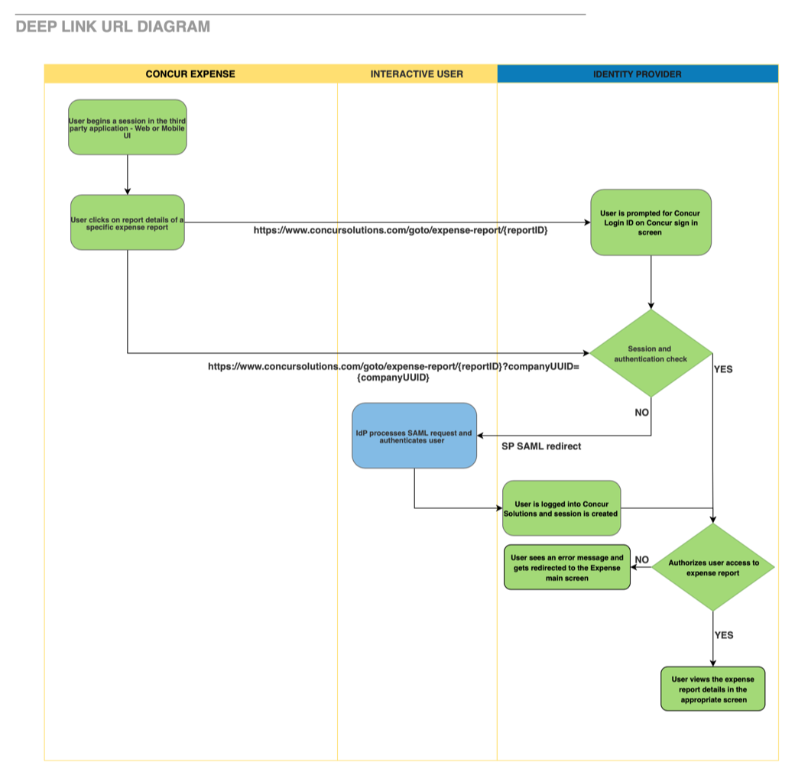

# Deeplink URL Integration



The Deeplink URL integration provides the ability for a user on a third-party website or portal to access the resource in Concur Expense. This is useful when the user needs to navigate to the SAP Concur solutions website or the SAP Concur Mobile app to complete their operation on the resource, or requires more insights on the resource than that provided in the third-party website or portal.  

* [Limitations](#limitations)
* [Process Flow](#process-flow)
* [Scope Usage](#scope-usage)
* [Datacenter Availability](#datacenter-availability)
* [Integration Details](#integration-details)

## <a name="limitations"></a>Limitations

This functionality is only available in US and EMEA data centers. Users must purchase Concur Expense in order to use this integration capability. This integration is only available to partners who have been granted access and to customers who either use username/password or SSO SAML2 implementation for authenticating. Access to this documentation does not provide access to the integration.   

## <a name="process-flow"></a>Process Flow



## <a name="scope-usage"></a>Scope Usage

Required Scopes:

| Name|Description|Endpoint|
| ---|---|---|
|`expense.report.read`| Get information about expense reports.|GET|
|`expense.report.readwrite`|Read and write expense report headers.|PATCH|
|`user.read`|Get User Information, necessary for `userID`.|GET|

## <a name="integration-details"></a>Integration Details

### URI Template

```shell
https://www.concursolutions.com/goto/expense-report/{reportID}?companyUUID={companyUUID}&context={CONTEXT}
```
### Parameters

|Name|Type|Format|Description|
|---|---|---|---|
|`reportID`|`string`|-|**Required** The 20-character unique identifier of the report that is being read.|
|`companyUUID`|`string`|-|The unique identifier of the company, in UUID format, to which the expense report belongs to.|
|`context`|`string`|-|The access level of the user, which determines the form fields they can view/modify. Supported values: `TRAVELER`, `MANAGER`, or `PROCESSOR`|

When the deep link URL is generated without the company UUID, the user will be prompted with a sign in page to provide login ID in order to discover the company UUID. The user will be prompted with the identity provider (IdP) sign in page to provide the appropriate login ID, which is used for authentication purposes.

#### Example:

```shell
https://www.concursolutions.com/goto/expense-report/474EB203C0DE4F08A517?companyUUID=ae4a796a-68da-4b80-b508-36022e2bacef
```

This deep link URL will support the feature to access SAP Concur solutions via SSO or username/password authentication when launched from third party applications. When clicked, this link will:

* **Web UI:** Enable the user to access the specific report whose summary or link they were viewing in the third-party application.
* **Mobile UI:** Enable the user to access the specific report whose summary they were viewing in the third-party application’s mobile app.

#### Pre-requisites:

* The user must already exist as an active user in the SAP Concur solution with a Concur Expense role such as Expense User, Expense Manager, or Expense Processor.
*	If multiple identity providers (IdPs) are in use, the user may be required to select the correct IdP or provide the login credentials prior to the SSO process.
