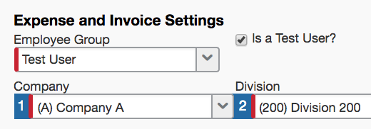

Many App Center partner applications do not need to be validated in a test environment because they are obtaining data directly from the customer's site and processing it on the partner's side. In other words, the presence of the partner's application has no impact on the normal use of the SAP Concur site as a result of obtaining data. However, some Enterprise Applications send data to the customer's SAP Concur site, which the customer may want to test before deploying.

## Test User Functionality

In most cases, customers can test App Center partner applications using the Test User functionality. This feature is available within their Professional Edition SAP Concur site and is the recommended option.

>**Important**: The Test User functionality only applies to Professional Edition customers. Standard Edition customers need to deploy the app in their production site.

This functionality completely separates the data between test and production, while allowing the customer to be confident their testing is being done within a production infrastructure (that is, the performance of the app is being tested in the normal environment where it will be used). In addition, the Test User functionality uses the same production configuration settings, which avoids issues related to inconsistent settings manually configured in a separate site. The test user data does not impact production analytics or extracts. Your SAP Concur contact can provide you with a copy of the *Shared: Test User Setup Guide*, which explains this feature in detail. If you’ve already used the Test User functionality only a subset of the steps below may be required.

At the customer’s request SAP Concur will configure the following:

* Copy the Expense, Invoice, or Request Policy that is to be used in conjunction with the App Center partner integration. The name of the new Policy must include "Test User" in the Policy name along with any other descriptive terms the customer provides.
* Create a Test User Group and apply it to the Test Policy.
* Add necessary Test User records and assign them to the Test Group. (*client-configured*)

> **Important**: The checkbox field, "Is a Test User" in the employee profile must be checked for each test profile used in the testing before clicking **Save**. Once selected, that checkbox is permanent and there is no way to change the profile. When a user profile is set up as a test user, that profile will always be in test mode. The converse is also true – a production profile will never have this checkbox checked. This ensures that test and production data is kept separate.

> **Tip**: Include "Test" in the login ID to emphasize the correct use of each profile. For example, Jane.Doe.Test@<company domain>.com.

* Adjust any other configuration within the Test User Policy and the Test User Group that is relevant to the app deployment. For example, Attendee Types can be set up for Test User Group access only.
* If desired, request a test user extract file be created.
* Deploy the App Center partner application, limited to the test users and complete the desired tests. The user profiles marked as "Is a Test User" must be used. (*client or SAP Concur*)

## Pre-Production Alternative

If the partner's application cannot be tested using the Test User functionality and the customer is still in **implementation**, then the customer can deploy the application in their site during implementation, which is a production site in a test state. The test state remains until the site is moved to production. Any configuration related to the app will not need to be redone once the customer moves their site to production. However, the customer will need to reauthenticate.

> **Important**: Testing App Center Partner apps are not able to be tested in Test Entity sites.  The test entities are also not in a production environment so the infrastructure is not conducive to a complete test of web traffic (API transactions).