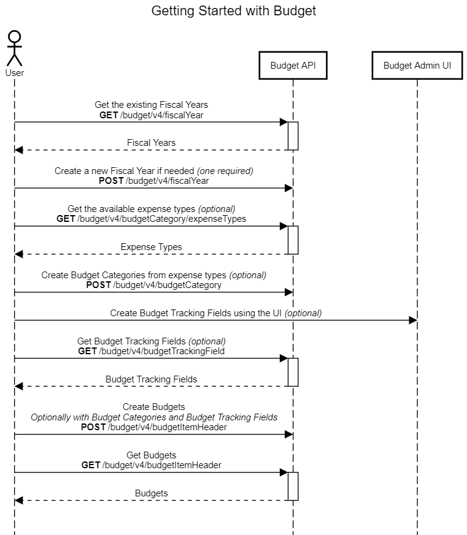

## Menu

* [Getting Started](./getting-started.html)
* [Fiscal Year](/api-reference/budget/v4.fiscal-year.html)
* [Budget Category](/api-reference/budget/v4.budget-category.html)
* [Budget Item](/api-reference/budget/v4.budget-header.html)
* [Budget Tracking Field](/api-reference/budget/v4.budget-trackingfield.html)
* [Budget Adjustments](/api-reference/budget/v4.budget-adjustments.html)

## Getting Started

* [Overview](#overview)
* [Process Flow](#process-flow)
* [Products and Editions](#products-editions)
* [Scope Usage](#scope-usage)
* [Dependencies](#dependencies)
* [Access Token Usage](#access-token-usage)

## Overview

The Budget service exposes budget and fiscal year data.  Partners and clients may use the service endpoints to read and alter fiscal year, budget, budget adjustment, and budget matching configuration.
Summary and detailed balance amounts are also available to read, but may not be altered via the API.

The sequence to configure budgets is to first setup the fiscal year and then the budget categories (if applicable) before creating budget items. Budget items may use budget tracking fields as filters. The budget tracking field can only be configured in the application UI. Also budget owner, approver, and budget viewer permissions have to be assigned to users prior to configuring budgets.

## Process Flow

## Products and Editions

* Concur Request Professional Edition
* Concur Request Standard Edition
* Concur Expense Professional Edition
* Concur Expense Standard Edition
* Concur Invoice Professional Edition
* Concur Invoice Standard Edition

## Scope Usage

This API requires one or more of the following scopes:

Name|Description|Endpoint
---|---|---
`budgetitem.read`|Grants read access to the budget resources.|GET Budget Category, GET Budget Item, GET Budget Tracking Fields, GET Fiscal Year, GET Valid Expense Types
`budgetitem.write`|Grants read and write access to the budget resources.|GET Budget Category, GET Budget Item, GET Budget Tracking Fields, GET Fiscal Year, GET Valid Expense Types, POST Budget Adjustment, POST Budget Category, POST Budget Item, POST Fiscal Year, DELETE Budget Category, DELETE Budget Item, DELETE Fiscal Year
`fiscalcalendar.read`|Grants read access to the fiscal calendar.|GET All Fiscal Years, GET a Fiscal Year
`fiscalcalendar.write`|Grants read and write access to the fiscal calendar.|GET All Fiscal Years, GET a Fiscal Year, POST a Fiscal Year, DELETE a Fiscal Year

## Dependencies

SAP Concur clients must purchase Budget in order to use this API.

## Access Token Usage

This API supports both company level and user level access tokens. The user needs to have the Budget Administrator role in order to access the API.
