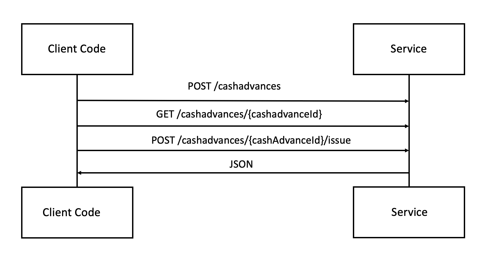



The Cash Advance API can be used to create, view, and issue a cash advance.

> **Limitations**: This API is only available to clients who have been granted access by SAP Concur. Access to this documentation does not provide access to the API. This API is not available for partner or third party use. This API is not available in Implementation environments. Cash Advance APIs supports single Cash Advance Creation, Retrieval and Issuance. Create Cash Advance API currently does not support receipt upload.

* [Process Flow](#process-flow)
* [Products and Editions](#products-editions)
* [Scope Usage](#scope-usage)
* [Dependencies](#dependencies)
* [Access Token Usage](#access-token-usage)
* [Create a Cash Advance](#create-cash-advance)
* [Retrieve a Cash Advance](#get-cash-advance)
* [Issue a Cash Advance](#issue-cash-advance)
* [Schema](#schema)
  * [Create Cash Advance Request](#create-cash-advance-request-schema)
    * [amount](#amount-schema)
  * [Create Cash Advance Response](#create-cash-advance-response-schema)
  * [Get Cash Advance Response](#get-cash-advance-response-schema)
    * [payment](#payment-schema)
    * [exchangeRate](#exchange-rate-schema)
    * [amountRequested](#amount-requested-schema)
    * [availableBalance](#available-balance-schema)
    * [approvalStatus](#approval-status-schema)
  * [Issue Cash Advance Request](#issue-cash-advance-request-schema)
  * [Issue Cash Advance Response](#issue-cash-advance-response-schema)
    * [status](#status-schema)
  * [Error](#schema-error)

## <a name="process-flow"></a>Process Flow



## <a name="products-editions"></a>Products and Editions

* Concur Expense Professional Edition
* Concur Expense Standard Edition

## <a name="scope-usage"></a>Scope Usage

Name|Description|Endpoint
---|---|---
`cashadvance.write`|Create, Retrieve and Issue a cash advance.|GET, POST

## <a name="dependencies"></a>Dependencies

The client may use the following SAP Concur APIs to get information:
* [Identity v4](/api-reference/profile/v4.identity.html), to retrieve the `userId`.

## <a name="access-token-usage"></a>Access Token Usage

This API supports user and company level access tokens only.

## <a name="create-cash-advance"></a>Create a Cash Advance

Creates a cash advance.

### Scopes

`cashadvance.write` - Refer to [Scope Usage](#scope-usage) for full details.

### Request

#### URI

##### Template

```shell
https://{datacenterURI}/cashadvance/v4/cashadvances
```
##### Parameters

None.

#### Headers

* [RFC 7231 Content-Type](https://tools.ietf.org/html/rfc7231#section-3.1.1.5)
* [RFC 7235 Authorization](https://tools.ietf.org/html/rfc7235#section-4.2) - Bearer Token that identifies the caller. This is the User or Company access token.
* `concur-correlationid` is a SAP Concur specific custom header used for technical support in the form of a [RFC 4122 A Universally Unique IDentifier (UUID) URN Namespace](https://tools.ietf.org/html/rfc4122).

#### Payload

* [Create Cash Advance Request](#create-cash-advance-request-schema)

### Response

#### Status Codes

* [201 Created](https://tools.ietf.org/html/rfc7231#section-6.3.2)
* [400 Bad Request](https://tools.ietf.org/html/rfc7231#section-6.5.1)
* [401 Unauthorized](https://tools.ietf.org/html/rfc7235#section-3.1)
* [403 Forbidden](https://tools.ietf.org/html/rfc7231#section-6.5.3)
* [404 Not Found](https://tools.ietf.org/html/rfc7231#section-6.5.4)
* [408 Request Timeout](https://tools.ietf.org/html/rfc7231#section-6.5.7)
* [500 Internal Server Error](https://tools.ietf.org/html/rfc7231#section-6.6.1)
* [503 Service Unavailable](https://tools.ietf.org/html/rfc7231#section-6.6.4)

#### Payload

* [Create Cash Advance Response](#create-cash-advance-response-schema)

### Example

#### Request

```
  https://us.api.concursolutions.com/cashadvance/v4/cashadvances \
  -H 'Accept: application/json' \
  -H 'Authorization: Bearer {access_token}' \
  -H 'Content-Type: application/json' \
  -H 'concur-correlationid: create-cash-advance-test' \
  -d '{
  "accountCode": "employee account code",
  "amountRequested": {
    "currency": "USD",
    "amount": 100
  },
  "comment": "Cash Advance of local trips",
  "name": "Cash Advance for Chicago",
  "purpose": "Trip to home office",
  "userId": "9FED321D-3484-49F3-A514-84CB2590DFC4"
}
```

#### Response

```
201 Created
{
    "cashAdvanceId": "C0550587A7D7DF4AB41CA8EF72F6F3D1"
}
```

## <a name="get-cash-advance"></a>Retrieve a Cash Advance

Retrieve a cash advance.

### Scopes
`cashadvance.write` - Refer to [Scope Usage](#scope-usage) for full details.

### Request

#### URI

##### Template

```shell
https://{datacenterURI}/cashadvance/v4/cashadvances/{cashAdvanceId}
```

##### Parameters

Name|Type|Format|Description
---|---|---|---
`cashAdvanceId`|`string`|-|**Required** Cash advance ID.

#### Headers

* [RFC 7235 Authorization](https://tools.ietf.org/html/rfc7235#section-4.2) - Bearer Token that identifies the caller. This is the User or Company access token.
* `concur-correlationid` is a SAP Concur specific custom header used for technical support in the form of a [RFC 4122 A Universally Unique IDentifier (UUID) URN Namespace](https://tools.ietf.org/html/rfc4122)

### Response

#### Status Codes

* [200 OK](https://tools.ietf.org/html/rfc7231#section-6.3.1)
* [400 Bad Request](https://tools.ietf.org/html/rfc7231#section-6.5.1)
* [401 Unauthorized](https://tools.ietf.org/html/rfc7235#section-3.1)
* [403 Forbidden](https://tools.ietf.org/html/rfc7231#section-6.5.3)
* [404 Not Found](https://tools.ietf.org/html/rfc7231#section-6.5.4)
* [408 Request Timeout](https://tools.ietf.org/html/rfc7231#section-6.5.7)
* [500 Internal Server Error](https://tools.ietf.org/html/rfc7231#section-6.6.1)
* [503 Service Unavailable](https://tools.ietf.org/html/rfc7231#section-6.6.4)

#### Payload

* [Get Cash Advance Response](#get-cash-advance-response-schema)

### Example

#### Request

```
  https://us.api.concursolutions.com/cashadvance/v4/cashadvances/C0550587A7D7DF4AB41CA8EF72F6F3D1 \
  -H 'Authorization: Bearer {access_token}' \
  -H 'concur-correlationid: create-cash-advance-test' \
  -d '{
}
```

#### Response

```
200 OK

{
    "paymentType": {
        "description": "Payment in cash",
        "paymentCode": "CASH"
    },
    "exchangeRate": {
        "operation": "MULTIPLY",
        "value": "1.00000000000000"
    },
    "amountRequested": {
        "amount": "100.000000",
        "value": "100.000000",
        "currency": "USD"
    },
    "availableBalance": {
        "amount": "0.0",
        "currency": "USD"
    },
    "approvalStatus": {
        "name": "Not Submitted",
        "code": "C_NOTF"
    },
    "cashAdvanceId": "83C46E6ADBD7D647B1AC34D1C0574E87",
    "requestDate": "2020-10-29 18:28:11.0",
    "name": "Cash Advance for Chicago",
    "purpose": "Trip to home office",
    "issuedDate": null,
    "accountCode": "employee account cod",
    "comment": "Cash Advance of local trips",
    "lastModifiedDate": "2020-10-29 18:28:11.0",
    "hasReceipts": false,
    "reimbursementCurrency": "USD"
}
```

## <a name="issue-cash-advance"></a>Issue a Cash Advance

Issues a cash advance.

### Scopes

`cashadvance.write` - Refer to [Scope Usage](#scope-usage) for full details.

### Request

#### URI

##### Template

```shell
https://{datacenterURI}/cashadvance/v4/cashadvances/{cashAdvanceId}/issue
```

##### Parameters

Name|Type|Format|Description
---|---|---|---
`cashAdvanceId`|`string`|-|**Required** Cash advance ID.

#### Headers

* [RFC 7231 Content-Type](https://tools.ietf.org/html/rfc7231#section-3.1.1.5)
* [RFC 7235 Authorization](https://tools.ietf.org/html/rfc7235#section-4.2) - Bearer Token that identifies the caller. This is the User or Company access token.
* `concur-correlationid` is a SAP Concur specific custom header used for technical support in the form of a [RFC 4122 A Universally Unique IDentifier (UUID) URN Namespace](https://tools.ietf.org/html/rfc4122)

#### Payload

* [Issue Cash Advance Request](#issue-cash-advance-request-schema)

### Response

#### Status Codes

* [200 OK](https://tools.ietf.org/html/rfc7231#section-6.3.1)
* [400 Bad Request](https://tools.ietf.org/html/rfc7231#section-6.5.1)
* [401 Unauthorized](https://tools.ietf.org/html/rfc7235#section-3.1)
* [403 Forbidden](https://tools.ietf.org/html/rfc7231#section-6.5.3)
* [404 Not Found](https://tools.ietf.org/html/rfc7231#section-6.5.4)
* [408 Request Timeout](https://tools.ietf.org/html/rfc7231#section-6.5.7)
* [500 Internal Server Error](https://tools.ietf.org/html/rfc7231#section-6.6.1)
* [503 Service Unavailable](https://tools.ietf.org/html/rfc7231#section-6.6.4)

#### Payload

* [Issue Cash Advance Response](#issue-cash-advance-response-schema)

### Example

#### Request

```
  https://us.api.concursolutions.com/cashadvance/v4/cashadvances/C0550587A7D7DF4AB41CA8EF72F6F3D1/issue \
  -H 'Accept: application/json' \
  -H 'Authorization: Bearer {access_token}' \
  -H 'Content-Type: application/json' \
  -H 'concur-correlationid: create-cash-adavance-test' \
  -d '{
  "accountCode": "employee account code",
  "comment": "Issuing Cash Advance of employee local trips",
  "exchangeRate": 1.00000
}
```

#### Response

```
200 OK

{
    "issuedDate": "2020-10-29",
    "status": {
        "code": "C_ISSU",
        "name": "Issued"
    }
}
```

## <a name="schema"></a>Schema

### <a name="create-cash-advance-request-schema"></a>Create Cash Advance Request

Name|Type|Format|Description
---|---|---|---
`accountCode`|`string`|-|The account code, if not provided, will be read from the employee profile configuration data. Maximum characters: 48
`amountRequested`|-|[`amount`](#amount-schema)|**Required** The amount of the cash advance.
`comment`|`string`|-|Comment while creating a cash advance. Maximum characters: 2000
`name`|`string`|-|**Required** Cash advance name. Maximum characters: 40
`purpose`|`string`|-|Purpose of raising a cash advance. Maximum characters: 2000
`userID`|`string`|-|**Required** The unique identifier of the SAP Concur user. Use [Identity v4](api-reference/profile/v4.identity.html) to retrieve the `userID`. Maximum characters: 16

### <a name="amount-schema"></a>Amount

Name|Type|Format|Description
---|---|---|---
`currency`|`string`|-|**Required** The 3-letter ISO 4217 currency code.  Maximum characters: 3
`amount`|`number`|-|**Required** The amount value. Maximum characters: 23

### <a name="create-cash-advance-response-schema"></a>Create Cash Advance Response

Name|Type|Format|Description
---|---|---|---
`cashAdvanceId`|`string`|-|Unique cash advance identifier.

### <a name="get-cash-advance-response-schema"></a>Get Cash Advance Response

Name|Type|Format|Description
---|---|---|---
`paymentType`|-|[`payment`](#payment-schema)|Details on type of the payment used.
`exchangeRate`|-|[`exchangeRate`](#exchange-rate-schema)|Details on the exchange rate. Maximum characters: 23
`amountRequested`|-|[`amountRequested`](#amount-requested-schema)|Details on the amount requested.
`availableBalance`|-|[`availableBalance`](#available-balance-schema)|Details on the available balance.
`approvalStatus`|-|[`approvalStatus`](#approval-status-schema)|Details on the approval status.
`cashAdvanceId`|`string`|-|Unique cash advance identifier.
`requestDate`|`string`|`YYYY-MM-DD`|The date the cash advance was requested.
`name`|`string`|-|Cash advance name. Maximum characters: 40
`purpose`|`string`|-|Purpose of raising a cash advance. Maximum characters: 2000
`issuedDate`|`string`|`YYYY-MM-DD`|The date the cash advance was issued.
`accountCode`|`string`|-|Account code linked to the employee.
`comment`|`string`|-|Comment while creating a cash advance. Maximum characters: 2000
`lastModifiedDate`|`string`|`YYYY-MM-DD`|The date the cash advance was last modified.
`hasReceipts`|`string`|-|If the cash advance has receipts.
`reimbursementCurrency`|`string`|-|The 3-letter ISO 4217 currency code. Maximum characters: 3

### <a name="payment-schema"></a>payment

Name|Type|Format|Description
---|---|---|---
`description`|`string`|-|The payment method for the cash advance.
`paymentCode`|`string`|-|The ID of the payment type for the cash advance.

### <a name="exchange-rate-schema"></a>exchangeRate

Name|Type|Format|Description
---|---|---|---
`operation`|`string`|-|Exchange rate operation. Supported values: `MULTIPLY`
`value`|`number`|-|Exchange rate value.

### <a name="amount-requested-schema"></a>amountRequested

Name|Type|Format|Description
---|---|---|---
`amount`|`number`|-|Requested cash advance amount. Maximum characters: 23
`value`|`number`|-|Deprecated (Use amount).
`currency`|`number`|-|The 3-letter ISO 4217 currency code. Maximum characters: 3

### <a name="available-balance-schema"></a>availableBalance

Name|Type|Format|Description
---|---|---|---
`amount`|`number`|-|Unsubmitted balance. Maximum characters: 23
`currency`|`number`|-|The 3-letter ISO 4217 currency code. Maximum characters: 3

### <a name="approval-status-schema"></a>approvalStatus

Name|Type|Format|Description
---|---|---|---
`name`|`string`|-|Cash advance status name. Maximum characters: 40
`code`|`string`|-|Cash advance status key.

### <a name="issue-cash-advance-request-schema"></a>Issue Cash Advance Request

Name|Type|Format|Description
---|---|---|---
`accountCode`|`string`|-|Account code linked to the employee.
`comment`|`string`|-|Comment while issuing a cash advance.  Maximum characters: 2000
`exchangeRate`|`number`|-|The exchange rate that applies to the expected expense.If no exchange rate is provided system exchange rate will be considered. Maximum characters: 23

### <a name="issue-cash-advance-response-schema"></a>Issue Cash Advance Response

Name|Type|Format|Description
---|---|---|---
`status`|-|[`status`](#status-schema)|Details on type of payment used.
`issuedDate`|`string`|`YYYY-MM-DD`|The date the cash advance was issued.

### <a name="status-schema"></a>status

Name|Type|Format|Description
---|---|---|---
`code`|`string`|-|Cash advance status key.
`name`|`string`|-|Cash advance status name. Maximum characters: 40

### <a name="schema-error"></a>Error

Name|Type|Format|Description
---|---|---|---
`errorCode`|`string`|-|The unique identifier of the error.
`errorMessage`|`string`|-|Message associated with the error.
