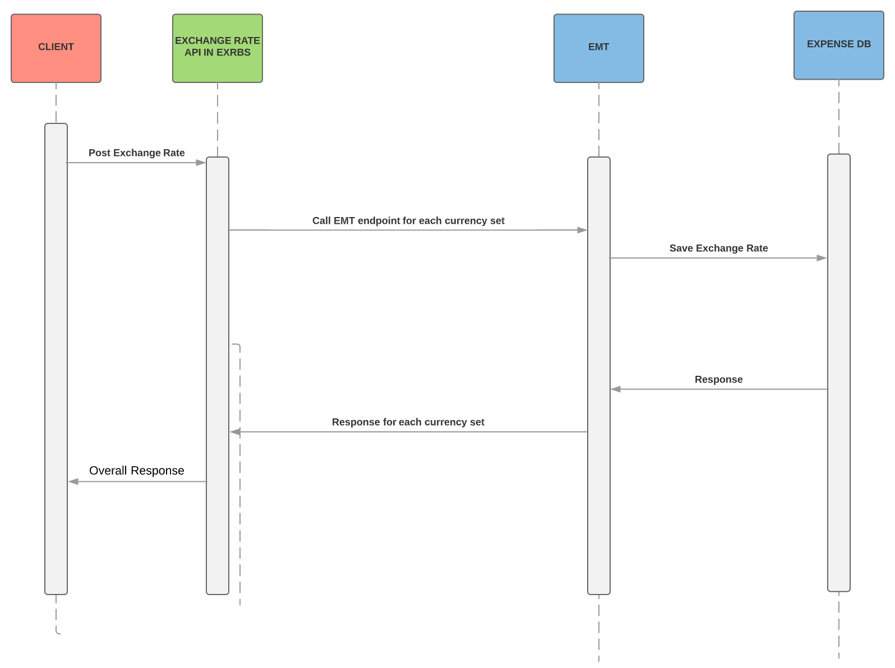
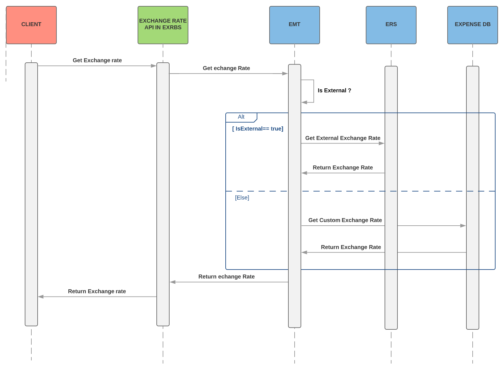



Used for fetching or uploading custom exchange rates for an entity

> **Limitations**: The POST (uploading custom exchange rate) API is designed to support at most 100 currency sets in a single synchronous call

* [Process Flow](#process-flow)
* [Products and Editions](#products-editions)
* [Scope Usage](#scope-usage)
* [Dependencies](#dependencies)
* [Access Token Usage](#access-token-usage)
* [Upload Custom Exchange Rates](#post)
* [Get Exchange Rate](#get)
* [Schema](#schema)


## <a name="process-flow"></a>Process Flow





## <a name="products-editions"></a>Products and Editions

* Concur Expense Professional Edition
* Concur Expense Standard Edition
* Concur Travel Professional Edition
* Concur Travel Standard Edition
* Concur Invoice Professional Edition
* Concur Invoice Standard Edition
* Concur Request Professional Edition
* Concur Request Standard Edition

## <a name="scope-usage"></a>Scope Usage

Name|Description|Endpoint
---|---|---
`expense.exchangerate.writeonly`|Permission to upload custom exchange rates for an entity|POST /v4/rates

## <a name="dependencies"></a>Dependencies

* Concur oauth2
* Concur EMT

## <a name="access-token-usage"></a>Access Token Usage

* Valid user token grants access to GET API and only GET
* Valid company token with required scope grants access to POST API and only POST

## <a name="post"></a>Upload custom exchange rates

Upload custom exchange rate sets for an entity.

### Scopes

`expense.exchangerate.writeonly` - Refer to [Scope Usage](#scope-usage) for full details.

### Request

#### URI

##### Template

```shell
POST /exchangeratebroker/v4/rates
```

#### Headers

* `concur-correlationid` (**Required**) is a Concur specific custom header used for technical support in the form of a [RFC 4122 A Universally Unique IDentifier (UUID) URN Namespace](https://tools.ietf.org/html/rfc4122)
* `company-uid` (**Required**) is a Concur specific custom header used to specify which entity to upload exchange rates for [RFC 4122 A Universally Unique IDentifier (UUID) URN Namespace](https://tools.ietf.org/html/rfc4122)
* [RFC 7231 Content-Type](https://tools.ietf.org/html/rfc7231#section-3.1.1.5)
* [RFC 7235 Authorization](https://tools.ietf.org/html/rfc7235#section-4.2)


#### Payload

* [BulkExchangeRateUploadRequest](#schema-post-req)

### Response

#### Status Codes

* [200 OK](https://tools.ietf.org/html/rfc7231#section-6.3.1)
* [400 Bad Request](https://tools.ietf.org/html/rfc7231#section-6.5.1)
* [401 Unauthorized](https://tools.ietf.org/html/rfc7235#section-3.1)
* [403 Forbidden](https://tools.ietf.org/html/rfc7231#section-6.5.3)
* [404 Not Found](https://tools.ietf.org/html/rfc7231#section-6.5.4)
* [500 Internal Server Error](https://tools.ietf.org/html/rfc7231#section-6.6.1)
* [503 Service Unavailable](https://tools.ietf.org/html/rfc7231#section-6.6.4)

#### Headers

* [RFC 7231 Content-Type](https://tools.ietf.org/html/rfc7231#section-3.1.1.5)
* [RFC 7230 Content-Length](https://tools.ietf.org/html/rfc7230#section-3.3.2)

#### Payload

* [BulkExchangeRateUploadResponse](#schema-post-resp)
* [Error](#schema-error)


## <a name="get"></a>Get Exchange Rate

Fetch exchange rate for an entity. Source of exchange rate depends on entity site setting.

### Request

#### URI

##### Template

```shell
GET /exchangeratebroker/v4/rates/{baseCurrency}/{date}/{quoteCurrency}
```

##### Parameters

Name|Type|Format|Description
---|---|---|---
`baseCurrency`|`string`|path|**Required** ISO 4217 Alphabetic code of the currency converting from.
`date`|`string`|path|**Required** UTC time YYYY-MM-DD for quoting exchange rate.
`quoteCurrency`|`string`|path|**Required** ISO 4217 Alphabetic code of the currency converting to.

#### Headers

* `concur-correlationid` (**Required**) is a Concur specific custom header used for technical support in the form of a [RFC 4122 A Universally Unique IDentifier (UUID) URN Namespace](https://tools.ietf.org/html/rfc4122)
* `company-uid` (**Required**) is a Concur specific custom header used to specify which entity's exchange rates to get, [RFC 4122 A Universally Unique IDentifier (UUID) URN Namespace](https://tools.ietf.org/html/rfc4122)
* `concur-uid` (**Required if using a user token as Authorization**) is a Concur specific custom header used for authorizing getting entity's exchage rate for user,  [RFC 4122 A Universally Unique IDentifier (UUID) URN Namespace](https://tools.ietf.org/html/rfc4122)
* [RFC 7231 Content-Type](https://tools.ietf.org/html/rfc7231#section-3.1.1.5)
* [RFC 7235 Authorization](https://tools.ietf.org/html/rfc7235#section-4.2)

### Response

#### Status Codes

* [200 OK](https://tools.ietf.org/html/rfc7231#section-6.3.1)
* [400 Bad Request](https://tools.ietf.org/html/rfc7231#section-6.5.1)
* [401 Unauthorized](https://tools.ietf.org/html/rfc7235#section-3.1)
* [403 Forbidden](https://tools.ietf.org/html/rfc7231#section-6.5.3)
* [404 Not Found](https://tools.ietf.org/html/rfc7231#section-6.5.4)
* [500 Internal Server Error](https://tools.ietf.org/html/rfc7231#section-6.6.1)
* [503 Service Unavailable](https://tools.ietf.org/html/rfc7231#section-6.6.4)

#### Headers

* [RFC 7231 Content-Type](https://tools.ietf.org/html/rfc7231#section-3.1.1.5)
* [RFC 7230 Content-Length](https://tools.ietf.org/html/rfc7230#section-3.3.2)

#### Payload

* [Get exchange rate response](#schema-get-resp)
* [Error](#schema-error)

## <a name="schema"></a>Schema

### <a name="schema-get-resp"></a>GET exchange rate response

Name|Type|Format|Description
---|---|---|---
`rate`|`BigDecimal`|-|Quoted exchange rate for entity.

### <a name="schema-post-req"></a>BulkExchangeRateUploadRequest

Name|Type|Format|Description
---|---|---|---
`currency_sets`|`array`|[`ExchangeRateUploadRequest`](#schema-upload-req)|**Required** An array of exchange rate upload requests

### <a name="schema-upload-req"></a>ExchangeRateUploadRequest

Name|Type|Format|Description
---|---|---|---
`from_crn_code`|`string`|-|**Required** ISO 4217 Alphabetic code of the currency converting from.
`to_crn_code`|`string`|-|**Required** ISO 4217 Alphabetic code of the currency converting to.
`start_date`|`string`|-|**Required** UTC time YYYY-MM-DD for exchange rate come to be effective.
`rate`|`string`|-|**Required** Custom exchange rate.

### <a name="schema-post-resp"></a>BulkExchangeRateUploadResponse

Name|Type|Format|Description
---|---|---|---
`overallStatus`|`string`|-|Overall status for this bulk upload.
`message`|`string`|-|Overall message for this bulk upload
`currencySets`|`array`|[`ExchangeRateUploadResponse`](#schema-upload-resp)|Array of individual upload results

### <a name="schema-upload-resp"></a>ExchangeRateUploadResponse

Name|Type|Format|Description
---|---|---|---
`from_crn_code`|`string`|-| ISO 4217 Alphabetic code of the currency converting from.
`to_crn_code`|`string`|-|ISO 4217 Alphabetic code of the currency converting to.
`start_date`|`string`|-| UTC time YYYY-MM-DD for exchange rate come to be effective.
`rate`|`string`|-|Custom exchange rate.
`statusCode`|`integer`|-| HTTP status code for uploading this custom currency set.
`statusMessage`|`string`|-| HTTP message for uploading this custom currency set.


### <a name="schema-error"></a>Error

Name|Type|Format|Description
---|---|---|---
`errorId`|`string`|-| The unique identifier of the error associated with the response or is it error response itself
`errorMessage`|`string`|-| The detailed error message
`httpStatus`|`string`|-| The http response code and phrase for the response
`path`|`string`|-| The URI of the attempted request
`timestamp`|`string($date-time)`|-| The datetime when the error was captured example: 2016-10-04T00:53:25.931+0000
`validationErrors`|`array`|[`ValidationError`](#schema-error-validation)| validation errors for this request

### <a name="schema-error-validation"></a>ValidationError

Name|Type|Format|Description
---|---|---|---
`message`|`string`|-| The detailed message of the validation error
`source`|`string`|-| The type of validation which failed
