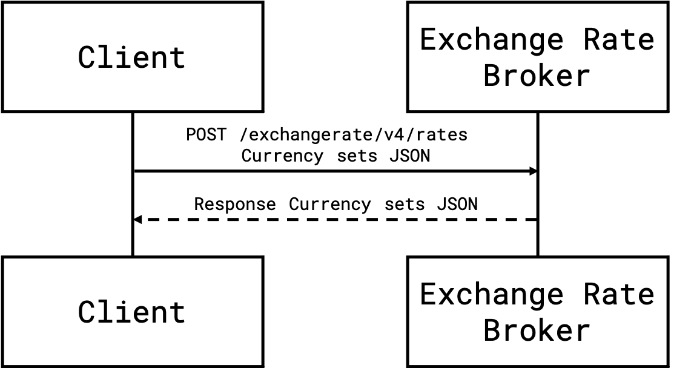

The Exchange Rate Broker API provides allows users to create custom exchange rates for a company. For additional configuration information, please see the [Currency Admin Configuration](./v4.admin-config.html) page.

> **Limitations**: The API currently allows a maximum of 100 exchange rates per POST request. This API is only available to users who have been granted access by SAP Concur. Access to this documentation does not provide access to the API.

* [Products and Editions](#products-and-editions)
* [Scope Usage](#scope-usage)
* [Dependencies](#dependencies)
* [Access Token Usage](#access-token-usage)
* [Create Custom Exchange Rates](#create-custom-exchange-rates)
* [Schema](#schema)
  * [BulkExchangeRateUploadRequest](#bulkexchangerateuploadrequest)
  * [ExchangeRateUploadRequest](#exchangerateuploadrequest)
  * [BulkExchangeRateUploadResponse](#bulkexchangerateuploadresponse)
  * [ExchangeRateUploadResponse](#exchangerateuploadresponse)
  * [Error](#error)
  * [ValidationError](#validationerror)

## Process Flow



# Products and Editions

* Concur Expense Professional Edition
* Concur Expense Standard Edition
* Concur Travel Professional Edition
* Concur Travel Standard Edition
* Concur Invoice Professional Edition
* Concur Invoice Standard Edition
* Concur Request Professional Edition
* Concur Request Standard Edition

## Scope Usage

Name|Description|Endpoint
---|---|---
`expense.exchangerate.writeonly`|Create custom exchange rates.|`POST`

## Dependencies

None.

## Access Token Usage

This API supports company level access tokens.

## Create Custom Exchange Rates

Create a set of custom exchange rates for the given of dates and currency pairs.

### Scopes

`expense.exchangerate.writeonly` - Refer to [Scope Usage](#scope-usage) for full details.

### Request

#### URI

##### Template

```shell
POST {datacenter}/exchangerate/v4/rates
```

##### Parameters

None.

#### Headers

* `Content-Type: application/json`
* `Authorization: Bearer Token`

#### Payload

**Example JSON request body:**

```json
{
  "currency_sets": [
    {
      "from_crn_code": "USD",
      "start_date": "2019-01-01",
      "rate": 1.2,
      "to_crn_code": "EUR"
    }, {
      "from_crn_code": "USD",
      "start_date": "2019-01-01",
      "rate": 1.3,
      "to_crn_code": "CAD"
    }
  ]
}
```

### Response

In case of success, the JSON response body will be the same array of exchange rate items with `overallStatus`, and individual rate upload `statusCode` and `statusMessage`. A bulk upload can be partially successful.

#### Status Codes

* [200 OK](https://tools.ietf.org/html/rfc7231#section-6.3.1)
* [400 Bad Request](https://tools.ietf.org/html/rfc7231#section-6.5.1)
* [401 Unauthorized](https://tools.ietf.org/html/rfc7235#section-3.1)
* [403 Forbidden](https://tools.ietf.org/html/rfc7231#section-6.5.3)
* [406 Not Acceptable](https://tools.ietf.org/html/rfc7231#section-6.5.6)
* [413 Payload Too Large](https://tools.ietf.org/html/rfc7231#section-6.5.11)
* [500 Internal Server Error](https://tools.ietf.org/html/rfc7231#section-6.6.1)
* [503 Service Unavailable](https://tools.ietf.org/html/rfc7231#section-6.6.4)
* [504 Gateway Timeout](https://tools.ietf.org/html/rfc7231#section-6.6.5)

#### Headers

* `concur-correlationid` is an SAP Concur specific custom header used for technical support in the form of a [RFC 4122 A Universally Unique IDentifier (UUID) URN Namespace](https://tools.ietf.org/html/rfc4122).
* [RFC 7231 Content-Type](https://tools.ietf.org/html/rfc7231#section-3.1.1.5)
* [RFC 7230 Content-Length](https://tools.ietf.org/html/rfc7230#section-3.3.2)

#### Payload

**Successfully Created Response:**

```json
{
    "overallStatus": "Success",
    "message": "Requests completed successfully",
    "currencySets": [
        {
            "from_crn_code": "USD",
            "start_date": "2019-01-01",
            "rate": 1.2,
            "to_crn_code": "EUR",
            "statusMessage": "success",
            "statusCode": 200
        },
        {
            "from_crn_code": "USD",
            "start_date": "2019-01-01",
            "rate": 1.3,
            "to_crn_code": "CAD",
            "statusMessage": "success",
            "statusCode": 200
        }
    ]
}
```

### Example - Success

#### Request

```shell
POST https://us.api.concursolutions.com/exchangerate/v4/rates
Accept: application/json
Authorization: Bearer {TOKEN}
Content-Type: application/json
```

```json
{
  "currency_sets": [
    {
      "from_crn_code": "USD",
      "start_date": "2019-01-01",
      "rate": 1.2,
      "to_crn_code": "EUR"
    }
    , {
      "from_crn_code": "USD",
      "start_date": "2019-01-01",
      "rate": 1.3,
      "to_crn_code": "CAD"
    }
  ]
}
```

#### Response

```shell
HTTP/1.1 200 OK
Content-Type: application/json
Date: Thu, 01 Jan 2020 18:50:00 GMT
concur-correlationid: abcd1234-wxyz-6789-abcd-abc123456789
```

```json
{
    "overallStatus": "Success",
    "message": "Requests completed successfully",
    "currencySets": [
        {
            "from_crn_code": "USD",
            "start_date": "2019-01-01",
            "rate": 1.2,
            "to_crn_code": "EUR",
            "statusMessage": "success",
            "statusCode": 200
        },
        {
            "from_crn_code": "USD",
            "start_date": "2019-01-01",
            "rate": 1.3,
            "to_crn_code": "CAD",
            "statusMessage": "success",
            "statusCode": 200
        }
    ]
}
```

### Example - Partial Success

This example only partially succeeds to create all exchange rates due to an invalid `from_crn_code` in the first array entry. However, the second array entry is successfully created.

#### Request

```shell
POST https://us.api.concursolutions.com/exchangerate/v4/rates
Accept: application/json
Authorization: Bearer {TOKEN}
Content-Type: application/json
```

```json
{
  "currency_sets": [
    {
      "from_crn_code": "INVALID",
      "start_date": "2019-01-01",
      "rate": 1.2,
      "to_crn_code": "EUR"
    }, {
      "from_crn_code": "USD",
      "start_date": "2019-01-01",
      "rate": 1.3,
      "to_crn_code": "CAD"
    }
  ]
}
```

#### Response

```shell
HTTP/1.1 200 OK
Content-Type: application/json
Date: Thu, 01 Jan 2020 18:50:00 GMT
concur-correlationid: abcd1234-wxyz-6789-abcd-abc123456789
```

```json
{
    "overallStatus": "Partial Success",
    "message": "Requests completed with errors",
    "currencySets": [
        {
            "from_crn_code": "INVALID",
            "start_date": "2019-01-01",
            "rate": 1.2,
            "to_crn_code": "EUR",
            "statusMessage": "Invalid request received",
            "statusCode": 400
        },
        {
            "from_crn_code": "USD",
            "start_date": "2019-01-01",
            "rate": 1.3,
            "to_crn_code": "CAD",
            "statusMessage": "success",
            "statusCode": 200
        }
    ]
}
```

## Schema

### BulkExchangeRateUploadRequest

Name|Type|Format|Description
---|---|---|---
`currency_sets`|`array`|[`ExchangeRateUploadRequest`](#schema-upload-req)|**Required** An array of exchange rate upload requests.

### ExchangeRateUploadRequest

Name|Type|Format|Description
---|---|---|---
`from_crn_code`|`string`|-|**Required** ISO 4217 Alphabetic code of the currency converting from.
`to_crn_code`|`string`|-|**Required** ISO 4217 Alphabetic code of the currency converting to.
`start_date`|`string`|`YYYY-MM-DD`|**Required** UTC time for exchange rate come to be effective.
`rate`|`number`|-|**Required** Custom exchange rate.

### BulkExchangeRateUploadResponse

Name|Type|Format|Description
---|---|---|---
`overallStatus`|`string`|-|Overall status for this bulk upload.
`message`|`string`|-|Overall message for this bulk upload.
`currencySets`|`array`|[`ExchangeRateUploadResponse`](#schema-upload-resp)|Array of individual upload results.

### ExchangeRateUploadResponse

Name|Type|Format|Description
---|---|---|---
`from_crn_code`|`string`|-|ISO 4217 alphabetic code of the currency converting from.
`to_crn_code`|`string`|-|ISO 4217 alphabetic code of the currency converting to.
`start_date`|`string`|`YYYY-MM-DD`|UTC time for exchange rate come to be effective.
`rate`|`number`|-|Custom exchange rate.
`statusCode`|`number`|-|HTTP status code for uploading this custom currency set.
`statusMessage`|`string`|-|HTTP message for uploading this custom currency set.

### Error

Name|Type|Format|Description
---|---|---|---
`errorId`|`string`|-|The unique identifier of the error associated with the response or is it error response itself.
`errorMessage`|`string`|-|The detailed error message.
`httpStatus`|`string`|-|The HTTP response code and phrase for the response.
`path`|`string`|-|The URI of the attempted request.
`timestamp`|`string($date-time)`|-|The datetime when the error was captured. Example: `2016-10-04T00:53:25.931+0000`
`validationErrors`|`array`|[`ValidationError`](#schema-error-validation)| Validation errors for this request.

### ValidationError

Name|Type|Format|Description
---|---|---|---
`message`|`string`|-| The detailed message of the validation error.
`source`|`string`|-| The type of validation which failed.
