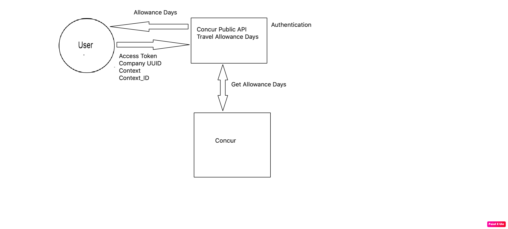

The Travel Allowance API fetches all the fixed allowance days in the specified expense report. Clients using this API can determine whether an allowance is a full day or partial day allowance.

> **Limitations**: This API is available only for Finland customers. This API is not available in the China Data Center.

* [Process Flow](#process-flow)
* [Products and Editions](#products-editions)
* [Scope Usage](#scope-usage)
* [Dependencies](#dependencies)
* [Access Token Usage](#access-token-usage)
* [Get Details of Travel Allowance Days](#details-of-travel-allowance-days)
* [Schema](#schema)
  * [Get Travel Allowance Days Response](#get-travel-allowance-days-response)
  * [Error](#schema-error)
* [Definitions](#definitions)

## <a name="process-flow"></a>Process Flow




## <a name="products-editions"></a>Products and Editions

* Concur Expense Professional Edition
* Concur Expense Standard Edition

## <a name="scope-usage"></a>Scope Usage

Name|Description|Endpoint
---|---|---|
travelallowance.allowancedays.read|View the allowance days in an expense report|GET
EXPRPT|Retrieve the report ID from the Expense Report API to supply to the Travel Allowance API|GET

## <a name="dependencies"></a>Dependencies

The developer must call the [Expense Report v3](/api-reference/expense/expense-report/v3.reports.html) API prior to using this API, to get the expense report Id.

## <a name="access-token-usage"></a>Access Token Usage

This API will work with Company access token only. A valid Company `access token` is needed to use this API.

### Retrieve a Company Access Token

A Company-level access token is required to create an integration with this API. This allows your integration to get fixed allowance day details of an expense report.  

For clients connecting to this API to build a custom integration you will receive client credentials and information on how to generate your company access token or company refresh token from the SAP Concur Web Services resource assigned to assist you with Authentication.

Before making requests to this API, you must [obtain an access token from the Authentication API](/api-reference/authentication/getting-started.html).

The response will include an `access_token` field, which contains your access token. For subsequent calls, you will need to include this access token in the `Authorization` header of your calls.

## <a name="details-of-travel-allowance-days"></a>Get Details of Travel Allowance Days

### Scopes

`travelallowance.allowancedays.read` - Refer to [Scope Usage](#scope-usage) for full details.

### Request

#### URI

##### Template

```shell
https://{datacenterURI}/api/v4/travelallowance/allowancedays/companyUUID/{companyUUID}/contexts/{Context}/{ContextId}
```

##### Parameters

Name|Type|Format|Description
---|---|---|---
`companyUUID`|`uuid`|-|**Required** The company's unique identifier.
`Context`|`string`|-|**Required** For expense reports, the value is `EXPENSE_REPORT`
`ContextId`|`string`|-|**Required** For expense reports, this is the reportId of the report.

#### Headers

* [RFC 7231 Content-Type](https://tools.ietf.org/html/rfc7231#section-3.1.1.5)
* [RFC 7235 Authorization](https://tools.ietf.org/html/rfc7235#section-4.2)
* `concur-correlationid` is a Concur specific custom header used for technical support in the form of a [RFC 4122 A Universally Unique IDentifier (UUID) URN Namespace](https://tools.ietf.org/html/rfc4122)

#### Payload

* None

### Response

#### Status Codes

* [200 OK](https://tools.ietf.org/html/rfc7231#section-6.3.1)
* [204 No Content](https://tools.ietf.org/html/rfc7231#section-6.3.5)
* [400 Bad Request](https://tools.ietf.org/html/rfc7231#section-6.5.1)
* [401 Unauthorized](https://tools.ietf.org/html/rfc7235#section-3.1)
* [403 Forbidden](https://tools.ietf.org/html/rfc7231#section-6.5.3)
* [404 Not Found](https://tools.ietf.org/html/rfc7231#section-6.5.4)
* [405 Method Not Allowed](https://tools.ietf.org/html/rfc7231#section-6.5.5)
* [408 Request Timeout](https://tools.ietf.org/html/rfc7231#section-6.5.7)
* [500 Internal Server Error](https://tools.ietf.org/html/rfc7231#section-6.6.1)
* [502 Bad Gateway](https://tools.ietf.org/html/rfc7231#section-6.6.3)
* [503 Service Unavailable](https://tools.ietf.org/html/rfc7231#section-6.6.4)
* [504 Gateway Timeout](https://tools.ietf.org/html/rfc7231#section-6.6.5)

#### Headers

* `concur-correlationid` is a Concur specific custom header used for technical support in the form of a [RFC 4122 A Universally Unique IDentifier (UUID) URN Namespace](https://tools.ietf.org/html/rfc4122)
* [RFC 7231 Content-Type](https://tools.ietf.org/html/rfc7231#section-3.1.1.5)
* [RFC 7231 Content-Encoding](https://tools.ietf.org/html/rfc7231#section-3.1.2.2)
* [RFC 7231 Content-Language](https://tools.ietf.org/html/rfc7231#section-3.1.3.2)
* [RFC 7230 Content-Length](https://tools.ietf.org/html/rfc7230#section-3.3.2)

#### Payload

* [Get Travel Allowance Days Response](#get-travel-allowance-days-response)
* [Error](#schema-error)

### Example

#### Request

```shell
GET https://us.api.concursolutions.com/api/v4/travelallowance/allowancedays/companyUUID/d5528866-51b1-40a1-bab2-76296a106dcd/contexts/EXPENSE_REPORT/B769E8B106C04F30AE27
Authorization: Bearer {token}
Content-Type: application/json
```

#### Response

```shell
HTTP/1.1 200 OK
Content-Type: application/json
Date: Wed, 06 Jul 2020 17:33:03 GMT
Content-Length: 1270
```

```json
{
  "links": [
    {
      "rel": "self",
      "href": "https://us.api.concursolutions.com/api/v4/travelallowance/allowancedays/companyUUID/d5528866-51b1-40a1-bab2-76296a106dcd/contexts/EXPENSE_REPORT/B769E8B106C04F30AE27"
    }
  ],
  "content": [
    {
      "currencyCode": "EUR",
      "fullAllowanceDay": "False",
      "allowanceDate": "2018-09-244T12:00:00",
      "expenseTransactionDate": "2018-09-244T12:00:00",
      "expenseTransactionAmount": 29,
      "expenseTypeCode": "MEALS"
    },
    {
      "currencyCode": "EUR",
      "fullAllowanceDay": "False",
      "allowanceDate": "2018-09-245T12:00:00",
      "expenseTransactionDate": "2018-09-245T12:00:00",
      "expenseTransactionAmount": 29,
      "expenseTypeCode": "MEALS"
    },
    {
      "currencyCode": "EUR",
      "fullAllowanceDay": "False",
      "allowanceDate": "2018-09-246T12:00:00",
      "expenseTransactionDate": "2018-09-246T12:00:00",
      "expenseTransactionAmount": 29,
      "expenseTypeCode": "MEALS"
    }
  ]
}
```

## <a name="schema"></a>Schema

### <a name="get-travel-allowance-days-response"></a>Get Travel Allowance Days Response Schema

Name|Type|Format|Description
---|---|---|---
`expenseTypeCode`|`string`|-|Expense Code. For example, MEALS for Travel Allowance.
`fullAllowanceDay`|`string`|-|True/False. 'True' means full allowance day and 'False' means partial allowance day.
`currencyCode`|`string`|-|The 3-letter ISO 4217 currency code for the expense report currency. The expense report currency is defined as the report creator's default reimbursement currency.
`allowanceDate`|`dateTime`|[dateTime](#definition-dateTime)|Travel Allowance Date.
`expenseTransactionDate`|`dateTime`|[dateTime](#definition-dateTime)|Expense transaction date.
`expenseTransactionAmount`|`numeric`|-|Expense transaction amount, in the expense entry currency.
`href`|`string`|-|The href represents the target resource identifiers.
`rel`|`string`|-|The link relation type describes how the current context (source) is related to the target resource.

### <a name="schema-error"></a>Error

Name|Type|Format|Description
---|---|---|---
`exception`|`string`|-|Relative exception details.
`timestamp`|`date`|-|Time at which exception occur.
`message`|`string`|-|**Required** Message associated with the error.
`path`|`string`|-|Relative data path.

## <a name="definitions"></a>Definitions

Name|Type|Format|Description
---|---|---|---
<a name="definition-dateTime"></a>`dateTime`|`string`|-|DateTime of where the transaction happened in format specified in ISO 8601, using UTC + Offset. For example, 2016-04-22T12:20+0700 (12:20 PM in Pacific Time).
