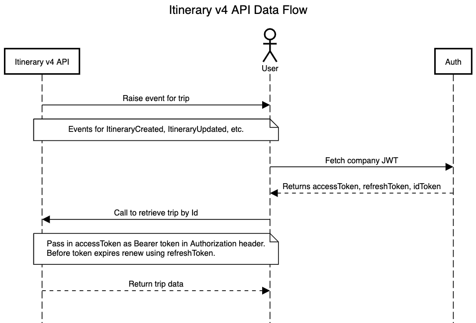



* [Overview](#overview)
* [Process Flow](#process-flow)
* [Products and Editions](#products-editions)
* [Scope Usage](#scope-usage)
* [Dependencies](#dependencies)
* [Access Token Usage](#access-token-usage)
* [Retrieve a Trip Record](#get-trip)  
* [Schemas](#schema)
  * [Error Schema](#error-schema)

## <a name="overview"></a>Overview

The Itinerary API provides clients and authorized partners access to travel itinerary data.

> **Limitations**: This API is only available to clients and partners who have been granted access by SAP Concur. Access to this documentation does not provide access to the API. This API is only available in US and EMEA data centers.

## Prior Versions

* Itinerary v1 documentation is available [here](./api-reference/travel/itinerary/itinerary.html).

## <a name="process-flow"></a>Process Flow



## <a name="products-editions"></a>Products and Editions

* Concur Travel Professional Edition
* Concur Travel Standard Edition

## <a name="scope-usage"></a>Scope Usage

|Name|Description|Endpoint|
|---|---|---|
`travel.itinerary.read`|Allows user to read travel itinerary data.|GET

## <a name="dependencies"></a>Dependencies

None.

## <a name="access-token-usage"></a>Access Token Usage

This API supports only company level access tokens.

## <a name="get-trip"></a>Retrieve a Trip Record

Retrieves the record of a trip.

### Scopes

`travel.itinerary.read` - Refer to [Scope Usage](#scope-usage) for full details.

### Request

#### URI

##### Template

```shell
GET https://{region}.api.concursolutions.com/travel/v4/trips/{id}
```

##### Parameters

Name|Type|Format|Description
---|---|---|---
`region`|`string`|-|**Required**: Region of the trip. Supported values: `us`, `eu`
`id`|`string`|-|**Required** The trip ID.

#### Headers

* [RFC 7231 Accept](https://tools.ietf.org/html/rfc7231#section-5.3.2)
* [RFC 7231 Accept-Encoding](https://tools.ietf.org/html/rfc7231#section-5.3.4)
* [RFC 7235 Authorization](https://tools.ietf.org/html/rfc7235#section-4.2)

### Response

#### Error Codes

* [400 Bad Request](https://tools.ietf.org/html/rfc7231#section-6.5.1)
* [401 Unauthorized](https://tools.ietf.org/html/rfc7235#section-3.1)
* [403 Forbidden](https://tools.ietf.org/html/rfc7231#section-6.5.3)
* [404 Not Found](https://tools.ietf.org/html/rfc7231#section-6.5.4)
* [500 Internal Server Error](https://tools.ietf.org/html/rfc7231#section-6.6.1)


#### Payload

* [Error](#error-schema)

### Example

#### Request

```shell
GET https://us.api.concursolutions.com/travel/v4/trips/51519e89-2c1d-47ec-bd93-7c4ace9c57e6
Accept: application/json
Authorization: Bearer <JWT Token>
```

#### Response

```shell
HTTP/1.1 200 OK
Content-Type: application/json
```

```json
{
    "BookedVia": "Agent",
    "Bookings": [
        {
            "AgencyName": "Outtask Travel Apollo",
            "AgencyPCC": "C4I",
            "AirfareQuotes": [
                {
                    "BaseFare": 1264,
                    "BaseFareCurrency": "EUR",
                    "DateCreatedUtc": "2020-11-04T20:54:19.000+00:00",
                    "DateModifiedUtc": "2020-11-04T20:54:19.000+00:00",
                    "IssueByDate": "2020-09-25T15:54:18.000-00:00",
                    "TotalFare": 1341.2,
                    "TotalFareCurrency": "EUR"
                }
            ],
            "AirlineTickets": {
                "AirlineAdjustment": [
                    {
                        "AddCollectAmount": 0,
                        "AdjustmentDateTime": "2020-11-02T00:00:00.000-00:00",
                        "AdjustmentType": "C",
                        "AirlineCharges": {
                            "Fixed": [
                                {
                                    "Amount": -23,
                                    "Currency": "EUR",
                                    "Description": "Ice cream with meal",
                                    "IsPaid": true,
                                    "IsPrimary": false
                                }
                            ]
                        },
                        "DateCreatedUtc": "2020-11-04T20:54:19.000+00:00",
                        "DateModifiedUtc": "2020-11-04T20:54:19.000+00:00",
                        "PassengerName": "EschIII/BenDwayne",
                        "PlatingCarrierNumericCode": "638",
                        "PlatingControlNumber": "0522482769",
                        "RecordLocator": "A56053",
                        "Taxes": [
                            {
                                "TaxAmount": 5,
                                "TaxAuthority": "USA",
                                "TaxName": "Silly Air Adjustment Tax",
                                "TaxRate": 0.58,
                                "TaxType": "US"
                            },
                            {
                                "TaxAmount": -5,
                                "TaxAuthority": "USA",
                                "TaxName": "Silly Air Adjustment Tax",
                                "TaxRate": 0.58,
                                "TaxType": "AY"
                            },
                            {
                                "TaxAmount": -9,
                                "TaxAuthority": "USA",
                                "TaxName": "Silly Air Adjustment Tax",
                                "TaxRate": 0.58,
                                "TaxType": "XF"
                            }
                        ],
                        "TotalAdjustment": -100,
                        "TotalAdjustmentCurrency": "USD"
                    }
                ],
                "AirlineTicket": [
                    {
                        "AccountingLine": {
                            "AirlineCode": "AA",
                            "Comment": "VIxxxxxxxxxxxx1111",
                            "Commission": "10.00",
                            "Fare": "1168",
                            "FOPMethod": "CX",
                            "MCOType": "AC",
                            "Tax": "72.40",
                            "TranControlNbr": "0251207588"
                        },
                        "AirlineTicketCoupons": [
                            {
                                "ClassOfService": "E",
                                "CouponNumber": 1,
                                "CouponStatus": "USED",
                                "EndCityCode": "DEN",
                                "FlightNumber": "5894",
                                "RateCode": "CQ690",
                                "StartCityCode": "IAD",
                                "StartDateLocal": "2020-12-11T15:54:18.000-00:00",
                                "Vendor": "AA"
                            },
                            {
                                "ClassOfService": "E",
                                "CouponNumber": 2,
                                "CouponStatus": "OPEN",
                                "EndCityCode": "LAX",
                                "FlightNumber": "6617",
                                "RateCode": "CQ210",
                                "StartCityCode": "IAD",
                                "StartDateLocal": "2020-12-16T15:54:18.000-00:00",
                                "Vendor": "UA"
                            }
                        ],
                        "AirlineTicketFareBreakups": [
                            {
                                "BaseFare": 275.55,
                                "Currency": "USD",
                                "EndCityCode": "SFO",
                                "IsRefundable": true,
                                "StartCityCode": "LAX",
                                "TotalFare": 355.55,
                                "Vendor": "AA"
                            }
                        ],
                        "BaseFare": 1168,
                        "BaseFareCurrency": "USD",
                        "ComparisonFare": 1,
                        "ComparisonFareCurrency": "USD",
                        "DateCreatedUtc": "2020-11-04T20:54:19.000+00:00",
                        "DateModifiedUtc": "2020-11-04T20:54:19.000+00:00",
                        "Endorsements": "NOREF/NOEXCH.  NO VALUE AFTER FIRST FLT DATE",
                        "IssueDateTime": "2020-11-03T00:00:00.000-00:00",
                        "IssuingIataAgencyNumber": 82494313,
                        "IssuingPseudoCity": "13H1",
                        "LinearFareConstructor": "THIS IS A LINEAR FARE CONSTRUCTOR IAD-LAX",
                        "PassengerName": "DoverRN MSN CNBC/Emil",
                        "PlatingCarrierNumericCode": "001",
                        "PlatingControlNumber": "0251207588",
                        "ProgramCarrierCode": "AA",
                        "ProgramMembershipNumber": "387519635",
                        "RecordLocator": "A88372",
                        "Taxes": [
                            {
                                "TaxAmount": 58.4,
                                "TaxAuthority": "USA",
                                "TaxName": "Silly Air Ticket Tax",
                                "TaxRate": 0.57,
                                "TaxType": "US"
                            },
                            {
                                "TaxAmount": 5,
                                "TaxAuthority": "USA",
                                "TaxName": "SillyAir Ticket Tax",
                                "TaxRate": 0.57,
                                "TaxType": "AY"
                            },
                            {
                                "TaxAmount": 9,
                                "TaxAuthority": "USA",
                                "TaxName": "Silly Air Ticket Tax",
                                "TaxRate": 0.57,
                                "TaxType": "XF"
                            },
                            {
                                "TaxAmount": 3.6,
                                "TaxAuthority": "USA",
                                "TaxName": "Silly Air Ticket Tax",
                                "TaxRate": 0.57,
                                "TaxType": "ZP"
                            }
                        ],
                        "Ticketless": false,
                        "TotalFare": 1244,
                        "TotalFareCurrency": "USD"
                    },
                    {
                        "AccountingLine": {
                            "AirlineCode": "AA",
                            "Comment": "VIxxxxxxxxxxxx1111",
                            "Commission": "10.00",
                            "Fare": "2341",
                            "FOPMethod": "CX",
                            "MCOType": "AC",
                            "Tax": "131.05",
                            "TranControlNbr": "0137973356"
                        },
                        "AirlineTicketCoupons": [
                            {
                                "ClassOfService": "E",
                                "CouponNumber": 1,
                                "CouponStatus": "EXCH",
                                "EndCityCode": "DEN",
                                "FlightNumber": "5894",
                                "RateCode": "CQ690",
                                "StartCityCode": "IAD",
                                "StartDateLocal": "2020-12-11T15:54:18.000-00:00",
                                "Vendor": "AA"
                            },
                            {
                                "ClassOfService": "E",
                                "CouponNumber": 2,
                                "CouponStatus": "EXCH",
                                "EndCityCode": "LAX",
                                "FlightNumber": "6617",
                                "RateCode": "CQ210",
                                "StartCityCode": "IAD",
                                "StartDateLocal": "2020-12-16T15:54:18.000-00:00",
                                "Vendor": "UA"
                            }
                        ],
                        "AirlineTicketExchanges": [
                            {
                                "Amount": 100,
                                "AppliedSegment1": 1,
                                "AppliedSegment2": 1,
                                "Currency": "EUR",
                                "DateModifiedUtc": "2020-11-04T20:54:19.000+00:00",
                                "OldRecordLocator": "DEL324",
                                "PlatingCarrierNumericCode": "001",
                                "PlatingControlNumber": "0137973356"
                            }
                        ],
                        "AirlineTicketFareBreakups": [
                            {
                                "BaseFare": 255.55,
                                "Currency": "USD",
                                "EndCityCode": "SFO",
                                "IsRefundable": true,
                                "StartCityCode": "JFK",
                                "TotalFare": 375.55,
                                "Vendor": "AA"
                            }
                        ],
                        "BaseFare": 2341,
                        "BaseFareCurrency": "USD",
                        "ComparisonFare": 1,
                        "ComparisonFareCurrency": "USD",
                        "DateCreatedUtc": "2020-11-04T20:54:19.000+00:00",
                        "DateModifiedUtc": "2020-11-04T20:54:19.000+00:00",
                        "Endorsements": "NOREF/NOEXCH.  NO VALUE AFTER FIRST FLT DATE",
                        "IssueDateTime": "2020-11-02T00:00:00.000-00:00",
                        "IssuingIataAgencyNumber": 96085218,
                        "IssuingPseudoCity": "13H1",
                        "LinearFareConstructor": "THIS IS A LINEAR FARE CONSTRUCTOR IAD-LAX",
                        "PassengerName": "DoverRN MSN CNBC/Emil",
                        "PlatingCarrierNumericCode": "001",
                        "PlatingControlNumber": "0137973356",
                        "ProgramCarrierCode": "AA",
                        "ProgramMembershipNumber": "387519635",
                        "RecordLocator": "A21012",
                        "Taxes": [
                            {
                                "TaxAmount": 117.05,
                                "TaxAuthority": "USA",
                                "TaxName": "Silly Air Ticket Tax",
                                "TaxRate": 0.57,
                                "TaxType": "US"
                            },
                            {
                                "TaxAmount": 5,
                                "TaxAuthority": "USA",
                                "TaxName": "SillyAir Ticket Tax",
                                "TaxRate": 0.57,
                                "TaxType": "AY"
                            },
                            {
                                "TaxAmount": 9,
                                "TaxAuthority": "USA",
                                "TaxName": "Silly Air Ticket Tax",
                                "TaxRate": 0.57,
                                "TaxType": "XF"
                            },
                            {
                                "TaxAmount": 3.6,
                                "TaxAuthority": "USA",
                                "TaxName": "Silly Air Ticket Tax",
                                "TaxRate": 0.57,
                                "TaxType": "ZP"
                            }
                        ],
                        "Ticketless": false,
                        "TotalFare": 2475.65,
                        "TotalFareCurrency": "USD"
                    }
                ]
            },
            "BookingOwner": "ConcurTravel",
            "BookingSource": "Manual",
            "Charges": {
                "Fixed": [
                    {
                        "Amount": 2,
                        "Currency": "USD",
                        "Description": "Booking fee",
                        "IsPrimary": false,
                        "SemanticsCode": "OTHER",
                        "SemanticsVendorType": "C",
                        "Vendor": "LH",
                        "VendorChargeCode": "BF2000"
                    }
                ],
                "Percent": [
                    {
                        "Amount": 7,
                        "Currency": "USD",
                        "Description": "Tax",
                        "IsPrimary": false,
                        "SemanticsCode": "VAT",
                        "SemanticsVendorType": "H",
                        "VendorChargeCode": "Mars tax"
                    }
                ]
            },
            "DateBookedLocal": "2020-10-30T15:54:18.000-00:00",
            "DateCreatedUtc": "2020-11-04T20:54:19.000+00:00",
            "DateModifiedUtc": "2020-11-04T20:54:19.000+00:00",
            "Delivery": {
                "AddressLine1": "200 Street 1",
                "AddressLine2": "Street 2",
                "City": "London",
                "Country": "UK",
                "Email": "pasenger@keto.com",
                "Latitude": 51.320000,
                "LocationAdditionalDetails": "<Kiosk KioskLocation=\"On concourse\"/>",
                "LocationDesc": "You will find the Self-service Ticket machine located at the front of the station. Aberystwyth Station is open 24 hours a day.",
                "LocationName": "London Euston",
                "Longitude": 0.500000,
                "PhoneNumber": "(703)837.6100",
                "ReferenceNumber": "RBK9G589",
                "State": "MA",
                "Type": "Kiosk",
                "Zip": "32432"
            },
            "FormOfPaymentName": "CorporateAccount",
            "FormOfPaymentType": "CA",
            "IsGhostCard": false,
            "PassPrograms": [
                {
                    "Amount": 2,
                    "Name": "North America - Tango Plus 200 credits",
                    "Type": "Credits",
                    "UserFirstName": "Peter",
                    "UserLastName": "Neagle"
                }
            ],
            "Passengers": [
                {
                    "FirstNameNumber": 0,
                    "FrequentTravelerPrograms": {
                        "FrequentFlyer": [
                            {
                                "FrequentFlyerNumber": "1234567890"
                            },
                            {
                                "AirlineVendor": "BA",
                                "FrequentFlyerNumber": "01234567890"
                            }
                        ]
                    },
                    "LastNameNumber": 1,
                    "NameFirst": "Emil",
                    "NameLast": "Dover",
                    "NameSuffix": "RN MSN CNBC",
                    "NameTitle": "Mr.",
                    "TextName": "DoverRN MSN CNBC/Emil"
                },
                {
                    "FirstNameNumber": 1,
                    "FrequentTravelerPrograms": {
                        "FrequentFlyer": [
                            {
                                "FrequentFlyerNumber": "1234567890"
                            },
                            {
                                "AirlineVendor": "BA",
                                "FrequentFlyerNumber": "01234567890"
                            },
                            {
                                "FrequentFlyerNumber": "ABC12345",
                                "Status": "Gold",
                                "StatusExpirationDate": "2020-12-31T00:00:00.000-00:00"
                            }
                        ]
                    },
                    "LastNameNumber": 1,
                    "NameFirst": "Ben",
                    "NameLast": "Esch",
                    "NameMiddle": "Dwayne",
                    "NameRemark": "FINANCE",
                    "NameSuffix": "III",
                    "NameTitle": "Mr.",
                    "TextName": "EschIII/BenDwayne"
                }
            ],
            "PhoneNumbers": [
                {
                    "Description": "Residence",
                    "PassengerRPH": 0,
                    "PhoneNumber": "703-837-6100"
                }
            ],
            "RecordLocator": "BCC52120201104205418831",
            "Remarks": {
                "TripLinkRemarks": [
                    {
                        "TripLinkRemark": [
                            {
                                "Text": "TESTING"
                            }
                        ]
                    }
                ]
            },
            "Segments": {
                "Air": [
                    {
                        "AircraftCode": "767",
                        "Cabin": "E",
                        "CarbonEmissionLbs": 5470,
                        "CarbonModel": 158,
                        "CheckedBaggage": "Extra bag $25",
                        "ClassOfService": "E",
                        "ConfirmationNumber": "N1985820201104205418865",
                        "DateCreatedUtc": "2020-11-04T20:54:19.000+00:00",
                        "DateModifiedUtc": "2020-11-04T20:54:19.000+00:00",
                        "Duration": 140,
                        "EndCityCode": "DEN",
                        "EndDateLocal": "2020-12-11T18:14:18.000-00:00",
                        "EndDateUtc": "2020-12-12T01:14:18.000+00:00",
                        "EndGate": "68",
                        "EndTerminal": "D",
                        "FlightNumber": "5894",
                        "FrequentTravelerId": "387519635",
                        "IsUpgradeAllowed": true,
                        "LegId": 1,
                        "Meals": "Kebabs",
                        "Miles": 986,
                        "NumStops": 0,
                        "OperatedByFlightNumber": "8606",
                        "OperatedByVendor": "DL",
                        "OperatedByVendorName": "Delta",
                        "Seats": [
                            {
                                "PassengerRph": 0,
                                "SeatNumber": "12A",
                                "Status": "X"
                            },
                            {
                                "PassengerRph": 1,
                                "SeatNumber": "13B"
                            }
                        ],
                        "SpecialInstructions": "Nothing special",
                        "StartCityCode": "IAD",
                        "StartDateLocal": "2020-12-11T15:54:18.000-00:00",
                        "StartDateUtc": "2020-12-11T20:54:18.000+00:00",
                        "StartGate": "47",
                        "StartTerminal": "A",
                        "Status": "HK",
                        "UpgradedDateTime": "2020-12-11T15:54:18.000-00:00",
                        "Vendor": "AA",
                        "VendorName": "American Airlines"
                    },
                    {
                        "AircraftCode": "767",
                        "Cabin": "E",
                        "CheckedBaggage": "Extra bag $25",
                        "ClassOfService": "E",
                        "ConfirmationNumber": "N7192620201104205418868",
                        "DateCreatedUtc": "2020-11-04T20:54:19.000+00:00",
                        "DateModifiedUtc": "2020-11-04T20:54:19.000+00:00",
                        "Duration": 81,
                        "EndCityCode": "LAX",
                        "EndDateLocal": "2020-12-16T17:15:18.000-00:00",
                        "EndDateUtc": "2020-12-17T01:15:18.000+00:00",
                        "EndGate": "20",
                        "EndTerminal": "D",
                        "FlightNumber": "6617",
                        "FrequentTravelerId": "1815857656",
                        "IsUpgradeAllowed": true,
                        "LegId": 2,
                        "Meals": "Kebabs",
                        "Miles": 663,
                        "NumStops": 2,
                        "OperatedByFlightNumber": "4047",
                        "OperatedByVendor": "UA",
                        "OperatedByVendorName": "United",
                        "Seats": [
                            {
                                "PassengerRph": 0,
                                "SeatNumber": "12A",
                                "Status": "X"
                            },
                            {
                                "PassengerRph": 1,
                                "SeatNumber": "13B"
                            }
                        ],
                        "SpecialInstructions": "Nothing special",
                        "StartCityCode": "IAD",
                        "StartDateLocal": "2020-12-16T15:54:18.000-00:00",
                        "StartDateUtc": "2020-12-16T20:54:18.000+00:00",
                        "StartGate": "86",
                        "StartTerminal": "A",
                        "Status": "HK",
                        "UpgradedDateTime": "2020-12-11T15:54:18.000-00:00",
                        "Vendor": "UA",
                        "VendorName": "United"
                    }
                ]
            },
            "WebAddresses": [
                {
                    "Description": "Work Email",
                    "Format": "E",
                    "PassengerRPH": 0,
                    "Type": "WRK",
                    "WebAddress": "Michaell@concur.com"
                }
            ]
        },
        {
            "AgencyName": "Outtask Travel Apollo",
            "AgencyPCC": "C4I",
            "BookingOwner": "ConcurTravel",
            "BookingSource": "Manual",
            "Charges": {
                "Fixed": [
                    {
                        "Amount": 4,
                        "Currency": "USD",
                        "Description": "Booking fee",
                        "IsPrimary": false,
                        "SemanticsCode": "OTHER",
                        "SemanticsVendorType": "C",
                        "Vendor": "LH",
                        "VendorChargeCode": "BF2000"
                    }
                ],
                "Percent": [
                    {
                        "Amount": 1,
                        "Currency": "USD",
                        "Description": "Tax",
                        "IsPrimary": false,
                        "SemanticsCode": "VAT",
                        "SemanticsVendorType": "H",
                        "VendorChargeCode": "Mars tax"
                    }
                ]
            },
            "DateBookedLocal": "2020-10-30T15:54:18.000-00:00",
            "DateCreatedUtc": "2020-11-04T20:54:19.000+00:00",
            "DateModifiedUtc": "2020-11-04T20:54:19.000+00:00",
            "Delivery": {
                "AddressLine1": "200 Street 1",
                "AddressLine2": "Street 2",
                "City": "London",
                "Country": "UK",
                "Email": "pasenger@keto.com",
                "Latitude": 51.320000,
                "LocationAdditionalDetails": "<Kiosk KioskLocation=\"On concourse\"/>",
                "LocationDesc": "You will find the Self-service Ticket machine located at the front of the station. Aberystwyth Station is open 24 hours a day.",
                "LocationName": "London Euston",
                "Longitude": 0.500000,
                "PhoneNumber": "(703)837.6100",
                "ReferenceNumber": "RBK9G589",
                "State": "MA",
                "Type": "Kiosk",
                "Zip": "32432"
            },
            "FormOfPaymentName": "CorporateAccount",
            "FormOfPaymentType": "CA",
            "PassPrograms": [
                {
                    "Amount": 2,
                    "Name": "North America - Tango Plus 200 credits",
                    "Type": "Credits",
                    "UserFirstName": "Peter",
                    "UserLastName": "Neagle"
                }
            ],
            "Passengers": [
                {
                    "FirstNameNumber": 0,
                    "LastNameNumber": 0,
                    "NameFirst": "Ann",
                    "NameLast": "Esch",
                    "NamePrefix": "Sgt.",
                    "NameRemark": "ABC*123",
                    "NameSuffix": "III",
                    "NameTitle": "Mr.",
                    "TextName": "EschIII/AnnSgt."
                }
            ],
            "PhoneNumbers": [
                {
                    "Description": "Agency",
                    "PhoneNumber": "703-837-6106",
                    "Type": "W"
                }
            ],
            "RecordLocator": "K5589420201104205418911",
            "Segments": {},
            "WebAddresses": [
                {
                    "Description": "Work Email",
                    "Format": "E",
                    "PassengerRPH": 0,
                    "Type": "WRK",
                    "WebAddress": "Michaell@concur.com"
                }
            ]
        },
        {
            "AgencyName": "Outtask Travel Apollo",
            "AgencyPCC": "C4I",
            "BookingOwner": "ConcurTravel",
            "BookingSource": "Manual",
            "Charges": {
                "Fixed": [
                    {
                        "Amount": 4,
                        "Currency": "USD",
                        "Description": "Booking fee",
                        "IsPrimary": false,
                        "SemanticsCode": "OTHER",
                        "SemanticsVendorType": "C",
                        "Vendor": "LH",
                        "VendorChargeCode": "BF2000"
                    }
                ],
                "Percent": [
                    {
                        "Amount": 3,
                        "Currency": "USD",
                        "Description": "Tax",
                        "IsPrimary": false,
                        "SemanticsCode": "VAT",
                        "SemanticsVendorType": "H",
                        "VendorChargeCode": "Mars tax"
                    }
                ]
            },
            "DateBookedLocal": "2020-10-30T15:54:18.000-00:00",
            "DateCreatedUtc": "2020-11-04T20:54:19.000+00:00",
            "DateModifiedUtc": "2020-11-04T20:54:19.000+00:00",
            "Delivery": {
                "AddressLine1": "200 Street 1",
                "AddressLine2": "Street 2",
                "City": "London",
                "Country": "UK",
                "Email": "pasenger@keto.com",
                "Latitude": 51.320000,
                "LocationAdditionalDetails": "<Kiosk KioskLocation=\"On concourse\"/>",
                "LocationDesc": "You will find the Self-service Ticket machine located at the front of the station. Aberystwyth Station is open 24 hours a day.",
                "LocationName": "London Euston",
                "Longitude": 0.500000,
                "PhoneNumber": "(703)837.6100",
                "ReferenceNumber": "RBK9G589",
                "State": "MA",
                "Type": "Kiosk",
                "Zip": "32432"
            },
            "FormOfPaymentName": "CorporateAccount",
            "FormOfPaymentType": "CA",
            "PassPrograms": [
                {
                    "Amount": 2,
                    "Name": "North America - Tango Plus 200 credits",
                    "Type": "Credits",
                    "UserFirstName": "Peter",
                    "UserLastName": "Neagle"
                }
            ],
            "Passengers": [
                {
                    "FirstNameNumber": 1,
                    "LastNameNumber": 0,
                    "NameFirst": "Ann",
                    "NameLast": "Dover",
                    "NamePrefix": "Sgt.",
                    "NameRemark": "FINANCE",
                    "NameTitle": "Mr.",
                    "TextName": "Dover/AnnSgt."
                }
            ],
            "PhoneNumbers": [
                {
                    "Description": "Business",
                    "PhoneNumber": "800 401 8412",
                    "Type": "B"
                }
            ],
            "RecordLocator": "TF630420201104205418911",
            "Remarks": {
                "TripLinkRemarks": [
                    {
                        "TripLinkRemark": [
                            {
                                "Text": "MID OFFICE STUFF"
                            },
                            {
                                "Text": "TESTING"
                            },
                            {
                                "Text": "TO TEST THE MID OFFICE REMARKS"
                            }
                        ]
                    }
                ]
            },
            "Segments": {
                "Ride": [
                    {
                        "CancellationPolicy": "Call 20 minutes in advance to avoid charge",
                        "ConfirmationNumber": "C74450820201104205418911",
                        "Currency": "USD",
                        "DateCreatedUtc": "2020-11-04T20:54:19.000+00:00",
                        "DateModifiedUtc": "2020-11-04T20:54:19.000+00:00",
                        "DropoffInstructions": "Open door and jump out when speed is below 10 MPH",
                        "Duration": 2,
                        "EndAddress": "DCA",
                        "EndAddress2": "Thomas Ave & Abingon",
                        "EndCity": "Alexandria",
                        "EndCityCode": "DCA",
                        "EndCountry": "US",
                        "EndDateLocal": "2020-12-16T13:54:18.000-00:00",
                        "EndDateUtc": "2020-12-16T18:54:18.000+00:00",
                        "EndLatitude": 38.852843,
                        "EndLongitude": -77.038536,
                        "EndPostalCode": "22202",
                        "EndState": "VA",
                        "MeetingInstructions": "Meet by hot dog stand in front of building",
                        "Miles": 10,
                        "Name": "Yellow Cab",
                        "NumPersons": 2,
                        "NumberOfHours": 0.03333333333333333,
                        "PhoneNumber": "703-837-6100",
                        "PickupInstructions": "Pickup at given address",
                        "Rate": 24,
                        "RateDescription": "Hourly rate",
                        "RateType": "H",
                        "StartAddress": "209 Madison Street",
                        "StartCity": "Alexandria",
                        "StartCityCode": "DCA",
                        "StartCountry": "US",
                        "StartDateLocal": "2020-12-16T11:54:18.000-00:00",
                        "StartDateUtc": "2020-12-16T16:54:18.000+00:00",
                        "StartLatitude": 38.814098,
                        "StartLongitude": -77.040939,
                        "StartPostalCode": "22314",
                        "StartState": "VA",
                        "TimeZoneId": 25,
                        "Vendor": "$R",
                        "VendorName": "RideCharge"
                    }
                ]
            },
            "WebAddresses": [
                {
                    "Description": "Home AIM",
                    "Format": "I",
                    "Type": "RES",
                    "WebAddress": "mloreOuttask"
                }
            ]
        }
    ],
    "Comments": "Generated from - MakeRandomItineraryWithSpecifiedSegment: 401722883",
    "CustomAttributes": [
        {
            "Data": "1914163392_1398750079_63698747",
            "DataType": "Enumeration",
            "DisplayOnItinerary": true,
            "DisplayTitle": "Title_1882786037",
            "Name": "Custom_1047320375"
        },
        {
            "Data": "2144949539_499322633_1732005039",
            "DataType": "Enumeration",
            "DisplayOnItinerary": false,
            "DisplayTitle": "Title_559871572",
            "Name": "Custom_1726736195"
        },
        {
            "Data": "683267112_1599532776_1875679442",
            "DataType": "Enumeration",
            "DisplayOnItinerary": true,
            "DisplayTitle": "Title_119690786",
            "ExternalId": 1088610323,
            "Name": "Custom_1899779539"
        },
        {
            "Data": "56781286_861560873_80874171",
            "DataType": "Enumeration",
            "DisplayOnItinerary": true,
            "DisplayTitle": "Title_390352466",
            "Name": "Custom_1579191469"
        },
        {
            "Data": "2067714888_1442184475_1016439405",
            "DataType": "String",
            "DisplayOnItinerary": true,
            "DisplayTitle": "Title_1544667785",
            "Name": "Custom_1166600630"
        },
        {
            "Data": "351251522_246017323",
            "DataType": "Numeric",
            "DisplayOnItinerary": true,
            "DisplayTitle": "Title_19093583",
            "Name": "Custom_750631891"
        },
        {
            "Data": "821749202_364197364_762362918",
            "DataType": "Enumeration",
            "DisplayOnItinerary": false,
            "DisplayTitle": "Title_1467115321",
            "ExternalId": 1986175686,
            "Name": "Custom_2007441754"
        },
        {
            "Data": "473097600_978534217",
            "DataType": "Numeric",
            "DisplayOnItinerary": true,
            "DisplayTitle": "Title_1137473737",
            "Name": "Custom_1832693806"
        },
        {
            "Data": "1679301535_433494967_1252049254",
            "DataType": "Enumeration",
            "DisplayOnItinerary": true,
            "DisplayTitle": "Title_15390255",
            "Name": "Custom_1100573803"
        }
    ],
    "DateBookedLocal": "2020-10-30T15:54:18.000-00:00",
    "DateCreatedUtc": "2020-11-04T20:54:19.000+00:00",
    "DateModifiedUtc": "2020-11-04T20:54:51.026+00:00",
    "Description": "Trip from somewhere to somewhere else 506643842",
    "EndDateLocal": "2020-12-16T17:15:18.000-00:00",
    "EndDateUtc": "2020-12-17T01:15:18.000+00:00",
    "id": "https://us.api.concursolutions.com/travel/v4/trips/08d019f6-8c7e-5e96-bbf4-04726ac5def2",
    "ItinLocator": "gWutRRSrKhRhhY9lx0GUfP1YhfAXDTBtYwFTA$pKU",
    "ProjectName": "Big Project # 43534534",
    "StartDateLocal": "2020-12-11T15:54:18.000-00:00",
    "StartDateUtc": "2020-12-11T20:54:18.000+00:00",
    "TravelRequestId": "TR98318081",
    "TripName": "My Random Trip #266255879",
    "TripStatus": 0,
    "UserLoginId": "itintrips@coreprofiletesting.com"
}
```

## <a name="schema"></a>Schemas

### <a name="schema-one"></a>Main Itinerary Level Elements

Name|Type|Format|Description
---|---|---|---
`BookedByFirstName`|`string`|-|The first name of the person who booked the trip.
`BookedByLastName`|`string`|-|The last name of the person who booked the trip.
`BookedVia`	|`string`|-|The booking method for the trip.
`Bookings`|`array`|[`Booking Element`](#schema-booking)|A parent element that contains a `Booking` child element for each booking associated with this itinerary.
`CancelComments`|`string`|-|The comments provided if the itinerary is cancelled. Maximum length: 256 characters
`ClientLocator`|`string`|-|Represents the unique identifier of the trip in an external (non-SAP Concur) system. Maximum length: 32 characters
`Comments`|`string`|-|Comments for this itinerary. Maximum length: 512 characters
`CustomAttributes`|`array`|[`Custom Attribute Element`](#schema-custom-attribute)|A parent element that contains a `CustomAttribute` child element for all custom attributes configured for trip level that may or not may not have values set.
`DateBookedLocal`|`dateTime`|`YYYY-MM-DDThh:mm:ss`|The date the trip was booked, in the local time of the booking's location.
`DateCreatedUtc`|`dateTime`|`YYYY-MM-DDThh:mm:ss`|The date that this trip was created, in UTC.
`DateModifiedUtc`|`dateTime`|`YYYY-MM-DDThh:mm:ss`|The UTC date that this trip was last modified.
`Description`|`string`|-|The trip description. Maximum length: 512 characters
`EndDateLocal`|`dateTime`|`YYYY-MM-DDThh:mm:ss`|The end date of the trip in the ending location’s timezone.
`EndDateUtc`|`dateTime`|`YYYY-MM-DDThh:mm:ss`|The end date of the trip, in UTC.
`HasOpenBookingPassive`|`boolean`|`true`/`false`|The trip has TripLink passive segments.
`ID`|`string`|-|The unique identifier for the itinerary, this is included in the event and is used for the callback to get details of the trip.
`IsPersonal`|`boolean`|`true`/`false`|If `true`, the booking is a personal trip.
`ItinLocator`|`string`|-|The itinerary locator. This element is now deprecated and only supported for backward compatibility.
`ProjectName`|`string`|-|The associated project name for the trip. Maximum length: 255 characters
`StartDateLocal`|`dateTime`|`YYYY-MM-DDThh:mm:ss`|The start date of the trip in the starting location’s timezone.
`StartDateUtc`|`dateTime`|`YYYY-MM-DDThh:mm:ss`|The start date of the trip, in UTC.
`TravelRequestID`|`string`|-|SAP Concur Travel Request ID.
`TripLinkLocator`|`string`|-|SAP Concur TripLink ID.
`TripName`|`string`|-|Name of the trip. Maximum length: 255 characters
`TripStatus`|`string`|-|The status of the itinerary. Supported values: `0` - Confirmed, `1` - Ticketed by agent, `2` - Cancelled
`UserLoginID`|`string`|-|The user's login to the SAP Concur system.

### <a name="schema-booking"></a>Booking Element

Name|Type|Format|Description
---|---|---|---
`AgencyName`|`string`|-|The name of the agency.
`AgencyPCC`|`string`|-|Pseudo city code for the agency.
`AirfareQuotes`|`array`|[`Airfare Quotes Element`](#schema-quote)|List of stored airfare quotes. This parent element has a `Quote` child element for each airfare quote. The `Quote` parent element contains the `Airfare Quotes Child Elements`.
`AirlineTickets`|`type`|[`Airline Ticket Child Element`](#schema-airline-ticket-base)|List of airline tickets. This parent element contains Airline Tickets Child Elements.
`BookingOwner`|`string`|-|Indicates the tool that supplied the booking to Concur Travel.
`BookingSource`|`string`|-|The name of the booking source for this booking. A booking source is a textual name the system uses to track where a booking took place.
`Charges`|`type`|[`Charge Detail Element`](#schema-charge-detail)|List of charges for this booking.
`DateBookedLocal`|`dateTime`|`YYYY-MM-DDThh:mm:ss`|The date the booking was created, in the local time of the booking's location.
`DateCreatedUtc`|`dateTime`|`YYYY-MM-DDThh:mm:ss`|The date that this booking was created, in UTC.
`DateModifiedUtc`|`dateTime`|`YYYY-MM-DDThh:mm:ss`|The UTC date that this booking was last modified.
`Delivery` |`type`|[`Delivery Element`](#schema-delivery)|The method this booking was delivered.
`FormOfPaymentName`|`string`|-|The name of the form of payment for the booking.
`FormOfPaymentType`|`string`|-|The type of the form of payment.
`IsGhostCard`|`boolean`|`true`/`false`|If `true`, the payment was made using a shared corporate credit card.
`ItinSourceName`|`string`|`TravelSupplier`|The itinerary source.
`LastTicketDateUtc`|`dateTime`|`YYYY-MM-DDThh:mm:ss`|UTC timestamp of the latest ticket.
`MiscChargeOrders`|`array`|[`Misc Charge Order Element`](#schema-misc-charge)|This parent element has a `MiscellaneousChargeOrder` child element for each included miscellaneous charge. The `MiscellaneousChargeOrder` parent element contains `Miscellaneous Charge Order Child Elements`.
`Passengers`|`array`|[`Passenger Element`](#schema-passenger)|Contains a `Passenger` child element for each included passenger.
`PassPrograms`|`array`|[`Pass Program Element`](#schema-pass-program)|This parent element has `Pass Program` child elements for each pass program associated with the booking.
`PhoneNumbers`|`array`|[`Phone Number Data Element`](#schema-phone-number)|List of phone numbers associated with this booking. This parent element has a `PhoneNumberData` child element for each phone number associated with the booking. The `PhoneNumberData` parent element has the following child elements: `PassengerRPH`, `PhoneNumber`, `Type`, and `Description`.
`RailPayments`|`type`|`[Rail Payment Child Element`](#schema-rail-payment-base)|List of rail payments associated with rail segments in this booking. It has the following child elements: `RailPayment` that represents the payment information for a rail booking and `RailAdjustment` for the amount adjusted for a rail booking.
`RecordLocator`|`string`|-|The unique identifier for a booking. This is often six alphanumeric characters, but can have other formats depending on the booking source.
`Remarks`|`type`|[`Remark Element`](#schema-remark)|Remarks on the booking.
`Segments`|`type`|[`Segment Element`](#schema-segment)|List of segments in this booking. The child elements included in this element vary depending on whether a TMC, SAP Concur client,  third-party developer, or TripLink supplier is requesting the itinerary details: **For TMCs, clients, and third-party developers**, the `Segments` element contains one or more `Air`, `Car`, `Hotel`, `Dining`, `Ride`, `Rail`, `Parking`, or `Travel` parent elements. **For TripLink suppliers**, the `Segments` element contains one or more `Air`, `Car`, `Hotel`, or `Ride` parent elements.
`TicketMailingAddress`|`string`|-|The mailing address for the booked ticket, if available.
`TicketPickupLocation`|`string`|-|The pick-up location for the booked ticket, if available.
`TicketPickupNumber`|`string`|-|The confirmation number for the booked ticket, if available.
`WaitListSegments` |`type`|[`Wait List Segment Element`](#schema-wait-list-segment)|The segments that the traveler is waitlisted for this booking.
`Warning`|`array`|[`Warning Element`](#schema-warning)|The warnings associated with the booking.
`WebAddresses`|`array`|[`Web Address Element`](#schema-web-address)|List of web addresses such as emails, pick-up URLs, and so on associated with this booking.

### <a name="schema-quote"></a>Airfare Quotes Element

Name|Type|Format|Description
---|---|---|---
`AirlineCharges`|`array`|[`Charge Detail Element`](#schema-charge-detail)| This parent element contains a `Fixed` and a `Percent` child element for each fixed charge and percent of fixed charge associated with this airfare quote. For information about these child elements, see the `Fixed Elements` table and the `Percent Elements` table.
`BaseFare`|`decimal`|-|The base fare of the airfare quote.
`BaseFareCurrency`|`string`|-|The 3-letter ISO 4217 currency code for the base fare.
`BaseFareNuc`|`decimal`|-|The base fare in NUC.
`BaseFareNucCurrency`|`string`|-|The 3-letter ISO 4217 currency code for the base fare in NUC.
`DateCreatedUtc`|`dateTime`|`YYYY-MM-DDThh:mm:ss`|The date that this airfare quote was created, in UTC.
`DateModifiedUtc`|`dateTime`|`YYYY-MM-DDThh:mm:ss`|The UTC date that this airfare quote was last modified.
`Endorsements`|`string`|-|Notes from the airline if it endorses the ticket as acceptable on a different airline.
`IssueByDate`|`dateTime`|`YYYY-MM-DDThh:mm:ss`|The date the quote must be issued by.
`TotalFare`|`decimal`|-|The total price of the booking.
`TotalFareCurrency`|`string`|-|The 3-letter ISO 4217 currency code for the total fare.

### <a name="schema-airline-ticket-base"></a>Airline Ticket Child Element

Name|Type|Format|Description
---|---|---|---
`AirlineAdjustment`|`array`|[`Airline Adjustment Element`](#schema-airline-adjustment)|Any adjustment made to the booking. For information about the child elements of `AirlineAdjustmentType`, see the `AirlineAdjustmentType` Elements table.
`AirlineTicket`|`array`|[`Airline Ticket Element`](#schema-airline-ticket)|The manual airline ticket for the booking. For information about the child elements of `ManualAirlineTicket`, see the `ManualAirlineTicket` Elements table.
`ManualAirlineTicket`|`array`|[`Manual Airline Ticket Element`](#schema-manual-airline-ticket)|The airline ticket for the booking. For information about the child elements of `AirlineTicket`, see the `AirlineTicket` Elements table.

### <a name="schema-delivery"></a>Delivery Element

Name|Type|Format|Description
---|---|---|---
`AddressLine1`|`string`|-|The delivery street address.
`AddressLine2`|`string`|-|The delivery street address.
`City`|`string`|-|The city of the delivery address.
`Country`|`string`|-|The country of the delivery address.
`Email`|`string`|-|The email of the delivery contact.
`Latitude`|`decimal`|-|The latitude of the delivery address.
`LocationAdditionalDetails`|`string`|-|Additional information about the delivery location.
`LocationDesc`|`string`|-|The description of the delivery location.
`LocationName`|`string`|-|The name of the delivery location.
`Longitude`|`decimal`|-|The longitude of the delivery address.
`PhoneNumber`|`string`|-|The phone number of the delivery contact.
`ReferenceNumber`|`string`|-|The reference number for the delivery.
`State`|`string`|-|The state of the delivery address.
`Type`|`string`|-|The type of delivery address.
`Zip`|`string`|-|The postal code or zip code of the delivery address.

### <a name="schema-misc-charge"></a>Miscellaneous Charge Order Element

Name|Type|Format|Description
---|---|---|---
`DateCreatedUtc`|`dateTime`|`YYYY-MM-DDThh:mm:ss`|The date the charge order was created, in UTC.
`DateModifiedUtc`|`dateTime`|`YYYY-MM-DDThh:mm:ss`|The date the charge order was last modified, in UTC.
`IssueDate`|`dateTime`|`YYYY-MM-DDThh:mm:ss`|The date the charge order was issued.
`PlatingCarrierNumericCode`|`string`|-|The three-digit ticket number that indicates the airline code. Examples: `001` - American, `005` - Continental, `006` - Delta, `012` - Northwest
`PlatingControlNumber`|`string`|-|Ten digits of the ticket number that indicates the ticket control number.
`TotalAmount`|`decimal`|-|The total amount of charge orders for the ticket.
`TotalAmountCurrency`|`string`|-|The 3-letter ISO 4217 currency code for the total charge order amount.

### <a name="schema-pass-program"></a>Pass Program Element

Name|Type|Format|Description
---|---|---|---
`Amount`|`decimal`|-|The program amount.
`Name`|`string`|-|The program name.
`Type`|`string`|-|The program type.
`UserFirstName`|`string`|-|The first name of the passenger.
`UserLastName`|`string`|-|The last name of the passenger.

### <a name="schema-passenger"></a>Passenger Element

Name|Type|Format|Description
---|---|---|---
`City`|`string`|-|The city of the passenger's address.
`Country`|`string`|-|The country of the passenger's address.
`FirstNameNumber`|`integer`|-|The number of characters in the passenger's first name.
`FrequentTravelerProgram`|`type`|[`Frequent Traveler Program Element`](#schema-frequent-traveler-program)|Passenger's loyalty programs.
`LastNameNumber`|`number`|-|The number of characters in the passenger's last name.
`NameFirst`|`string`|-|The first name of the passenger.
`NameLast`|`string`|-|The last name of the passenger.
`NameMiddle`|`string`|-|The middle name of the passenger.
`NamePrefix`|`string`|-|The name prefix of the passenger.
`NameRemark`|`string`|-|Additional details about the passenger's name.
`NameSuffix`|`string`|-|The name suffix of the passenger.
`NameTitle`|`string`|-|The title of the passenger.
`PostalCode`|`string`|-|The postal code or zip code of the passenger's address.
`State`|`string`|-|The state of the passenger's address.
`StreetAddress`|`string`|-|The passenger's street address.
`StreetAddress2`|`string`|-|The passenger's street address.
`TextName`|`string`|-|The user's full name as entered in the booking tool if different from the name in the database.

### <a name="schema-phone-number"></a>Phone Number Data Element

Name|Type|Format|Description
---|---|---|---
`Description`|`string`|-|The description for the phone number.
`PassengerRPH`|`integer`|-|Indicates the passenger to whom this phone number belongs.
`PhoneNumber`|`string`|-|The passenger's phone number.
`Type`|`string`|-|The type of phone number.

### <a name="schema-rail-payment-base"></a>Rail Payment Child Element

Name|Type|Format|Description
---|---|---|---
`RailAdjustment`|`array`|[`Rail Adjustment Element`](#schema-rail-adjustment)|The amount adjusted for a rail booking. For information about the `RailAdjustment` child elements, see the `Rail Adjustment Element` table.
`RailPayment`|`array`|[`Rail Payment Element`](#schema-rail-payment)|The payment information for a rail booking. For information about the `RailPayment` child elements, see the `Rail Payment Element` table.

### <a name="schema-remark"></a>Remark Element

Name|Type|Format|Description
---|---|---|---
`TripLinkRemarks`|`array`|[`TripLink Remarks Element`](#schema-triplink-remarks)|TripLink remarks.

### <a name="schema-triplink-remarks"></a>TripLink Remarks Element

Name|Type|Format|Description
---|---|---|---
`TripLinkRemark`|`array`|[`TripLink Remark Element`](#schema-triplink-remark)|A TripLink remark.

### <a name="schema-triplink-remark"></a>TripLink Remark Element

Name|Type|Format|Description
---|---|---|---
`Text`|`string`|-|TripLink remarks.

### <a name="schema-segment"></a>Segment Element

Name|Type|Format|Description
---|---|---|---
`Air`|`array`|[`Air Segment Element`](#schema-air-segment)|Air segment.
`Car`|`array`|[`Car Segment Element`](#schema-car-segment)|Car segment.
`Dining`|`array`|[`Dining Segment Element`](#schema-dining-segment)|Dining segment.
`Hotel`|`array`|[`Hotel Segment Element`](#schema-hotel-segment)|Hotel segment.
`Parking`|`array`|[`Parking Segment Element`](#schema-parking-segment)|Parking segment.
`Rail`|`array`|[`Rail Segment Element`](#schema-rail-segment)|Rail segment.
`Ride`|`array`|[`Ride Segment Element`](#schema-ride-segment)|Ride segment.
`Travel`|`array`|[`Travel Segment Element`](#schema-travel-segment)|Travel segment.

### <a name="schema-wait-list-segment"></a>Wait List Segment Element

Name|Type|Format|Description
---|---|---|---
`SegmentOption`|`array`|[`Segment Option Item Element`](#schema-segment-option-item)|Air segments on which a user is waitlisted.

### <a name="schema-warning"></a>Warning Element

Name|Type|Format|Description
---|---|---|---
`Code`|`array`|-|Warning code.
`Text`|`array`|-|Warning text.
`Type`|`array`|-|Warning type.

### <a name="schema-charge-detail"></a>Charge Detail Element

Name|Type|Format|Description
---|---|---|---
`Fixed`|`array`|[`Fixed Charge Element`](#schema-fixed-charge)|The fixed charges.
`Percent`|`array`|[`Percent of Fixed Charges Element`](#schema-percent-fixed)|The percent of fixed charges.
`Rate`|`array`|[`Rate Charge Element`](#schema-rate-charge)|The rate for the booking.
`RateWithAllowance`|`array`|[`Rate With Allowance Charge Element`](#schema-rate-w-allowance-charge)|The rate for the booking, including any travel allowances.

### <a name="schema-airline-adjustment"></a>Airline Adjustment Element

Name|Type|Format|Description
---|---|---|---
`AddCollectAmount`|`decimal`|-|Specifies the net fare (i.e. the actual fare paid) if it differs from the total fare for the ticket due to applicable credits from the original exchanged ticket.
`AdjustmentDateTime`|`dateTime`|`YYYY-MM-DDThh:mm:ss`|Local timestamp for the adjustment.
`AdjustmentDateTimeUTC`|`dateTime`|`YYYY-MM-DDThh:mm:ss`|UTC timestamp for the adjustment.
`AdjustmentType`|`string`|-|Type of adjustment.
`AirlineCharges`|`array`|[`Charge Detail Element`](#schema-charge-detail)|Charges associated to the adjustment.
`DateCreatedUtc`|`dateTime`|`YYYY-MM-DDThh:mm:ss`|UTC timestamp of adjustment creation.
`DateModifiedUtc`|`dateTime`|`YYYY-MM-DDThh:mm:ss`|UTC timestamp of adjustment modification.
`PassengerName`|`string`|-|Name of passenger.
`PlatingCarrierNumericCode`|`string`|-|The three-digit ticket number that indicates the airline code. Examples: `001` - American, `005` - Continental, `006` - Delta, `012` - Northwest
`PlatingControlNumber`|`string`|-|Ten digits of the ticket number that indicates the ticket control number.
`RecordLocator`|`string`|-|The unique identifier for a booking. This is often six alphanumeric characters, but can have other formats depending on the booking source.
`Taxes`|`array`|[`Tax Element`](#schema-tax)|Taxes on the adjustment.
`TotalAdjustment`|`decimal`|-|Total cost of adjustment.
`TotalAdjustmentCurrency`|`string`|-|Currency of the adjustment.

### <a name="schema-airline-ticket"></a>Airline Ticket Element

Name|Type|Format|Description
---|---|---|---
`AccountingLine`|`type`|[`Accounting Line Element`](#schema-accounting-line)|The accounting line on the airline ticket.
`AddCollectAmount`|`decimal`|-|Specifies the net fare (i.e. the actual fare paid) if it differs from the total fare for the ticket due to applicable credits from the original exchanged ticket.
`AirlineCharges`|`array`|[`Charge Detail Element`](#schema-charge-detail)|Charges associated to the ticket.
`AirlineTicketCoupons`|`array`|[`Airline Ticket Coupon Element`](#schema-airline-coupon)|A list of coupons for this ticket. This parent element has an `AirlineTicketCoupon` child element for each coupon associated with this airline ticket. For information about these child elements, see the `Airline Ticket Coupon Element` table.
`AirlineTicketExchanges`|`array`|[`Airline Ticket Exchanges Element`](#schema-airline-exchanges)|A list of exchanges for this ticket. This parent element has an `AirlineTicketExchange` child element for each exchange associated with this airline ticket. For information about these child elements, see the `Airline Ticket Exchange Element` table.
`AirlineTicketFareBreakups`|`array`|[`Airline Ticket Fare Breakups Element`](#schema-airline-ticket-fare-breakup)| A list of fare breakups for this ticket. This parent element has an `AirlineTicketFareBreakup` child element for each fare breakup associated with this airline ticket. For information about these child elements, see the `Airline Ticket Fare Breakup Element` table.
`BaseFare`|`decimal`|-|Fare without any tax penalties.
`BaseFareCurrency`|`string`|-|The 3-letter ISO 4217 currency code for the base fare.
`BaseFareNuc`|`decimal`|-|The base fare in NUC.
`BaseFareNucCurrency`|`string`|-|The 3-letter ISO 4217 currency code for the base fare in NUC.
`ComparisonFare`|`decimal`|-|A baseline fare provided by the TMC for contractual reference.
`ComparisonFareCurrency`|`string`|-|The 3-letter ISO 4217 currency code for the comparison fare.
`DateCreatedUtc`|`dateTime`|`YYYY-MM-DDThh:mm:ss`|UTC timestamp of ticket creation.
`DateModifiedUtc`|`dateTime`|`YYYY-MM-DDThh:mm:ss`|UTC timestamp of ticket modification.
`Endorsements`|`string`|-|Notes from the airline if it endorses the ticket as acceptable on a different airline.
`InvoiceNumber`|`string`|-|Invoice associated with the ticket.
`IssueDateTime`|`dateTime`|`YYYY-MM-DDThh:mm:ss`|Timestamp of ticket issuing.
`IssueDateTimeUTC`|`dateTime`|`YYYY-MM-DDThh:mm:ss`|UTC timestamp of ticket issuing.
`IssuingIataAgencyNumber`|`integer`|-|IATA number of agency that issued the ticket.
`IssuingPseudoCity`|`string`|-|Pseudo city code of the issuing ticket agency.
`LinearFareConstructor`|`string`|A breakdown of the total fare.
`MasterTicketNumber`|`string`|-|The ticket number.
`NameReference`|`string`|-|Not used.
`PassengerName`|`string`|-|Airline ticket holder's full name.
`PlatingCarrierNumericCode`|`string`|-|The three-digit ticket number that indicates the airline code. Examples: `001` - American, `005` - Continental, `006` - Delta, `012` - Northwest
`PlatingControlNumber`|`string`|-|Ten digits of the ticket number that indicates the ticket control number.
`ProgramCarrierCode`|`string`|-|The airline vendor code for the program.
`ProgramMembershipNumber`|`string`|-|The membership number for the program.
`RecordLocator`|`string`|-|The unique identifier for a booking. This is often six alphanumeric characters, but can have other formats depending on the booking source.
`SabreDkNumber`|`string`|-|Appears only if a booking was created by the relavent GDS.
`Taxes`|`array`|[`Tax Element`](#schema-tax)|Taxes applied to the airline ticket.
`Ticketless`|`boolean`|`true`/`false`|If `true`, the ticket is ticketless.
`TicketType`|`string`|-|The type of the ticket.
`TotalFare`|`decimal`|-|Total cost of ticket.
`TotalFareCurrency`|`string`|-|The 3-letter ISO 4217 currency code of ticket.
`TourIdentifier`|`string`|-|Special negotiated fare.

### <a name="schema-manual-airline-ticket"></a>Manual Airline Ticket Element

Name|Type|Format|Description
---|---|---|---
`AirlineCharges`|`array`|[`Charge Detail Element`](#schema-charge-detail)|Charges associated to the ticket.
`BaseFare`|`decimal`|-|Fare without any tax penalties.
`BaseFareCurrency`|`string`|-|The 3-letter ISO 4217 currency code for the base fare.
`DateCreatedUtc`|`dateTime`|`YYYY-MM-DDThh:mm:ss`|UTC timestamp of ticket creation.
`DateModifiedUtc`|`dateTime`|`YYYY-MM-DDThh:mm:ss`|UTC timestamp of ticket modification.
`Taxes`|`array`|[`Tax Element`](#schema-tax)|Taxes on the ticket.
`TotalFare`|`decimal`|-|Total cost of ticket.
`TotalFareCurrency`|`string`|-|The 3-letter ISO 4217 currency code of ticket.

### <a name="schema-fixed-charge"></a>Fixed Charge Element

Name|Type|Format|Description
---|---|---|---
`Amount`|`decimal`|-|The total amount for the rate for the booking.
`Currency`|`string`|-|The 3-letter ISO 4217 currency code for the total amount.
`Description`|`string`|-|The description for the rate.
`IsPaid`|`boolean`|`true`/`false`|If `true`, the rate has been paid.
`IsPrimary`|`boolean`|`true`/`false`|If `true`, the rate is the primary rate. If one of the rates is the actual rate and the rest are penalties, the actual rate should be set as `IsPrimary`. Only one charge in a set should be set as primary.
`SemanticsCode`|`string`|-|Indicates the charge category for the line item. Refer to the [`Semantics Codes`](#semantics-codes) table for more information.
`SemanticsVendorType`|`string`|-|The vendor type. Supported values: `H` - Hotel, `C` - Car, `A` - Air, `G` - Ground, `R` - Rail
`StartDateLocal`|`dateTime`|`YYYY-MM-DDThh:mm:ss`|The start date of the booking, in the user's local time.
`Vendor`|`string`|-|The vendor for the booking charge.
`VendorChargeCode`|`string`|-|The vendor's code for the charge.

### <a name="schema-percent-fixed"></a>Percent of Fixed Charges Element

Name|Type|Format|Description
---|---|---|---
`Amount`|`decimal`|-|The total amount for the rate for the booking.
`Currency`|`string`|-|The 3-letter ISO 4217 currency code for the total amount.
`Description`|`string`|-|The description for the rate.
`IsPaid`|`boolean`|`true`/`false`|If `true`, the rate has been paid.
`IsPrimary`|`boolean`|`true`/`false`|If `true`, the rate is the primary rate. If one of the rates is the actual rate and the rest are penalties, the actual rate should be set as `IsPrimary`. Only one charge in a set should be set as primary.
`SemanticsCode`|`string`|-|Indicates the charge category for the line item. Refer to the [`Semantics Codes`](#semantics-codes) table for more information.
`SemanticsVendorType`|`string`|-|The vendor type. Supported values: `H` - Hotel, `C` - Car, `A` - Air, `G` - Ground, `R` - Rail
`StartDateLocal`|`dateTime`|`YYYY-MM-DDThh:mm:ss`|The start date of the booking, in the user's local time.
`Vendor`|`string`|-|The vendor for the booking charge.
`VendorChargeCode`|`string`|-|The vendor's code for the charge.

### <a name="schema-rate-charge"></a>Rate Charge Element

Name|Type|Format|Description
---|---|---|---
`Amount`|`decimal`|-|The total amount for the rate for the booking.
`Currency`|`string`|-|The 3-letter ISO 4217 currency code for the total amount.
`Description`|`string`|-|The description for the rate.
`IsPaid`|`boolean`|`true`/`false`|If `true`, the rate has been paid.
`IsPrimary`|`boolean`|`true`/`false`|If `true`, the rate is the primary rate. If one of the rates is the actual rate and the rest are penalties, the actual rate should be set as `IsPrimary`. Only one charge in a set should be set as primary.
`NumUnits`|`decimal`|-|The  number of units expected for the charge.
`PerUnit`|`string`|-|The  unit of measure for the charge. Example: `DAY`, `WEEK`, `MONTH`
`SemanticsCode`|`string`|-|Indicates the charge category for the line item. Refer to the [`Semantics Codes`](#semantics-codes) table for more information.
`SemanticsVendorType`|`string`|-|The vendor type. Supported values: `H` - Hotel, `C` - Car, `A` - Air, `G` - Ground, `R` - Rail
`StartDateLocal`|`dateTime`|`YYYY-MM-DDThh:mm:ss`|The start date of the booking, in the user's local time.
`Vendor`|`string`|-|The vendor for the booking charge.
`VendorChargeCode`|`string`|-|The vendor's code for the charge.

### <a name="schema-rate-w-allowance-charge"></a>Rate With Allowance Charge Element

Name|Type|Format|Description
---|---|---|---
`AllowanceAmount`|`decimal`|-|The cost of overage fees when the allowance is exceeded. For example, if the allowance is 5000 miles, the cost could be $0.02 per mile. The overage must be in the same currency as the basic rate.
`AllowanceIsUnlimited`|`boolean`|`true`/`false`|If `true`, the allowance is unlimited.
`AllowanceNumUnits`|`decimal`|-|The number of units for the allowance associated with the charge.
`AllowanceUnit`|`string`|-|The unit of measure for the allowance associated with the charge.
`Amount`|`decimal`|-|The total amount for the rate for the booking.
`Currency`|`string`|-|The 3-letter ISO 4217 currency code for the total amount.
`Description`|`string`|-|The description for the rate.
`IsPaid`|`boolean`|`true`/`false`|If `true`, the rate has been paid.
`IsPrimary`|`boolean`|`true`/`false`|If `true`, the rate is the primary rate. If one of the rates is the actual rate and the rest are penalties, the actual rate should be set as `IsPrimary`. Only one charge in a set should be set as primary.
`NumUnits`|`decimal`|-|The  number of units expected for the charge.
`PerUnit`|`string`|-|The  unit of measure for the charge. Example: `DAY`, `WEEK`, `MONTH`
`SemanticsCode`|`string`|-|Indicates the charge category for the line item. Refer to the [`Semantics Codes`](#semantics-codes) table for more information.
`SemanticsVendorType`|`string`|-|The vendor type. Supported values: `H` - Hotel, `C` - Car, `A` - Air, `G` - Ground, `R` - Rail
`StartDateLocal`|`dateTime`|`YYYY-MM-DDThh:mm:ss`|The start date of the booking, in the user's local time.
`Vendor`|`string`|-|The vendor for the booking charge.
`VendorChargeCode`|`string`|-|The vendor's code for the charge.

### <a name="schema-rail-adjustment"></a>Rail Adjustment Element

Name|Type|Format|Description
---|---|---|---
`AdjustmentDateTime`|`dateTime`|`YYYY-MM-DDThh:mm:ss`|Timestamp for the adjustment.
`AdjustmentDateTimeUTC`|`dateTime`|`YYYY-MM-DDThh:mm:ss`|UTC timestamp for the adjustment.
`AdjustmentType`|`string`|-|Type of adjustment.
`DateCreatedUtc`|`dateTime`|`YYYY-MM-DDThh:mm:ss`|UTC timestamp for adjustment creation.
`DateModifiedUtc`|`dateTime`|`YYYY-MM-DDThh:mm:ss`|UTC timestamp for adjustment modification.
`RailCharges`|`array`|[`Charge Detail Element`](#schema-charge-detail)|List of charges for this rail booking.
`Taxes`|`array`|[`Tax Element`](#schema-tax)|Taxes on the adjustment.
`TicketDocumentIdentifier`|`string`|-|Not used.
`TotalAdjustment`|`decimal`|-|Total cost of the adjustment.
`TotalAdjustmentCurrency`|`string`|-|The 3-letter ISO 4217 currency code for the total adjustment.


### <a name="schema-rail-payment"></a>Rail Payment Element

Name|Type|Format|Description
---|---|---|---
`BaseFare`|`decimal`|-|Fare without any tax penalties.
`BaseFareCurrency`|`string`|-|The 3-letter ISO 4217 currency code for the base fare.
`DateCreatedUtc`|`dateTime`|`YYYY-MM-DDThh:mm:ss`|The date the quote was created, in UTC.
`DateModifiedUtc`|`dateTime`|`YYYY-MM-DDThh:mm:ss`|The date the quote was last modified, in UTC.
`IncludesVAT`|`boolean`|`true`/`false`|If `true`, includes the value add tax.
`IssueByDate`|`dateTime`|`YYYY-MM-DDThh:mm:ss`|The date the quote must be issued by.
`IssueDateTime`|`dateTime`|`YYYY-MM-DDThh:mm:ss`|Timestamp of quote being issued.
`IssueDateTimeUTC`|`dateTime`|`YYYY-MM-DDThh:mm:ss`|UTC timestamp of quote being issued.
`RailCharges`|`array`|[`Charge Detail Element`](#schema-charge-detail)|List of charges for this rail booking.
`TaxInvoice`|`boolean`|`true`/`false`|If `true`, the charge is a legal tax invoice.
`Taxes`|`array`|[Tax Element](#schema-tax)|Taxes on the payment.
`TicketDocumentIdentifier`|`string`|-|Not used.
`TicketType`|`string`|-|Type of the ticket.
`TotalFare`|`decimal`|-|The total price of the booking.
`TotalFareCurrency`|`string`|-|The 3-letter ISO 4217 currency code for the total fare.
`VatApplicable`|`boolean`|`true`/`false`|If `true`, value add tax is applicable.

### <a name="schema-air-segment"></a>Air Segment Element

Name|Type|Format|Description
---|---|---|---
`AircraftCode`|`string`|-|The code for the aircraft type.
`Bags`|`string`|-|The number of bags included in the booking.
`Cabin`|`string`|-|The section of the airplane for the booking.
`CancellationNumber`|`string`|-|The cancellation number from the vendor. This field should be set when you cancel a segment.
`CancellationPolicy`|`string`|-|The cancellation policy from the vendor.
`CarbonEmissionLbs`|`decimal`|-|The pounds of carbon emission for this booking.
`CarbonModel`|`integer`|-|The model used to calculate the carbon emissions.
`Charges`|`type`|[`Charge Detail Element`](#schema-charge-detail)|List of charges for this booking.
`CheckedBaggage`|`string`|-|Whether the booking includes checked baggage.
`ClassOfService`|`string`|-|The class of the booking.
`ConfirmationNumber`|`string`|-|The record locator or confirmation number for the flight from the airline.
`DateCancelledUtc`|`dateTime`|`YYYY-MM-DDThh:mm:ss`|The date the booking was cancelled, in UTC.
`DateCreatedUtc`|`dateTime`|`YYYY-MM-DDThh:mm:ss`|The date the booking was created, in UTC.
`DateModifiedUtc`|`dateTime`|`YYYY-MM-DDThh:mm:ss`|The date the booking was modified, in UTC.
`Duration`|`integer`|-|The duration of the booked flight.
`EndCityCode`|`string`|-|The IATA airport code for the end city of the booking.
`EndDateLocal`|`dateTime`|`YYYY-MM-DDThh:mm:ss`|The booking ending time and date, in the booking location's local time.**For  TripLink suppliers:** The time portion of this value will be set to T00:00:00 if the request is from a TripLink - Open Booking Air supplier that does not own the booking.
`EndDateUtc`|`dateTime`|`YYYY-MM-DDThh:mm:ss`|The booking ending time and date, in UTC. **For TripLink suppliers:** The time portion of this value will be set to T00:00:00 if the request is from a TripLink - Open Booking Air supplier that does not own the booking.
`EndGate`|`string`|-|The arrival gate for the booking. **For TripLink suppliers:** Will not appear in the response if the request is from a TripLink - Open Booking Air supplier that does not own the booking.
`EndTerminal`|`string`|-|The arrival terminal for the booking.**For TripLink suppliers:** Will not appear in the response if the request is from a TripLink - Open Booking Air supplier that does not own the booking.
`ETicket`|`string`|`E`/`Y`/`N`|Whether the booking has an e-ticket.
`FlightNumber`|`string`|-|The flight number for the booking.
`FrequentTravelerId`|`string`|-|The traveler’s ID for the frequent traveler reward program.
`IsOpenSegment`|`boolean`|`true`/`false`|If `true`, the segment is open.
`IsPreferredVendor`|`boolean`|`true`/`false`|If `true`, the airline is marked as a preferred property by the company.
`IsUpgradeAllowed`|`boolean`|`true`/`false`|If `true`, the booking can be upgraded.
`LegID`|`string`|-|The leg ID of the booking. Leg IDs do not change on a connection. For each  unique leg ID in the trip, all flights subsequent to the first segment with the same leg ID are connections.
`Meals`|`string`|-|The meals included in the booking.
`Miles`|`integer`|-|The number of miles included in the booking.
`Notes`|`string`|-|Additional details about the booking.
`NumStops`|`unsignedByte`|-|The number of stops in the booking.
`OpenSegment`|`string`|-|Additional information about the open segment.
`OperatedByFlightNumber`|`string`|-|Flight number provided by the airline operating the flight on behalf of the booked airline.
`OperatedByVendor`|`string`|-|The airline operating the flight on behalf of the booked airline.
`OperatedByVendorName`|`string`|-|The name of the airline operating the flight on behalf of the booked airline.
`Remarks`|`type`|[`Remark Element`](#schema-remark)|Remarks on the segment.
`RuleViolations`|`array`|[`Rule Violation Element`](#schema-rule-violation)|The list of rule violations associated with the itinerary. This parent element contains a `Rule Violation` child element for each associated rule violation.
`Seats`|`array`|[`Air Seat Element`](#schema-air-seat)|The seats for the booking. This parent element contains an `AirSeat` element for each included seat. For more information, see the `Air Seat Elements` table later on this page.
`Services`|`string`|-|The services included in the booking.
`SpecialInstructions`|`string`|-|Additional instructions regarding the booking. Maximum length: 256
`StartCityCode`|`string`|-|The IATA airport code for the starting address for the booking.
`StartDateLocal`|`dateTime`|`YYYY-MM-DDThh:mm:ss`|The booking starting time and date, in the booking location's local time. **For TripLink suppliers:** The time portion of this value will be set to T00:00:00 if the request is from a TripLink - Open Booking Air supplier that does not own the booking.
`StartDateUtc`|`dateTime`|`YYYY-MM-DDThh:mm:ss`|The booking starting time and date, in UTC. **For TripLink suppliers:** The time portion of this value will be set to T00:00:00 if the request is from a TripLink - Open Booking Air supplier that does not own the booking.
`StartGate`|`string`|-|The departure gate for the booking. **For TripLink suppliers:** Will not appear in the response if the request is from a TripLink - Open Booking Air supplier that does not own the booking.
`StartTerminal`|`string`|-|The departure terminal for the booking. **For TripLink suppliers:** Will not appear in the response if the request is from a TripLink - Open Booking Air supplier that does not own the booking.
`Status`|`string`|-| The GDS based booking status for the segment. Example: `HK`, `HL`, `BK`
`TimeZone`|`string`|`Olson` or `Windows Time Zones`|The time zone of the booking.
`TimeZoneID`|`integer`|-|The ID for the time zone of the booking.
`UpgradedDateTime`|`dateTime`|`YYYY-MM-DDThh:mm:ss`|The date and time the booking was upgraded.
`Vendor`|`string`|-|The two-letter GDS vendor code
`VendorFlags`|`string`|-|Not used
`VendorName`|`string`|-|The name of the vendor.

### <a name="schema-car-segment"></a>Car Segment Element

Name|Type|Format|Description
---|---|---|---
`AirCondition`|`string`|-|The character code that indicates if car has air conditioner. Supported values: `R` - AC, `N` - No AC
`Body`|`string`|-|The body style of the car. Supported values: `B` - Two-door sedan, `D` - Four-door sedan, `F` - Four-wheel drive, `J` - All terrain, `K` - Truck, `L` - Limo, `P` - Pickup, `R` - recreation, `S` - Sport, `T` - Convertible, `V` - Van, `W` - Wagon/Estate, `X` - Special
`CancellationNumber`|`string`|-|The cancellation number from the vendor. This field should be set when you cancel a segment.
`Charges`|`type`|[`Charge Detail Element`](#schema-charge-detail)|List of charges for this booking.
`Class`|`string`|-|Character code to indicate the class of the car. Varies by vendor. Supported values: `C` - Compact, `E` - Economy, `F` - Full size, `I` - Intermediate, `L` - Luxury, `M` - Mini, `P` - Premium, `S` - Standard, `X` - Special
`ConfirmationNumber`|`string`|-|The confirmation number from the vendor.
`Currency`|`string`|-| The 3-letter ISO 4217 currency code for the booking.
`DailyRate`|`decimal`|-|The daily rate for the booking.
`DateCancelledUtc`|`dateTime`|`YYYY-MM-DDThh:mm:ss`|The date the booking was cancelled, in UTC.
`DateCreatedUtc`|`dateTime`|`YYYY-MM-DDThh:mm:ss`|The date the booking was created, in UTC.
`DateModifiedUtc`|`dateTime`|`YYYY-MM-DDThh:mm:ss`|The date the booking was modified, in UTC.
`DiscountCode`|`string`|-|The discount code used by the company or TMC to get a discounted rate.
`DropoffCollectionAddress1`|`string`|-|The `AddressLine1` for the dropoff address when the rental service offers dropoff.
`DropoffCollectionAddressType`|`string`|-|The type of address for the dropoff address when the rental service offers dropoff.
`DropoffCollectionCategory`|`string`|-|The category of dropofff address when the rental service offers dropoff.
`DropoffCollectionCityCode`|`string`|-|The IATA airport code for the dropoff address when the rental service offers dropoff.
`DropoffCollectionCity`|`string`|-|City for the dropoff address when the rental service offers dropoff.
`DropoffCollectionCountry`|`string`|-|The country for the dropoff address when the rental service offers dropoff.
`DropoffCollectionLatitude`|`string`|-|The latitude for the dropoff address when the rental service offers dropoff.
`DropoffCollectionLongitude`|`string`|-|The longitude for the dropoff address when the rental service offers dropoff.
`DropoffCollectionNumber`|`string`|-|The number for the dropoff address when the rental service offers dropoff.
`DropoffCollectionPhoneNumber`|`string`|-|The phone number for the dropoff address when the rental service offers dropoff.
`DropoffCollectionPostalCode`|`string`|-|The postal code for the dropoff address when the rental service offers dropoff.
`DropoffCollectionState`|`string`|-|The state for the dropoff address when the rental service offers dropoff.
`EndAddress2`|`string`|-|The ending address for the booking.
`EndAddress`|`string`|-|The ending address for the booking.
`EndCityCode`|`string`|-| The IATA airport code for the ending address for the booking.
`EndCity`|`string`|-|The ending address for the booking.
`EndCloseTime`|`string`|-|The closing time for the dropoff location.
`EndCountry`|`string`|-|The ending address for the booking.
`EndDateLocal`|`dateTime`|`YYYY-MM-DDThh:mm:ss`|The booking ending time and date, in the booking location's local time.
`EndDateUtc`|`dateTime`|`YYYY-MM-DDThh:mm:ss`|The booking ending time and date, in UTC.
`EndLatitude`|`string`|-|The latitude for the ending location of the booking.
`EndLongitude`|`string`|-|The longitude for the ending location of the booking.
`EndOpenTime`|`string`|-|The opening time of the dropoff location.
`EndPhoneNumber`|`string`|-|The phone number of the dropoff location.
`EndPostalCode`|`string`|-| The ending address for the booking.
`EndState`|`string`|-|The ending address for the booking.
`IsGhostCard`|`boolean`|`true`/`false`|Indicates if a payment was made using a shared corporate credit card.
`IsPreferredVendor`|`integer`|-|If `true`, the rental service is marked as a preferred service by the company.
`IsUpgradeAllowed`|`boolean`|`true`/`false`|If `true`, the booking can be upgraded.
`Notes`|`string`|-|Additional information about the booking.
`NumCars`|`unsignedByte`|-|The number of cars rented.
`NumPersons`|`unsignedByte`|-|The number of people including the driver that the rental is for.
`PhoneNumber`|`string`|-|The phone number for the user.
`PickupDeliveryAddress1`|`string`|-|The `AddressLine1` for the pick-up address when the rental service offers pick-up.
`PickupDeliveryAddressType`|`string`|-|The type of address for the pick-up address when the rental service offers pick-up.
`PickupDeliveryCategory`|`string`|-|The category for the pick-up address when the rental service offers pick-up.
`PickupDeliveryCityCode`|`string`|-| The IATA airport code for the pick-up address when the rental service offers pick-up.
`PickupDeliveryCity`|`string`|-|The city for the pick-up address when the rental service offers pick-up.
`PickupDeliveryCountry`|`string`|-|The country for the pick-up address when the rental service offers pick-up.
`PickupDeliveryLatitude`|`string`|-|The latitude for the pick-up address when the rental service offers pick-up.
`PickupDeliveryLongitude`|`string`|-|The longitude for the pick-up address when the rental service offers pick-up.
`PickupDeliveryNumber`|`string`|-|The number for the pick-up address when the rental service offers pick-up.
`PickupDeliveryPhoneNumber`|`string`|-|The phone number for the pick-up address when the rental service offers pick-up.
`PickupDeliveryPostalCode`|`string`|-|The postal code for the pick-up address when the rental service offers pick-up.
`PickupDeliveryState`|`string`|-|The state for the pick-up address when the rental service offers pick-up.
`RateCode`|`string`|-|The rate code for the booking.
`RateType`|`string`|-|The rate type for the booking.
`Remarks`|`type`|[`Remark Element`](#schema-remark)|Remarks on the segment.
`SpecialEquipment`|`string`|-|Any special equipment required by the renter.
`SpecialInstructions`|`string`|-|Additional instructions regarding the booking. Maximum length: 256
`StartAddress2`|`string`|-| The starting address for the booking.
`StartAddress`|`string`|-|The starting address of the booking.
`StartCityCode`|`string`|-|The IATA airport code for the starting address for the booking.
`StartCity`|`string`|-|The starting address for the booking.
`StartCloseTime`|`string`|-|The closing time for the pick-up location.
`StartCountry`|`string`|-|The starting address for the booking.
`StartDateLocal`|`dateTime`|`YYYY-MM-DDThh:mm:ss`|The booking starting time and date, in the booking location's local time.
`StartDateUtc`|`dateTime`|`YYYY-MM-DDThh:mm:ss`|The booking starting time and date, in UTC.
`StartLatitude`|`string`|-|The latitude for the starting location of the booking.
`StartLocation`|`string`|-|The starting location of the booking.
`StartLongitude`|`string`|-|The longitude for the starting location of the booking.
`StartOpenTime`|`string`|-|The opening time for the pick-up location.
`StartPostalCode`|`string`|-|The starting address for the booking.
`StartState`|`string`|-|The starting address for the booking.
`Status`|`string`|-|The booking status.
`TimeZone`|`string`|`Olson` or `Windows Time Zones`|The time zone of the booking.
`TimeZoneID`|`integer`|-|The ID for the time zone of the booking.
`TotalRate`|`decimal`|-|The total rate amount of the booking.
`Transmission`|`string`|-|The character code that indicates if the car has auto-transmission. Supported values: `A` - Auto, `M` - Manual
`UpgradedDateTime`|`dateTime`|`YYYY-MM-DDThh:mm:ss`|The date and time the booking was upgraded.
`VendorName`|`string`|-|The name of the vendor. When using the Unknown Vendor Code (`$$`), this value appears as the vendor in the itinerary.
`VendorFlags`|`string`|-|Not used
`Vendor`|`string`|-| The two letter GDS vendor code.

### <a name="schema-dining-segment"></a>Dining Segment Element

Name|Type|Format|Description
---|---|---|---
`CancellationNumber`|`string`|-|The cancellation number from the vendor. This field should be set when you cancel a segment.
`Charges`|`type`|[`Charge Detail Element`](#schema-charge-detail)|List of charges for this booking.
`ConfirmationNumber`|`string`|-|The confirmation number from the vendor.
`DateCancelledUtc`|`dateTime`|`YYYY-MM-DDThh:mm:ss`|The date the booking was cancelled, in UTC.
`DateCreatedUtc`|`dateTime`|`YYYY-MM-DDThh:mm:ss`|The date the booking was created, in UTC.
`DateModifiedUtc`|`dateTime`|`YYYY-MM-DDThh:mm:ss`|The date the booking was modified, in UTC.
`EndDateLocal`|`dateTime`|`YYYY-MM-DDThh:mm:ss`|The booking ending time and date, in the booking location's local time.
`EndDateUtc`|`dateTime`|`YYYY-MM-DDThh:mm:ss`|The booking ending time and date, in UTC.
`FrequentTravelerId`|`string`|-|The loyalty program ID for the user.
`IsPreferredVendor`|`integer`|-|If `true`, the restaurant is marked as a preferred property by the company.
`IsUpgradeAllowed`|`boolean`|`true`/`false`|If `true`, the booking can be upgraded.
`Name`|`string`|-|The name of the restaurant. Maximum length: 80
`Notes`|`string`|-|Additional information about the booking.
`NumPersons`|`unsignedByte`|-|The number of persons for the booking.
`PhoneNumber`|`string`|-| The restaurant phone number.
`Remarks`|`type`|[`Remark Element`](#schema-remark)|Remarks on the segment.
`ReservationID`|`string`|-|The ID for restaurant reservation.
`StartAddress`|`string`|-|The restaurant address. Maximum length: 80
`StartAddress2`|`string`|-|The restaurant address. Maximum length: 80
`StartCity`|`string`|-|The restaurant address. Maximum length: 50
`StartCountry`|`string`|-|The restaurant address.
`StartDateLocal`|`dateTime`|`YYYY-MM-DDThh:mm:ss`|The booking starting time and date, in the booking location's local time.
`StartDateUtc`|`dateTime`|`YYYY-MM-DDThh:mm:ss`|The booking starting time and date, in UTC.
`StartLatitude`|`string`|-|The latitude of the restaurant.
`StartLongitude`|`string`|-|The longitude of the restaurant.
`StartPostalCode`|`string`|-|The restaurant address. Maximum length: 24
`StartState`|`string`|-|The restaurant address. Maximum length: 50
`Status`|`string`|-|The status of the segment.
`TimeZone`|`string`|`Olson` or `Windows Time Zones`|The time zone of the booking.
`TimeZoneID`|`integer`|-|The ID for the time zone of the booking.
`UpgradedDateTime`|`dateTime`|`YYYY-MM-DDThh:mm:ss`|The date and time the booking was upgraded.
`Vendor`|`string`|-|The two letter GDS vendor code.
`VendorFlags`|`string`|-|Not used
`VendorName`|`string`|-|The name of the vendor. When using the Unknown Vendor Code (`$$`), this value appears as the vendor in the itinerary.

### <a name="schema-hotel-segment"></a>Hotel Segment Element

Name|Type|Format|Description
---|---|---|---
`Breakfast`|`boolean`|`true`/`false`|Indicates if breakfast is included with hotel stay.
`CancellationNumber`|`string`|-|The cancellation number from the vendor. This field should be set when you cancel a segment.
`CancellationPolicy`|`string`|-|The cancellation policy from the vendor.
`Charges`|`type`|[`Charge Detail Element`](#schema-charge-detail)|List of charges for this booking.
`CheckinTime`|`string`|-|The check in time for the hotel booking.
`CheckoutTime`|`string`|-|The check out time for the hotel booking.
`ConfirmationNumber`|`string`|-|The confirmation number from the vendor.
`Currency`|`string`|-|The 3-letter ISO 4217 currency code for the booking.
`DailyRate`|`decimal`|-|Average per day rate for the hotel. If the rate varies over the duration, it can be specified using the charges model.
`DateCancelledUtc`|`dateTime`|`YYYY-MM-DDThh:mm:ss`|The date the booking was cancelled, in UTC.
`DateCreatedUtc`|`dateTime`|`YYYY-MM-DDThh:mm:ss`|The date the booking was created, in UTC.
`DateModifiedUtc`|`dateTime`|`YYYY-MM-DDThh:mm:ss`|The date the booking was modified, in UTC.
`DirectBill`|`boolean`|`true`/`false`|Indicates the hotel will bill the company directly.
`DiscountCode`|`string`|-|The discount code for the booking.
`Email`|`string`|-|Email for the hotel.
`EndDateLocal`|`dateTime`|`YYYY-MM-DDThh:mm:ss`| The booking ending time and date, in the booking location's local time.
`EndDateUtc`|`dateTime`|`YYYY-MM-DDThh:mm:ss`|The booking ending time and date, in UTC.
`EquipmentCode`|`string`|-|Not used.
`FaxNumber`|`string`|-|Fax number for the hotel.
`FrequentTravelerId`|`string`|-|The traveler’s ID for the frequent traveler reward program.
`HotelPropertyID`|`string`|-|The hotel's property ID.
`IncludedCustomAmenities`|`string`|-|Not used.
`IsGhostCard`|`boolean`|`true`/`false`|Indicates if a payment was made using a shared corporate credit card.
`IsPreferredVendor`|`integer`|-|If `true`, the hotel is marked as a preferred property by the company.
`IsUpgradeAllowed`|`boolean`|`true`/`false`|If `true`, the booking can be upgraded.
`ModificationCode`|`string`|-|The code for the modification to the booking.
`Name`|`string`|-|The hotel name for the booking.
`Notes`|`string`|-|Additional information about the booking.
`NumPersons`|`unsignedByte`|-|The number of people the booking is for.
`NumRooms`|`unsignedByte`|-|The number of rooms the booking is for.
`Parking`|`boolean`|`true`/`false`|Indicates if the hotel reservation includes parking.
`PartnerMembershipId`|`string`|-|The membership ID of the partner associated with the booking.
`PassiveType`|`string`|-|The type of the booking.
`PhoneNumber`|`string`|-|The phone number for the booking.
`RateAccess`|`string`|-|The rate access for the booking.
`RateCode`|`string`|-|The rate code for the booking.
`RateType`|`string`|-|The rate type for the booking.
`RoomDescription`|`string`|-|The room description for the booking.  Maximum length: 200
`RoomType`|`string`|-|The room type for the booking.
`SpecialInstructions`|`string`|-|Additional instructions regarding the booking. Maximum length: 256
`StartAddress`|`string`|-|The starting address of the booking.
`StartAddress2`|`string`|-|The starting address for the booking.
`StartCity`|`string`|-|The starting address for the booking.
`StartCityCode`|`string`|-| The IATA airport code for the starting address for the booking.
`StartCountry`|`string`|-|The starting address for the booking.
`StartDateLocal`|`dateTime`|`YYYY-MM-DDThh:mm:ss`| The booking starting time and date, in the booking location's local time.
`StartDateUtc`|`dateTime`|`YYYY-MM-DDThh:mm:ss`|The booking starting time and date, in UTC.
`StartLatitude`|`string`|-|The latitude for the starting location of the booking.
`StartLongitude`|`string`|-|The longitude for the starting location of the booking.
`StartPostalCode`|`string`|-|The starting address for the booking.
`StartState`|`string`|-|The starting address for the booking.
`Status`|`string`|-|The booking status.
`TimeZone`|`string`|`Olson` or `Windows  Time Zones`|The time zone of the booking.
`TimeZoneID`|`integer`|-|The ID for the time zone of the booking.
`TotalRate`|`string`|-|The total rate amount of the booking.
`UpgradedDateTime`|`dateTime`|`YYYY-MM-DDThh:mm:ss`|The date and time the booking was upgraded.
`Vendor`|`string`|-|The two letter GDS vendor code.
`VendorFlags`|`string`|-|Not used
`VendorName`|`string`|-|The name of the vendor. When using the Unknown Vendor Code (`$$`), this value appears as the vendor in the itinerary.
`WiFi`|`boolean`|`true`/`false`|Indicates if hotel reservation includes WIFI.


### <a name="schema-parking-segment"></a>Parking Segment Element

Name|Type|Format|Description
---|---|---|---
`CancellationNumber`|`string`|-|The cancellation number from the vendor. This field should be set when you cancel a segment.
`Charges`|`type`|[`Charge Detail Element`](#schema-charge-detail)|List of charges for this booking.
`ClassOfService`|`string`|-|The class of the booking.
`ConfirmationNumber`|`string`|-|The confirmation number from the vendor.
`Currency`|`string`|-|The 3-letter ISO 4217 currency code for the booking.
`DateCancelledUtc`|`dateTime`|`YYYY-MM-DDThh:mm:ss`| The date the booking was cancelled, in UTC.
`DateCreatedUtc`|`dateTime`|`YYYY-MM-DDThh:mm:ss`|The date the booking was created, in UTC.
`DateModifiedUtc`|`dateTime`|`YYYY-MM-DDThh:mm:ss`|The date the booking was modified, in UTC.
`EndDateLocal`|`dateTime`|`YYYY-MM-DDThh:mm:ss`|The booking ending time and date, in the booking location's local time.
`EndDateUtc`|`dateTime`|`YYYY-MM-DDThh:mm:ss`|The booking ending time and date, in UTC.
`FrequentTravelerId`|`string`|-|The traveler’s ID for the frequent traveler reward program.
`IsPreferredVendor`|`integer`|If `true`, the parking company is marked as preferred by the company.
`IsUpgradeAllowed`|`boolean`|`true`/`false`|If `true`, the booking can be upgraded.
`Name`|`string`|-|Name of the parking facility.
`Notes`|`string`|-|Additional information about the booking.
`OperatedByVendor`|`string`|-|The operating vendor of the booking.
`ParkingLocationId`|`string`|-|The location of the parking booking.
`PhoneNumber`|`string`|-|The parking phone number.
`Pin`|`string`|-|The PIN number for the booking.
`RateCode`|`string`|-|The vendor's code for the rate of the booking.
`Remarks`|`type`|[`Remark Element`](#schema-remark)|Remarks on the segment.
`StartAddress`|`string`|-|The starting address of the booking.
`StartAddress2`|`string`|-|The starting address of the booking.
`StartCity`|`string`|-|The starting address of the booking.
`StartCityCode`|`string`|-|The IATA airport code for the starting city of the booking.
`StartCountry`|`string`|-|The starting address of the booking.
`StartDateLocal`|`dateTime`|`YYYY-MM-DDThh:mm:ss`|The starting date of travel for this segment, in the local time of to the starting point.
`StartDateUtc`|`dateTime`|`YYYY-MM-DDThh:mm:ss`|The starting date of travel for this segment, in UTC.
`StartLocation`|`string`|-|The parking location.
`StartPostalCode`|`string`|-|The starting address of the booking. Maximum length: 24
`StartState`|`string`|-|The starting address of the booking. Maximum length: 50
`Status`|`string`|-|The booking status.
`TimeZone`|`string`|`Olson` or `Windows  Time Zones`|The time zone of the booking.
`TimeZoneID`|`integer`|-|The ID for the time zone of the booking.
`TotalRate`|`string`|-|The total rate amount of the booking.
`UpgradedDateTime`|`dateTime`|`YYYY-MM-DDThh:mm:ss`|The date and time the booking was upgraded.
`Vendor`|`string`||The two letter GDS vendor code.
`VendorFlags`|`string`|-|Not used
`VendorName`|`string`|-|The name of the vendor. When using the Unknown Vendor Code (`$$`), this value appears as the vendor in the itinerary.

### <a name="schema-rail-segment"></a>Rail Segment Element

Name|Type|Format|Description
---|---|---|---
`Amenities`|`string`|-|The booked amenities.
`Cabin`|`string`|-|The cabin identifier.
`CancellationNumber`|`string`|-|The cancellation number from the vendor. This field should be set when you cancel a segment.
`CarbonEmissionLbs`|`decimal`|-|The pounds of carbon emission for this booking.
`CarbonModel`|`integer`|-|The model used to calculate the carbon emissions.
`Charges`|`type`|[`Charge Detail Element`](#schema-charge-detail)|List of charges for this booking.
`ClassOfService`|`string`|-|The class of the booking.
`ConfirmationNumber`|`string`|-|The confirmation number from the vendor.
`Currency`|`string`|-|The 3-letter ISO 4217 currency code for the booking.
`DateCancelledUtc`|`dateTime`|`YYYY-MM-DDThh:mm:ss`|The date the booking was cancelled, in UTC.
`DateCreatedUtc`|`dateTime`|`YYYY-MM-DDThh:mm:ss`|The date the booking was created, in UTC.
`DateModifiedUtc`|`dateTime`|`YYYY-MM-DDThh:mm:ss`|The date the booking was modified, in UTC.
`DiscountCode`|`string`|-|The discount code for the booking.
`Duration`|`integer`|-|The duration of the trip booked.
`EndCity`|`string`|-|The end city for the rail trip.
`EndCityCode`|`string`|-|The IATA airport code for the end city of the trip.
`EndCountry`|`string`|-|The country code for the booking.
`EndDateLocal`|`dateTime`|`YYYY-MM-DDThh:mm:ss`|The booking ending time and date, in the booking location's local time.
`EndDateUtc`|`dateTime`|`YYYY-MM-DDThh:mm:ss`|The booking ending time and date, in UTC.
`EndLatitude`|`string`|-|The latitude of the ending point of the booking.
`EndLongitude`|`integer`|-|The longitude of the ending point of the booking.
`EndPlatform`|`string`|-|The ending platform location of the booking.
`EndRailStation`|`string`|-|The code for the ending station of the booking.
`EndRailStationName`|`string`|-|The name of the ending station of the booking.
`EndState`|`string`|-|The end state/province for the rail trip.
`Eticket`|`integer`|-|The e-ticket number.
`FrequentTravelerId`|`string`|-|The traveler’s ID for the frequent traveler reward program.
`IsPreferredVendor`|`integer`|-|If `true`, the rail carrier is marked as a preferred rail carrier by the company.
`IsUpgradeAllowed`|`boolean`|`true`/`false`|If `true`, the booking can be upgraded.
`LegId`|`string`|-|The trip leg ID.
`Meals`|`string`|-|The booked meals.
`Miles`|`integer`|-|The number of miles booked.
`Notes`|`string`|-|Additional information about the booking.
`NumPersons`|`unsignedByte`|-|The number of persons booked for the trip.
`NumStops`|`unsignedByte`|-|The number of stops in the booking.
`OperatedByTrainNumber`|`string`|-|The train identifier of the operating vendor of the booked trip.
`OperatedByVendor`|`string`|-|The operating vendor of the booked trip.
`RateCode`|`string`|-|The vendor's code for the rate of the booking.
`Remarks`|`type`|[`Remark Element`](#schema-remark)|Remarks on the segment.
`RouteRestrictCode`|`string`|-|The code to restrict the route of the booking.
`Seats`|`array`|[`Rail Seat Element`](#schema-rail-seat)|The booked seats. This parent element contains a `Rail Seat` element for each included seat. For more information, see the `Rail Seat Elements` table.
`SpecialInstructions`|`string`|-|The instructions for the booking. Maximum length: 256
`StartCity`|`string`|-|The starting city of the booking.
`StartCityCode`|`string`|-|The IATA airport code for the starting city of the booking.
`StartCountry`|`string`|-|The starting country of the booking.
`StartDateLocal`|`dateTime`|`YYYY-MM-DDThh:mm:ss`|The starting date of travel for this segment, in the local time of to the starting point.
`StartDateUtc`|`dateTime`|`YYYY-MM-DDThh:mm:ss`|The starting date of travel for this segment, in UTC.
`StartLatitude`|`string`|-|The latitude of the starting location of the booking.
`StartLongitude`|`string`|-|The longitude of the starting location of the booking.
`StartPlatform`|`string`|-|The starting platform location of the booking.
`StartRailStation`|`string`|-|The code of the starting station of the booking.
`StartRailStationName`|`string`|-|The name of the starting station of the booking.
`StartState`|`string`|-|The start state/province for the rail trip.
`Status`|`string`|-|The booking status.
`TimeZone`|`string`|`Olson` or `Windows  Time Zones`|The time zone of the booking.
`TimeZoneID`|`integer`|-|The ID for the time zone of the booking.
`TotalRate`|`decimal`|-|The total rate amount of the booking.
`TrainNumber`|`string`|-|The number for the booked train.
`TrainTypeCode`|`string`|-|The code for the type of train used in the booking.
`TrainTypeName`|`string`|-|The name of the type of train used in the booking.
`TransportMode`|`string`|-|The transport mode of the booking.
`UpgradedDateTime`|`dateTime`|`YYYY-MM-DDThh:mm:ss`|The date and time the booking was upgraded.
`Vendor`|`string`|-|The two letter GDS vendor code.
`VendorFlags`|`string`|-|Not used
`VendorName`|`string`|-|The name of the vendor. When using the Unknown Vendor Code (`$$`), this value appears as the vendor in the itinerary.
`WagonNumber`|`string`|-|The wagon number of the train car.

### <a name="schema-ride-segment"></a>Ride Element

Name|Type|Format|Description
---|---|---|---
`CancellationNumber`|`string`|-|The cancellation number from the vendor. This field should be set when you cancel a segment.
`CancellationPolicy`|`string`|-|The cancellation policy from the vendor.
`Charges`|`type`|[`Charge Detail Element`](#schema-charge-detail)|List of charges for this booking.
`ConfirmationNumber`|`string`|-|The confirmation number from the vendor.
`Currency`|`string`|-|The 3-letter ISO 4217 currency code for the booking.
`DateCancelledUtc`|`dateTime`|`YYYY-MM-DDThh:mm:ss`|The date the booking was cancelled, in UTC.
`DateCreatedUtc`|`dateTime`|`YYYY-MM-DDThh:mm:ss`|The date the booking was created, in UTC.
`DateModifiedUtc`|`dateTime`|`YYYY-MM-DDThh:mm:ss`|The date the booking was modified, in UTC.
`DropoffInstructions`|`string`|-|Instructions regarding the booking.
`Duration`|`integer`|-|The duration of the booking.
`EndAddress`|`string`|-|The ending address of the booking.
`EndAddress2`|`string`|-|The ending address of the booking.
`EndCity`|`string`|-|The ending address of the booking.
`EndCityCode`|`string`|-|The ending IATA airport code of the booking.
`EndCountry`|`string`|-|The ending address of the booking.
`EndDateLocal`|`dateTime`|`YYYY-MM-DDThh:mm:ss`|The booking ending time and date, in the booking location's local time.
`EndDateUtc`|`dateTime`|`YYYY-MM-DDThh:mm:ss`|The booking ending time and date, in UTC.
`EndLatitude`|`string`|-|The latitude for the ending location of the booking.
`EndLocationCode`|`string`|-|The ending location code of the booking.
`EndLongitude`|`string`|-|The longitude of the ending point of the booking.
`EndPostalCode`|`string`|-|The ending address of the booking.
`EndState`|`string`|-|The ending address of the booking.
`IsGhostCard`|`boolean`|`true`/`false`|Indicates if a payment was made using a shared corporate credit card.
`IsPreferredVendor`|`integer`|-|If `true`, the ride vendor is marked as a preferred ride vendor by the company.
`IsUpgradeAllowed`|`boolean`|`true`/`false`|If `true`, the booking can be upgraded.
`MeetingInstructions`|`string`|-|The instructions for the meeting location of the booking.
`Miles`|`integer`|-|The number of miles for the booking.
`Name`|`string`|-|The name on the booking.
`Notes`|`string`|-|Additional information about the booking.
`NumPersons`|`unsignedByte`|-|The number of people included in the booking.
`NumberOfHours`|`double`|-|The number of hours of the booking.
`OperatedByVendor`|`string`|-|The operated by vendor for the booking.
`PassiveCityCode`|`string`|-|The passive city code of the booking.
`PhoneNumber`|`string`|-|The ride vendor phone number.
`PickupInstructions`|`string`|-|Instructions regarding the booking.
`ProviderFeedback`|`string`|-|Feedback from the provider.
`Rate`|`string`|-|The rate for the booking.
`RateDescription`|`string`|-|The rate description for the booking.
`RateNotes`|`string`|-|The rate notes for the booking.
`RateType`|`string`|-|The rate type for the booking.
`Remarks`|`type`|[`Remark Element`](#schema-remark)|Remarks on the segment.
`ReservationID`|`string`|-|The booking vendor’s reservation ID.
`SpecialInstructions`|`string`|-|The special instructions for the ride. Maximum length: 256
`StartAddress`|`string`|-|The starting address of the booking.
`StartAddress2`|`string`|-|The starting address of the booking.
`StartCity`|`string`|-|The starting address of the booking.
`StartCityCode`|`string`|-|The starting IATA airport code of the booking.
`StartCountry`|`string`|-|The starting address of the booking.
`StartDateLocal`|`dateTime`|`YYYY-MM-DDThh:mm:ss`|The booking starting time and date, in the booking location's local time.
`StartDateUtc`|`dateTime`|`YYYY-MM-DDThh:mm:ss`|The booking starting time and date, in UTC.
`StartLatitude`|`string`||The latitude of the booking start location.
`StartLocation`|`string`|-|The starting location of the booking.
`StartLocationCode`|`string`|-|The code of the starting location of the booking.
`StartLocationName`|`string`|-|The name of the starting location of the booking.
`StartLongitude`|`string`|-|The longitude of the booking start location.
`StartPostalCode`|`string`|-|The starting address of the booking.
`StartState`|`string`|-|The starting address of the booking.
`TimeZone`|`string`|`Olson` or `Windows  Time Zones`|The time zone of the booking.
`TimeZoneID`|`integer`|-|The ID for the time zone of the booking.
`TotalRate`|`decimal`|-|The total rate amount of the booking.
`UpgradedDateTime`|`dateTime`|`YYYY-MM-DDThh:mm:ss`|The date and time the booking was upgraded.
`Vendor`|`string`|-|The two letter GDS vendor code. For an unknown vendor, use the code value: `$$`.
`VendorFlags`|`string`|-|Not used
`VendorName`|`string`|-|The name of the vendor. When using the Unknown Vendor Code (`$$`), this value appears as the vendor in the itinerary.

### <a name="schema-travel-segment"></a>Travel Segment Element

Name|Type|Format|Description
---|---|---|---
`CancellationNumber`| string |-|The cancellation number from the vendor. This field should be set when you cancel a segment.
`Charges`|`type`|[`Charge Detail Element`](#schema-charge-detail)|List of charges for this booking.
`ConfirmationNumber`|`string`|-|The confirmation number from the vendor.
`Currency`|`string`|-|The 3-letter ISO 4217 currency code for the booking.
`DailyRate`|`decimal`|-|Average per day rate for the booking. If the rate varies over the duration, it can be specified using the charges model.
`DateCancelledUtc`|`dateTime`|`YYYY-MM-DDThh:mm:ss`|The date the booking was cancelled, in UTC.
`DateCreatedUtc`|`dateTime`|`YYYY-MM-DDThh:mm:ss`|The date the booking was created, in UTC.
`DateModifiedUtc`|`dateTime`|`YYYY-MM-DDThh:mm:ss`|The date the booking was modified, in UTC.
`EndAddress`|`string`|-|The ending address of the booking.
`EndAddress2`|`string`|-|The ending address of the booking.
`EndCity`|`string`|-|The ending address of the booking.
`EndCityCode`|`string`|-|The IATA airport code for the ending city of the booking.
`EndCountry`|`string`|-|The ending address of the booking.
`EndDateLocal`|`dateTime`|`YYYY-MM-DDThh:mm:ss`|The booking ending time and date, in the booking location's local time.
`EndDateUtc`|`dateTime`|`YYYY-MM-DDThh:mm:ss`|The booking ending time and date, in UTC.
`EndLatitude`|`string`|-|The latitude for the ending location of the booking.
`EndLocation`|`string`|-|The ending location of the booking.
`EndLongitude`|`string`|-|The longitude of the ending point of the booking.
`EndPostalCode`|`string`|-|The ending address of the booking.
`EndState`|`string`|-|The ending address of the booking.
`IsGhostCard`|`boolean`|`true`/`false`|Indicates if a payment was made using a shared corporate credit card.
`Notes`|`string`|-|Additional information about the booking.
`NumPersons`|`unsignedByte`|-|The number of persons booked for the trip.
`PhoneNumber`|`string`|-|The booking phone number.
`Remarks`|`type`|[`Remark Element`](#schema-remark)|Remarks on the segment.
`SpecialInstructions`|`string`|-|The instructions for the booking. Maximum length: 256
`StartAddress`|`string`|-|The starting address of the booking.
`StartAddress2`|`string`|-|The starting address of the booking.
`StartCity`|`string`|-|The starting address of the booking.
`StartCityCode`|`string`|-|The IATA airport code for the starting city of the booking.
`StartCountry`|`string`|-|The starting address of the booking.
`StartDateLocal`|`dateTime`|`YYYY-MM-DDThh:mm:ss`|The starting date of travel for this segment, in the local time of to the starting point.
`StartDateUtc`|`dateTime`|`YYYY-MM-DDThh:mm:ss`|The starting date of travel for this segment, in UTC.
`StartLatitude`|`string`|-|The latitude of the booking.
`StartLocation`|`string`|-|The start location of the booking.
`StartLongitude`|`string`|-|The longitude of the booking.
`StartPostalCode`|`string`|-|The starting address of the booking. Maximum length: 24
`StartState`|`string`|-|The starting address of the booking. Maximum length: 50
`Status`|`string`|-|The booking status.
`TimeZone`|`string`|`Olson` or `Windows  Time Zones`|The time zone of the booking.
`TimeZoneID`|`integer`|-|The ID for the time zone of the booking.
`TotalRate`|`decimal`|-|The total rate amount of the booking.
`TransportMode`|`string`|-|The transport mode of the booking.
`Vendor`|`string`|-|The two letter GDS vendor code.
`VendorName`|`string`|-|The name of the vendor. When using the Unknown Vendor Code (`$$`), this value appears as the vendor in the itinerary.

### <a name="schema-accounting-line"></a>Accounting Line Element

Name|Type|Format|Description
---|---|---|---
`AirlineCode`|`string`|-|This is the 2-character IATA code assigned to the airline for which the ticket is issued
`AmountPaid`|`string`|-|This should coincide with the amount charged to the form of payment, less any ticket credit application. This amount can also represent a fare difference ("add collect") on an exchanged ticket. Example: original ticket = $100.00, new ticket = $250.00, AmountPaid = $150.00
`AmountPaidCurrency`|`string`|-|The 3-letter ISO 4217 currency code of the amount paid.
`Ccnumber`|`string`|-|Credit card number used for the accounting line
`Comment`|`string`|-|Comments left for the accounting line.
`Commission`|`string`|-|This is the amount of commission the agency (TMC) is taking on the ticket. Like most commissions, it should be accounted for in the total cost of the ticket.
`CommissionCurrency`|`string`|-|The 3-letter ISO 4217 currency code of the commission.
`ExchangedTicketNumber`|`string`|-|The original ticket number in the case where a ticket is being exchanged for another flight/fare.
`Fare`|`string`|-|The cost for the flights booked on the ticket.
`FareCurrency`|`string`|-|The 3-letter ISO 4217 currency code of the fare.
`Fopmethod`|`string`|-|Form of payment method.
`IssueDate`|`string`|-|The date the ticket was issued.
`McOType`|`string`|-|MCO = Miscellaneous Charge Order. MCOs are used as "virtual ticket numbers" or tracking numbers for agency service fees, as well as residual ticket credits (example: original ticket = $100.00, new ticket = $50.00, Residual/Credit issued as MCO = $50.00)
`Tax`|`string`|-|Total tax applied to the airfare.
`TaxCurrency`|`string`|-|The 3-letter ISO 4217 currency code for the taxes.
`TranControlNbr`|`string`|-|"Transaction Control Number" This is the 10-digit number that follows the plating number on a ticket.
`TranPlatingNbr`|`string`|-|"Transaction Plating Number." All IATA-authorized airlines are issued a 3-digit number that designates the airline on the ticket. Examples: 006 = Delta, 001 = American Airlines, 016 = United Airlines.

### <a name="schema-air-seat"></a>Air Seat Element

Name|Type|Format|Description
---|---|---|---
`PassengerRph`|`integer`|-|The passenger assigned to the seat.
`SeatNumber`|`string`|-|The number of the seat.
`Status`|`string`|-|The status for the seat.

### <a name="schema-airline-coupon"></a>Airline Ticket Coupon Element

Name|Type|Format|Description
---|---|---|---
`ClassOfService`|`string`|-|Class of service for the coupon.
`CouponNumber`|`integer`|-|ID for the coupon.
`CouponStatus`|`string`|-|Status of the coupon.
`EndCityCode`|`string`|-|End city code for the coupon.
`FlightNumber`|`string`|-|Flight number for the coupon.
`NotValidAfterDate`|`dateTime`|`YYYY-MM-DDThh:mm:ss`|Timestamp for when the coupon is not valid after.
`NotValidBeforeDate`|`dateTime`|`YYYY-MM-DDThh:mm:ss`|Timestamp for when the coupon is not valid before.
`RateCode`|`string`|-|The rate code for the coupon.
`StartCityCode`|`string`|-|Start city code for the coupon.
`StartDateLocal`|`dateTime`|`YYYY-MM-DDThh:mm:ss`|Local timestamp for when the flight departs.
`Status`|`string`|-|Status of the coupon.
`TicketDesignator`|`string`|-|A code on airline tickets to indicate what type of discount is applied, such as for a child or infant, or airline employee.
`Vendor`|`string`|-|2 letter vendor code for the coupon.

### <a name="schema-airline-exchanges"></a>Airline Ticket Exchanges Element

Name|Type|Format|Description
---|---|---|---
`Amount`|`decimal`|-|Amount exchanged.
`AppliedSegment1`|`integer`|-|Internal use.
`AppliedSegment10`|`integer`|-|Internal use.
`AppliedSegment2`|`unsignedByte`|-|Internal use.
`AppliedSegment3`|`integer`|-|Internal use.
`AppliedSegment4`|`integer`|-|Internal use.
`AppliedSegment5`|`integer`|-|Internal use.
`AppliedSegment6`|`integer`|-|Internal use.
`AppliedSegment7`|`integer`|-|Internal use.
`AppliedSegment8`|`integer`|-|Internal use.
`AppliedSegment9`|`integer`|-|Internal use.
`Currency`|`string`|-|The 3-letter ISO 4217 currency code for the ticket.
`DateModifiedUtc`|`dateTime`|`YYYY-MM-DDThh:mm:ss`|The UTC timestamp of ticket exchange modification.
`OldRecordLocator`|`string`|-|The unique identifier for a booking. This is often six alphanumeric characters, but can have other formats depending on the booking source.
`PlatingCarrierNumericCode`|`string`|-|The three-digit ticket number that indicates the airline code. Examples: `001` - American, `005` - Continental, `006` - Delta, `012` - Northwest
`PlatingControlNumber`|`string`|-|Ten digits of the ticket number that indicates the ticket control number.


### <a name="schema-airline-ticket-fare-breakup"></a>Airline Ticket Fare Breakups Element

Name|Type|Format|Description
---|---|---|---
`BaseFare`|`decimal`|-|Fare without any tax penalities.
`ClassOfService`|`string`|-|Class of fare for the ticket.
`Currency`|`string`|-|The 3-letter ISO 4217 currency code
`EndCityCode`|`string`|-|End city code for the ticket.
`IsRefundable`|`boolean`|`true`/`false`|Indicates if the ticket is refundable.
`StartCityCode`|`string`|-|Start city code for the ticket.
`TotalFare`|`decimal`|-|Total cost of the ticket.
`Vendor`|`string`|-|2 letter vendor code for the ticket fare.

### <a name="schema-custom-attribute"></a>Custom Attribute Element

Name|Type|Format|Description
---|---|---|---
`Data`|`string`|-|The value set for the custom attribute.
`DataType`|`string`|-|The type of the custom attribute like numeric, string, etc.
`DisplayOnItinerary`|`boolean`|`true`/`false`|The condition that determines whether the attribute is displayed on the itinerary.
`DisplayTitle`|`string`|-|ignore this - this is the title of the custom attribute to display on the Concur-UI.
`ExternalId`|`integer`|-|THe internal reference to the definition of the custom attribute definition.
`Name`|`string`|-|Work the Concur Travel Administrator for the company to get a list of configured custom trip attributes (known as Custom Trip Fields in the Concur documentation, not to be confused with Custom Profile fields). This is the name of the custom attribute configured by the admin.

### <a name="schema-frequent-traveler-program"></a>Frequent Traveler Program Element

Name|Type|Format|Description
---|---|---|---
`FrequentFlyer`|`array`|[`Frequent Flyer Element`](#schema-frequent-flyer)|Frequent flyer information
`RailProgram`|`array`|[`Rail Program Element`](#schema-rail-program)|Advantage program information

### <a name="schema-frequent-flyer"></a>Frequent Flyer Element

Name|Type|Format|Description
---|---|---|---
`AirlineVendor`|`string`|-|The 2 letter vendor code of the frequent flyer program.
`Description`|`string`|-|The program descirption.
`DiscountProgramExpirationDate`|`dateTime`|`YYYY-MM-DDThh:mm:ss`|The date the discount program enrollment expires.
`DiscountProgramType`|`string`|-|The type of the discount program.
`FrequentFlyerNumber`|`string`|-|The passenger's identifier for the program.
`Status`|`string`|-|The passenger's program status.
`StatusExpirationDate`|`dateTime`|`YYYY-MM-DDThh:mm:ss`|The expiration date for the passenger's program status.

### <a name="schema-rail-program"></a>Rail Program Element

Name|Type|Format|Description
---|---|---|---
`Description`|`string`|-|The description of the discount program.
`DiscountProgramExpirationDate`|`dateTime`|`YYYY-MM-DDThh:mm:ss`|The date the discount program enrollment expires.
`DiscountProgramType`|`string`|-|The type of the discount program.
`ProgramNumber`|`string`|-|The passenger's identifier for the program.
`Status`|`string`|-|The passenger's program status.
`StatusExpirationDate`|`dateTime`|`YYYY-MM-DDThh:mm:ss`|The expiration date for the passenger's program status.

### <a name="schema-rail-seat"></a>Rail Seat Element

Name|Type|Format|Description
---|---|---|---
`Amenities`|`string`|-|The amenities for the seat.
`BerthPosition`|`string`|-|The berth location of the seat.
`Deck`|`string`|-|Which deck the seat is on.
`FacingForward`|`string`|-|Whether the seat is facing forward.
`FareSpaceComfort`|`string`|-|The space around the seat.
`PassengerRph`|`integer`|-|Which passenger the seat is assigned to.
`SeatNumber`|`string`|-|The number of the seat.
`SeatPosition`|`string`|-|The location of the seat.
`SeatType`|`string`|-|The type of the seat.
`SpaceType`|`string`|-|The type of space around the seat.
`Status`|`string`|-|The status of the seat booking.
`WagonNumber`|`string`|-|The number of the wagon the seat is on.
`WagonType`|`string`|-|The type of wagon the seat is on.

### <a name="schema-rule-violation"></a>Rule Violation Element

Name|Type|Format|Description
---|---|---|---
`CompanyReasonCode`|`string`|-|Internal Only. The reason code congifured by the Travel Admin to identify the violation of policy for the booked trip
`CompanyRuleText`|`string`|-|Internal Only. The rule text configured by the Travel Admin.
`ViolationReasonCode`|`integer`|-|Internal Only. The integer identifier for the reason code selected when the user violates the rules/policy configured by the Travel Admin.

### <a name="schema-segment-option-item"></a>Segment Option Item Element

Name|Type|Format|Description
---|---|---|---
`Flight`|`array`|[`Segment Option Flight Type Element`](#schema-segment-option-flight-type)|The flight options.
`SegmentIndex`|`string`|-|The index of the segment among the options.
`StatusCode`|`string`|-|The status of the segment option.
`TimeStamp`|`string`|-|The timestamp for the segment option.

### <a name="schema-segment-option-flight-type"></a>Segment Option Flight Type Element

Name|Type|Format|Description
---|---|---|---
`ArrAirp`|`string`|-|Arrival airport.
`Cabin`|`string`|-|Cabin for the flight.
`Carrier`|`string`|-|The flight carrier.
`DepAirp`|`string`|-|Departure airport.
`FlightNum`|`string`|-|The flight number.

### <a name="schema-tax"></a>Tax Element

Name|Type|Format|Description
---|---|---|---
`TaxAmount`|`decimal`|-|The amount of the tax.
`TaxAuthority`|`string`|-|The entity levying the tax
`TaxName`|`string`|-|The name of the tax.
`TaxRate`|`decimal`|-|The tax percentage rate.
`TaxType`|`string`|-|The type of the tax.

## <a name="error-schema"></a>Error Schema

### <a name="schema-errors"></a>Errors Element

Name|Type|Format|Description
---|---|---|---
`errors`|`array`|[`Error Element`](#schema-error)|-

### <a name="schema-error"></a>Error Element

Name|Type|Format|Description
---|---|---|---
`errorCode`|`string`|-|Code for the error.
`errorMessage`|`string`|-|Message for the error.
`errors`|`array`|[`Error Element`](#schema-error)|List of sub errors.
