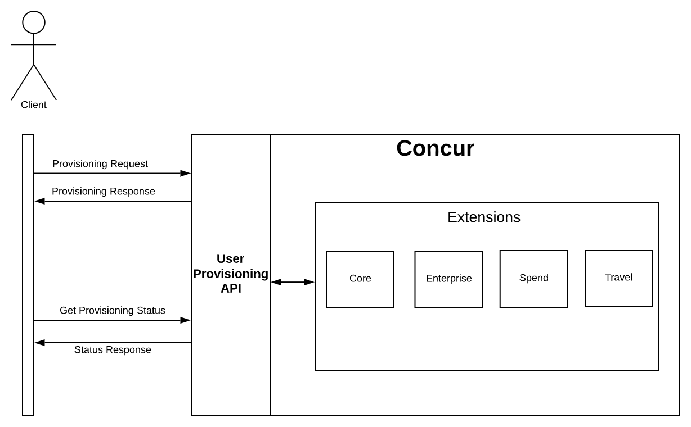



The User Provisioning Service allows callers to provision a user in the SAP Concur environment. Once a user is provisioned, the user profile is set up in Identity, Travel, and Spend.

> **Limitations**: This API is only available to partners who have been granted access. Access to this documentation does not provide access to the API.

* [Products and Editions](#products-editions)
* [Scope Usage](#scope-usage)
* [Dependencies](#dependencies)
* [Access Token Usage](#access-token-usage)
* [Event Usage](#event-usage)
* [Create a Provisioning Request for One or More Users](#create-bulk-post)
* [Update One or More Provisioning Requests](#update-bulk-patch)
* [Replace One or More Resources](#replace-bulk-put)
* [Create a User Provisioning Request](#create-users-post)
* [Update the Identity Data of a User](#update-users-patch)
* [Replace a User Resource](#replace-users-put)
* [Retrieving User Profile Data](#get-user)
  * [Identity](/api-reference/profile/v4.identity.html)
  * [Spend](/api-reference/user-provisioning/spend/v4.spend-user-retrieval.html)
  * [Travel](/api-reference/user-provisioning/travel/v4.travel-extension.html)
* [Retrieve a Provisioning Request Summary Status](#retrieve-summary-provision-request-status)
* [Retrieve a Detailed Provisioning Request Status](#retrieve-detailed-provision-request-status)
* [Retrieve Supported Resource Types](#retrieve-resource-types)
* [Retrieve Supported Schema](#retrieve-schemas)

* [Schemas](#schema)  
  * [User](#user-schema)  
  * [Travel User](#travel-user-schema)  
  * [Workflow Preference Extension](#workflow-preference-schema)  
  * [Bulk Request](#bulk-request-schema)  
  * [User Request](#user-request-schema)  
  * [Spend User](#spend-users-schema)  
  * [Spend Role](#spend-role-schema)  
  * [Spend Delegate](#spend-delegate-schema)  
  * [Spend Approver](#spend-approver-schema)  
  * [Enterprise User](#enterprise-user-schema)  
  * [Expense User Preference Extension](#expense-user-preference-schema)
  * [Payroll Extension](#payroll-extension-schema)   
  * [Provision Status](#provision-status-schema)
  * [Error](#error-schema)
  * [Definitions](#definitions)

## <a name="process-flow"></a>Process Flow



## <a name="products-editions"></a>Products and Editions

* Concur Expense Professional Edition
* Concur Expense Standard Edition
* Concur Travel Professional Edition
* Concur Travel Standard Edition
* Concur Invoice Professional Edition
* Concur Invoice Standard Edition
* Concur Request Professional Edition
* Concur Request Standard Edition

## <a name="scope-usage"></a>Scope Usage

Name|Description|Endpoint
---|---|---
`user.provision.write`|Provision a user.|GET, POST, PUT, PATCH
`user.provision.read`|Request status of a provisioning request.|GET
`identity.user.coreenterprise.writeonly`|Write access to all core and enterprise extensions except `externalID`.|POST, PUT, PATCH
`identity.user.externalID.writeonly`|Write access to `externalID` only.|POST, PUT, PATCH
`identity.user.ids.read`|Read user ID data.|GET
`identity.user.core.read`|Read user core data.|GET
`identity.user.coresensitive.read`|Read core sensitive data.|GET
`identity.user.enterprise.read`|Read user enterprise data.|GET
`travel.user.general.read`|Read general Travel data.|GET
`travel.user.private.read`|Read private Travel data.|GET
`spend.user.general.writeonly`|Change spend user information.|POST, PUT, PATCH
`spend.user.general.read`|View spend user information.|GET

## <a name="dependencies"></a>Dependencies

SAP Concur users must purchase either Concur Expense or Concur Travel or both in order to use this API. This API only available to approved early adopter partners and clients. Please contact your SAP Concur representative for more information.

## <a name="access-token-usage"></a>Access Token Usage

This API supports company level access tokens.

## <a name="event-usage"></a>Events

UPS supports post event notification when provisioning process is complete.

https://developer.concur.com/api-reference/callouts/post-event-notification.html

Event Type:
* `ProvisioningComplete`

## <a name="create-bulk-post"></a>Create a Provisioning Request for One or More Users

Creates one or more provisioning requests.

### Scopes

* `user.provision.write` - Refer to [Scope Usage](#scope-usage) for full details.
* `identity.user.coreenterprise.writeonly` - Refer to [Scope Usage](#scope-usage) for full details.
* `identity.user.externalID.writeonly` - Refer to [Scope Usage](#scope-usage) for full details.
* `spend.user.general.writeonly` - Refer to [Scope Usage](#scope-usage) for full details.

### Request

```shell
POST https://www.us.api.concursolutions.com/provisioning/v4/Bulk/
```
#### URI

##### Template

```shell
POST /provisioning/v4/Bulk/
```
#### Parameters

None

#### Headers
* [RFC 7231 Content-Type](https://tools.ietf.org/html/rfc7231#section-3.1.1.5)
* [RFC 7235 Authorization](https://tools.ietf.org/html/rfc7235#section-4.2)

#### Payload

* [Bulk Request](#bulk-request-schema)

### Response

#### Status Codes

* [200 OK](https://tools.ietf.org/html/rfc7231#section-6.3.1)
* [201 Created](https://tools.ietf.org/html/rfc7231#section-6.3.2)
* [202 Accepted](https://tools.ietf.org/html/rfc7231#section-6.3.3)
* [400 Bad Request](https://tools.ietf.org/html/rfc7231#section-6.5.1)
* [401 Unauthorized](https://tools.ietf.org/html/rfc7235#section-3.1)
* [403 Forbidden](https://tools.ietf.org/html/rfc7231#section-6.5.3)
* [404 Not Found](https://tools.ietf.org/html/rfc7231#section-6.5.4)
* [408 Request Timeout](https://tools.ietf.org/html/rfc7231#section-6.5.7)
* [413 Payload Too Large](https://tools.ietf.org/html/rfc7231#section-6.5.11)
* [429 Too Many Requests](https://tools.ietf.org/html/rfc6585#section-4)
* [500 Internal Server Error](https://tools.ietf.org/html/rfc7231#section-6.6.1)
* [501 Not Implemented](https://tools.ietf.org/html/rfc7231#section-6.6.2)
* [502 Bad Gateway](https://tools.ietf.org/html/rfc7231#section-6.6.3)
* [503 Service Unavailable](https://tools.ietf.org/html/rfc7231#section-6.6.4)
* [504 Gateway Timeout](https://tools.ietf.org/html/rfc7231#section-6.6.5)

#### Payload

None

### Example

### Request

The maximum file size allowed is 100 operations or 400kb per request.

```shell
{
    "schemas": [
        "urn:ietf:params:scim:api:messages:2.0:BulkRequest"
    ],
    "failOnErrors": 1,
    "Operations": [
        {
            "method": "POST",
            "path": "/Users",
            "bulkId": "bulk-operation-1",
            "data": {
                "userName": "Chris.doe198@sap.com",
                "active": true,
                "name": {
                    "formatted": "Chris Doe",
                    "legalName": "Chris Doe",
                    "familyName": "Doe",
                    "givenName": "Chris"
                },
                "emails": [
                    {
                        "value": "Chris.doe198@sap.com",
                        "type": "work"
                    }
                ],
        "timezone": "America/Los_Angeles",
                "entitlements": [
                    "Expense",
                    "Travel"
                ],
                "urn:ietf:params:scim:schemas:extension:enterprise:2.0:User": {
                    "employeeNumber": "3749",
                    "companyId": "xxxxxxxx-xxx-xxx-xxx-9300b1c317xxx"
                }
            }
        }
    ]
}
```

### Response
```shell
202 Accepted
Content-Type: application/json
```

```shell
{
    "schemas": [
        "urn:ietf:params:scim:schemas:extension:concur:2.0:Provision:Status"
    ],
    "id": "9ff00c90-1c35-4fd1-8ac7-db8b9be70a98",
    "operationsCount": {
        "total": 1,
        "success": 1,
        "failed": 0,
        "pending": 0
    },
    "status": {
        "completed": false,
        "success": null
    },
    "meta": {
        "location": "https://us.api.concursolutions.com/provisioning/v4/provisions/9ff00c90-1c35-4fd1-8ac7-db8b9be70a98/status",
        "created": "2021-04-26T16:29:38.459+0000",
        "lastModified": "2021-04-26T16:29:38.459+0000",
        "provisionType": "Bulk",
        "resourceType": "ProvisionRequest",
        "correlationId": "a2e9973f-516a-4203-ab86-b3d592fc0d5b"
    }
}
```

### <a name="update-bulk-patch"></a>Update One or More Provisioning Requests

Updates one or more provisioning requests.

### Scopes

* `user.provision.write` - Refer to [Scope Usage](#scope-usage) for full details.
* `identity.user.coreenterprise.writeonly` - Refer to [Scope Usage](#scope-usage) for full details.
* `identity.user.externalID.writeonly` - Refer to [Scope Usage](#scope-usage) for full details.
* `spend.user.general.writeonly` - Refer to [Scope Usage](#scope-usage) for full details.

### Request

```shell
PATCH https://www.us.api.concursolutions.com/provisioning/v4/Bulk/
```
#### URI

##### Template

```shell
PATCH /provisioning/v4/Bulk/
```
#### Parameters

None.

#### Headers

* [RFC 7235 Authorization](https://tools.ietf.org/html/rfc7235#section-4.2)
* [RFC 7231 Content-Type](https://tools.ietf.org/html/rfc7231#section-3.1.1.5)

#### Payload

[Bulk Request](#bulk-request-schema)

### Response

#### Status Codes

* [200 OK](https://tools.ietf.org/html/rfc7231#section-6.3.1)
* [201 Created](https://tools.ietf.org/html/rfc7231#section-6.3.2)
* [202 Accepted](https://tools.ietf.org/html/rfc7231#section-6.3.3)
* [400 Bad Request](https://tools.ietf.org/html/rfc7231#section-6.5.1)
* [401 Unauthorized](https://tools.ietf.org/html/rfc7235#section-3.1)
* [403 Forbidden](https://tools.ietf.org/html/rfc7231#section-6.5.3)
* [404 Not Found](https://tools.ietf.org/html/rfc7231#section-6.5.4)
* [408 Request Timeout](https://tools.ietf.org/html/rfc7231#section-6.5.7)
* [413 Payload Too Large](https://tools.ietf.org/html/rfc7231#section-6.5.11)
* [429 Too Many Requests](https://tools.ietf.org/html/rfc6585#section-4)
* [500 Internal Server Error](https://tools.ietf.org/html/rfc7231#section-6.6.1)
* [501 Not Implemented](https://tools.ietf.org/html/rfc7231#section-6.6.2)
* [502 Bad Gateway](https://tools.ietf.org/html/rfc7231#section-6.6.3)
* [503 Service Unavailable](https://tools.ietf.org/html/rfc7231#section-6.6.4)
* [504 Gateway Timeout](https://tools.ietf.org/html/rfc7231#section-6.6.5)


#### Payload
None

### Example

#### Request
```shell
PATCH https://www.us.api.concursolutions.com/provisioning/v4/Bulk/
```

```shell
{
    "schemas": [
        "urn:ietf:params:scim:api:messages:2.0:BulkRequest",
        "urn:ietf:params:scim:api:messages:2.0:PatchOp"
    ],
    "failOnErrors": 1,
    "Operations": [
        {
            "method": "PATCH",
            "path": "/Users/8f545a90-305f-441b-91cd-a69ad5f548f5",
            "data": {
                "Operations": [

                    {
                        "op": "add",
                        "path": "urn:ietf:params:scim:schemas:extension:enterprise:2.0:User:department",
                        "value": "Engineering"
                    },
                    {
                        "op": "replace",
                        "path": "userName",
                        "value":
                            "Updated_Chris_Doe_Name@sap.com"

                    }
                ]
            }
        }
    ]
}
```

#### Response
```shell
202 Accepted
Content-Type: application/json
```

```shell
{
    "schemas": [
        "urn:ietf:params:scim:schemas:extension:concur:2.0:Provision:Status"
    ],
    "id": "193975e3-f9b2-4786-813d-b209ee0f8527",
    "operationsCount": {
        "total": 1,
        "success": 0,
        "failed": 0,
        "pending": 1
    },
    "status": {
        "completed": true,
        "success": true
    },
    "meta": {
        "location": "https://us.api.concursolutions.com/provisioning/v4/provisions/193975e3-f9b2-4786-813d-b209ee0f8527/status",
        "created": "2021-04-26T16:47:44.009+0000",
        "lastModified": "2021-04-26T16:47:44.009+0000",
        "provisionType": "Bulk",
        "resourceType": "ProvisionRequest",
        "correlationId": "96f93318-8fb1-4949-b4ed-b4316455b032"
    }
}

```
* `provisionId`: "193975e3-f9b2-4786-813d-b209ee0f8527" is the provisioning request ID. This is a unique number that is used for querying status on the request.
* `location`: The location to receive status on the provisioning request.


### <a name="replace-bulk-put"></a>Replace One or More Resources

Replaces one or more existing resources. In the case where all attributes are not provisioned, system default values will be provisioned.

### Scopes

* `user.provision.write` - Refer to [Scope Usage](#scope-usage) for full details.
* `identity.user.coreenterprise.writeonly` - Refer to [Scope Usage](#scope-usage) for full details.
* `identity.user.externalID.writeonly` - - Refer to [Scope Usage](#scope-usage) for full details.
* `spend.user.general.writeonly` - Refer to [Scope Usage](#scope-usage) for full details.

### Request

```shell
PUT https://www.us.api.concursolutions.com/provisioning/v4/Bulk/
```
#### URI

##### Template

```shell
PUT /provisioning/v4/Bulk/
```
#### Parameters

None.

#### Headers

* [RFC 7235 Authorization](https://tools.ietf.org/html/rfc7235#section-4.2)
* [RFC 7231 Content-Type](https://tools.ietf.org/html/rfc7231#section-3.1.1.5)

#### Payload

[Bulk Request](#bulk-request-schema) 

### Response

#### Status Codes

* [200 OK](https://tools.ietf.org/html/rfc7231#section-6.3.1)
* [201 Created](https://tools.ietf.org/html/rfc7231#section-6.3.2)
* [202 Accepted](https://tools.ietf.org/html/rfc7231#section-6.3.3)
* [400 Bad Request](https://tools.ietf.org/html/rfc7231#section-6.5.1)
* [401 Unauthorized](https://tools.ietf.org/html/rfc7235#section-3.1)
* [403 Forbidden](https://tools.ietf.org/html/rfc7231#section-6.5.3)
* [404 Not Found](https://tools.ietf.org/html/rfc7231#section-6.5.4)
* [408 Request Timeout](https://tools.ietf.org/html/rfc7231#section-6.5.7)
* [413 Payload Too Large](https://tools.ietf.org/html/rfc7231#section-6.5.11)
* [429 Too Many Requests](https://tools.ietf.org/html/rfc6585#section-4)
* [500 Internal Server Error](https://tools.ietf.org/html/rfc7231#section-6.6.1)
* [501 Not Implemented](https://tools.ietf.org/html/rfc7231#section-6.6.2)
* [502 Bad Gateway](https://tools.ietf.org/html/rfc7231#section-6.6.3)
* [503 Service Unavailable](https://tools.ietf.org/html/rfc7231#section-6.6.4)
* [504 Gateway Timeout](https://tools.ietf.org/html/rfc7231#section-6.6.5)


#### Payload

None

### Example

#### Request

* Note that the SAP Concur platform UUID within the id attribute and path must be included within the data of the request.

```shell
{
    "schemas": [
        "urn:ietf:params:scim:api:messages:2.0:BulkRequest"
    ],
    "failOnErrors": 1,
    "Operations": [
        {
            "method": "PUT",
            "path": "/Users/8f545a90-305f-441b-91cd-a69ad5f548f5",
            "bulkId": "Seattle",
            "data": {
                "id": "8f545a90-305f-441b-91cd-a69ad5f548f5",
                "userName": "john.doe21224@sap.com",
                "active": false,
                "name": {
                    "formatted": "Mr. John Doe",
                    "legalName": "Mr. John Doe",
                    "middleName": "Joe",
                    "middleInitial": "J",
                    "familyName": "Doe",
                    "givenName": "John",
                    "honorificPrefix": "Prof Dr Mr",
                    "honorificSuffix": "VI",
                    "hasNoMiddleName": true
                },
                "emails": [
                    {
                        "value": "john.doe193@sap.com",
                        "type": "work"
                    }
                ]
            }
        }
    ]
}
```

#### Response

```shell
202 Accepted
Content-Type: application/json
```

```shell
{
    "schemas": [
        "urn:ietf:params:scim:schemas:extension:concur:2.0:Provision:Status"
    ],
    "id": "a43fd01c-fc99-4cf1-a16e-6f440b797603",
    "operationsCount": {
        "total": 1,
        "success": 1,
        "failed": 0,
        "pending": 0
    },
    "status": {
        "completed": true,
        "success": true
    },
    "meta": {
        "location": "https://us.api.concursolutions.com/provisioning/v4/provisions/a43fd01c-fc99-4cf1-a16e-6f440b797603/status",
        "created": "2021-04-26T16:57:39.719+0000",
        "lastModified": "2021-04-26T16:57:39.719+0000",
        "provisionType": "Bulk",
        "resourceType": "ProvisionRequest",
        "correlationId": "dbe2c569-3662-46e7-8521-e6ba77a014ef"
    }
}

```
* `provisionId`: "a43fd01c-fc99-4cf1-a16e-6f440b797603" is the provisioning request ID. This is a unique number that is used for querying status on the request.
* `location`: The location to receive status on the provisioning request.

## <a name="create-users-post"></a>Create a User Provisioning Request

Allows the creation of a single user resource.

### Scopes

* `user.provision.write` - Refer to [Scope Usage](#scope-usage) for full details.
* `identity.user.coreenterprise.writeonly` - Refer to [Scope Usage](#scope-usage) for full details.
* `identity.user.externalID.writeonly` - Refer to [Scope Usage](#scope-usage) for full details.
* `spend.user.general.writeonly` - Refer to [Scope Usage](#scope-usage) for full details.

### Request

```shell
POST https://www.us.api.concursolutions.com/provisioning/v4/Users/
```
#### URI

##### Template

```shell
POST /provisioning/v4/Users/
```

#### Parameters
None

#### Headers
* [RFC 7231 Content-Type](https://tools.ietf.org/html/rfc7231#section-3.1.1.5)
* [RFC 7235 Authorization](https://tools.ietf.org/html/rfc7235#section-4.2)

### Payload
* [Users Request](#users-request-schema)

### Request

#### Status Codes

* [200 OK](https://tools.ietf.org/html/rfc7231#section-6.3.1)
* [201 Created](https://tools.ietf.org/html/rfc7231#section-6.3.2)
* [202 Accepted](https://tools.ietf.org/html/rfc7231#section-6.3.3)
* [400 Bad Request](https://tools.ietf.org/html/rfc7231#section-6.5.1)
* [401 Unauthorized](https://tools.ietf.org/html/rfc7235#section-3.1)
* [403 Forbidden](https://tools.ietf.org/html/rfc7231#section-6.5.3)
* [404 Not Found](https://tools.ietf.org/html/rfc7231#section-6.5.4)
* [408 Request Timeout](https://tools.ietf.org/html/rfc7231#section-6.5.7)
* [413 Payload Too Large](https://tools.ietf.org/html/rfc7231#section-6.5.11)
* [429 Too Many Requests](https://tools.ietf.org/html/rfc6585#section-4)
* [500 Internal Server Error](https://tools.ietf.org/html/rfc7231#section-6.6.1)
* [501 Not Implemented](https://tools.ietf.org/html/rfc7231#section-6.6.2)
* [502 Bad Gateway](https://tools.ietf.org/html/rfc7231#section-6.6.3)
* [503 Service Unavailable](https://tools.ietf.org/html/rfc7231#section-6.6.4)
* [504 Gateway Timeout](https://tools.ietf.org/html/rfc7231#section-6.6.5)


#### Payload
None

### Example

#### Request
```shell
{
    "schemas": [
        "urn:ietf:params:scim:schemas:core:2.0:User"
    ],
    "userName": "John4_29_4@cs-sso-us-prod.com",
    
    "active": true,
    "name": {
        "formatted": "Mr. John Doe",
        "legalName": "Mr. John Doe",
        "middleName": "Joe",
        "middleInitial": "J",
        "familyName": "Doe",
        "givenName": "John",
        "honorificPrefix": "Prof Dr Mr",
        "honorificSuffix": "VI",
        "hasNoMiddleName": false
    },

    "emails": [
        {
            "value": "John4_29_4@cs-sso-us-prod.com",
            "type": "work"
        }
    ],
    "entitlements": [
        "Expense",
        "Invoice",
        "Locate",
        "Request",
        "Travel"
    ],
    "urn:ietf:params:scim:schemas:extension:enterprise:2.0:User": {
        "employeeNumber": "John4_29_4@cs-sso-us-prod.com",
        "companyId": "aa076ada-80a9-4f57-8e98-9300b1c3171d"
    },
    "urn:ietf:params:scim:schemas:extension:spend:2.0:User": {
        "locale": "en-US",
        "country": "US",
        "stateProvince": "WA",
        "ledgerCode": "DEFAULT",
        "reimbursementCurrency": "USD",
        "cashAdvanceAccountCode": "Code",
        "customData": [
            {
                "id": "custom1",
                "value": "testing"
            },
            {
                "id": "orgUnit1",
                "value": "testDepartment"
            }
        ]
    },
    "urn:ietf:params:scim:schemas:extension:spend:2.0:WorkflowPreference": {
        "emailStatusChangeOnCashAdvance": true,
        "emailAwaitApprovalOnCashAdvance": true,
        "emailStatusChangeOnReport": true,
        "emailAwaitApprovalOnReport": true,
        "promptForApproverOnReportSubmit": true,
        "emailStatusChangeOnTravelRequest": true,
        "emailAwaitApprovalOnTravelRequest": true,
        "promptForApproverOnTravelRequestSubmit": true,
        "emailStatusChangeOnPayment": true,
        "emailAwaitApprovalOnPayment": true,
        "promptForApproverOnPaymentSubmit": true,
        "promptForCardTransactionsOnReport": true
    },
    "urn:ietf:params:scim:schemas:extension:spend:2.0:UserPreference": {
        "allowCreditCardTransArrivalEmails": true,
        "defaultReportPrintFormat": "DETAILED",
        "showInstructHelpPanel": true,
        "expenseAuditRequired": "ALWAYS",
        "showImagingIntro": true,
        "allowReceiptImageAvailEmails": true,
        "autoAddTripCardTransOnReport": true,
        "processorReportAccess": "All reports excluding returned",
        "promptForCardTransactionsOnReport": true,
        "promptForReportPrintFormat": true,
        "showExpenseOnReport": "ALL",
        "showTotalOnReport": true,
        "useQuickItinAsDefault": false
    },
    "urn:ietf:params:scim:schemas:extension:spend:2.0:Role": {
        "roles": [
            {
                "roleName": "EXP_APPROVER",
                "roleGroups": []
            }
        ]
    },
    "urn:ietf:params:scim:schemas:extension:spend:2.0:Approver": {
        "report": [
            {
                "approver": {
                    "value": "d1eb15c1-ac9b-40d6-b5f7-ea2d2f5ae8a7",
                    "$ref": "https://www.concursoultions.com/users/approver2",
                    "displayName": "test.employee@sap.com",
                    "employeeNumber": "37480"
                },
                "primary": true
            }
        ]
    }
}
```

#### Response
```shell
201 Created
Content-Type: application/json
```
```shell
{
    "meta": {
        "resourceType": "User",
        "created": "2021-04-26T20:07:55.000097Z",
        "lastModified": "2021-04-26T20:07:55.000097Z",
        "version": 0,
        "location": "https://us.api.concursolutions.com/profile/identity/v4/Users/ef0bffaf-863f-4b3e-9c4c-bd9c9a8b2ea7",
        "statusUrl": "https://us.api.concursolutions.com/provisioning/v4/provisions/2b41c0c1-15f7-41cc-99bb-a82b5da128a2/status",
        "provisionId": "2b41c0c1-15f7-41cc-99bb-a82b5da128a2"
    },
    "displayName": "John",
    "name": {
        "middleInitial": "J",
        "middleName": "Joe",
        "formatted": "Doe, John Joe",
        "honorificPrefix": "Prof Dr Mr",
        "legalName": "Mr. John Doe",
        "familyName": "Doe",
        "givenName": "John",
        "honorificSuffix": "VI"
    },
    "schemas": [
        "urn:ietf:params:scim:schemas:core:2.0:User",
        "urn:ietf:params:scim:schemas:extension:enterprise:2.0:User",
        "urn:ietf:params:scim:schemas:extension:sap:2.0:User"
    ],
    "active": true,
    "id": "ef0bffaf-863f-4b3e-9c4c-bd9c9a8b2ea7",
    "emails": [
        {
            "value": "John4_29_4@cs-sso-us-prod.com",
            "type": "work",
            "notifications": false,
            "verified": false
        }
    ],
    "userName": "John4_26_1@cs-sso-us-prod.com",
    "urn:ietf:params:scim:schemas:extension:enterprise:2.0:User": {
        "employeeNumber": "John4_29_4@cs-sso-us-prod.com",
        "companyId": "aa076ada-xxxx-xxxx-xxxx-9300b1c3171d"

    }
}
```
* `provisionId`: "2b41c0c1-15f7-41cc-99bb-a82b5da128a2" is the provisioning request ID. This is a unique number that is used for querying status on the request.
* `id`: "ef0bffaf-863f-4b3e-9c4c-bd9c9a8b2ea7" is the SAP Concur user UUID. This is a unique number that is used for this particular user.
* `statusUrl`: The location to receive status on the provisioning request


### <a name="update-users-patch"></a>Update the Profile Data of a User

Allows the modification of a single resource.

### Scopes

* `user.provision.write` - Refer to [Scope Usage](#scope-usage) for full details.
* `identity.user.coreenterprise.writeonly` - Refer to [Scope Usage](#scope-usage) for full details.
* `identity.user.externalID.writeonly` - Refer to [Scope Usage](#scope-usage) for full details.
* `spend.user.general.writeonly` - Refer to [Scope Usage](#scope-usage) for full details.

### Request

```shell
PATCH https://www.us.api.concursolutions.com/provisioning/v4/Users/<Concur UUID>
```

#### URI

##### Template

```shell
PATCH /provisioning/v4/Users/
```

#### Parameters

|Name|Type|Format|Description|
|---|---|---|---|
`id`|`string`|`UUID`|The SAP Concur platform UUID of the user to be updated.

#### Headers

* [RFC 7231 Content-Type](https://tools.ietf.org/html/rfc7231#section-3.1.1.5)
* [RFC 7235 Authorization](https://tools.ietf.org/html/rfc7235#section-4.2)

#### Payload

* [Users Request](#users-request-schema)

### Response

#### Status Codes

* [200 OK](https://tools.ietf.org/html/rfc7231#section-6.3.1)
* [201 Created](https://tools.ietf.org/html/rfc7231#section-6.3.2)
* [202 Accepted](https://tools.ietf.org/html/rfc7231#section-6.3.3)
* [400 Bad Request](https://tools.ietf.org/html/rfc7231#section-6.5.1)
* [401 Unauthorized](https://tools.ietf.org/html/rfc7235#section-3.1)
* [403 Forbidden](https://tools.ietf.org/html/rfc7231#section-6.5.3)
* [404 Not Found](https://tools.ietf.org/html/rfc7231#section-6.5.4)
* [408 Request Timeout](https://tools.ietf.org/html/rfc7231#section-6.5.7)
* [413 Payload Too Large](https://tools.ietf.org/html/rfc7231#section-6.5.11)
* [429 Too Many Requests](https://tools.ietf.org/html/rfc6585#section-4)
* [500 Internal Server Error](https://tools.ietf.org/html/rfc7231#section-6.6.1)
* [501 Not Implemented](https://tools.ietf.org/html/rfc7231#section-6.6.2)
* [502 Bad Gateway](https://tools.ietf.org/html/rfc7231#section-6.6.3)
* [503 Service Unavailable](https://tools.ietf.org/html/rfc7231#section-6.6.4)
* [504 Gateway Timeout](https://tools.ietf.org/html/rfc7231#section-6.6.5)


#### Payload
None

### Example

#### Request

```shell
PATCH https://www.us.api.concursolutions.com/provisioning/v4/Users/ef0bffaf-863f-4b3e-9c4c-bd9c9a8b2ea7
```

```shell
{
    "schemas": [
        "urn:ietf:params:scim:api:messages:2.0:PatchOp"
    ],
    "Operations": [
        {
            "op": "add",
            "path": "entitlements",
            "value": [
                "Expense",
                "Invoice",
                "Locate",
                "Request",
                "Travel"
            ]
        },
        {
            "op": "replace",
            "path": "userName",
            "value": "John10_9_1_Replacement@sap.com"
        }
    ]
}

```

#### Response
```shell
200 OK
Content-Type: application/json
```

```shell
{
    "addresses": null,
    "meta": {
        "resourceType": "User",
        "created": "2021-04-26T20:07:55.000097Z",
        "lastModified": "2021-04-26T20:18:33.000701Z",
        "version": 3,
        "location": "https://us.api.concursolutions.com/profile/identity/v4/Users/ef0bffaf-863f-4b3e-9c4c-bd9c9a8b2ea7",
        "statusUrl": "https://us.api.concursolutions.com/provisioning/v4/provisions/e820c001-c358-4a3e-964a-321dc2a76203/status",
        "provisionId": "e820c001-c358-4a3e-964a-321dc2a76203"
    },
    "displayName": "John",
    "name": {
        "legalName": "Mr. John Doe",
        "honorificSuffix": "VI",
        "middleInitial": "J",
        "formatted": "Doe, John Joe",
        "familyName": "Doe",
        "givenName": "John",
        "honorificPrefix": "Prof Dr Mr",
        "middleName": "Joe"
    },
    "schemas": [
        "urn:ietf:params:scim:schemas:core:2.0:User",
        "urn:ietf:params:scim:schemas:extension:enterprise:2.0:User",
        "urn:ietf:params:scim:schemas:extension:sap:2.0:User"
    ],
    "active": true,
    "id": "ef0bffaf-863f-4b3e-9c4c-bd9c9a8b2ea7",
    "emails": [
        {
            "verified": false,
            "type": "work",
            "value": "John4_26_1@cs-sso-us-prod.com",
            "notifications": false
        }
    ],
    "userName": "John_Updated_76@cs-sso-us-prod.com",
    "urn:ietf:params:scim:schemas:extension:enterprise:2.0:User": {
        "companyId": "aa076ada-80a9-4f57-8e98-9300b1c3171d",
        "employeeNumber": "John_Updated_56@cs-sso-us-prod.com"
    }
}

```
* `provisionId`: "e820c001-c358-4a3e-964a-321dc2a76203" is the provisioning request ID. This is a unique number that is used for querying status on the request.
* `id`: "ef0bffaf-863f-4b3e-9c4c-bd9c9a8b2ea7" is the SAP Concur user UUID. This is a unique number that is used for this particular user.
* `statusUrl`: The location to receive status on the provisioning request

### <a name="replace-users-put"></a>Replace a User Resource

Allows the replacement of an existing resource. In the case where all attributes are not provisioned, system default values will be provisioned.

### Scopes

* `user.provision.write` - Refer to [Scope Usage](#scope-usage) for full details.
* `identity.user.coreenterprise.writeonly` - Refer to [Scope Usage](#scope-usage) for full details.
* `identity.user.externalID.writeonly` - Refer to [Scope Usage](#scope-usage) for full details.
*  `spend.user.general.writeonly` - Refer to [Scope Usage](#scope-usage) for full details.

### Request

```shell
PUT https://www.us.api.concursolutions.com/provisioning/v4/Users/<Concur UUID>
```

#### URI

##### Template

```shell
PUT /provisioning/v4/Users/
```

#### Parameters

|Name|Type|Format|Description|
|---|---|---|---|
`id`|`string`|`UUID`|The SAP Concur platform UUID of the user to be updated.

#### Headers

* [RFC 7231 Content-Type](https://tools.ietf.org/html/rfc7231#section-3.1.1.5)
* [RFC 7235 Authorization](https://tools.ietf.org/html/rfc7235#section-4.2)

#### Payload

* [Users Request](#users-request-schema)

### Request

#### Status Codes

* [200 OK](https://tools.ietf.org/html/rfc7231#section-6.3.1)
* [201 Created](https://tools.ietf.org/html/rfc7231#section-6.3.2)
* [202 Accepted](https://tools.ietf.org/html/rfc7231#section-6.3.3)
* [400 Bad Request](https://tools.ietf.org/html/rfc7231#section-6.5.1)
* [401 Unauthorized](https://tools.ietf.org/html/rfc7235#section-3.1)
* [403 Forbidden](https://tools.ietf.org/html/rfc7231#section-6.5.3)
* [404 Not Found](https://tools.ietf.org/html/rfc7231#section-6.5.4)
* [408 Request Timeout](https://tools.ietf.org/html/rfc7231#section-6.5.7)
* [413 Payload Too Large](https://tools.ietf.org/html/rfc7231#section-6.5.11)
* [429 Too Many Requests](https://tools.ietf.org/html/rfc6585#section-4)
* [500 Internal Server Error](https://tools.ietf.org/html/rfc7231#section-6.6.1)
* [501 Not Implemented](https://tools.ietf.org/html/rfc7231#section-6.6.2)
* [502 Bad Gateway](https://tools.ietf.org/html/rfc7231#section-6.6.3)
* [503 Service Unavailable](https://tools.ietf.org/html/rfc7231#section-6.6.4)
* [504 Gateway Timeout](https://tools.ietf.org/html/rfc7231#section-6.6.5)

#### Payload

None

### Example

#### Request

```shell
PUT https://www.us.api.concursolutions.com/provisioning/v4/Users/ef0bffaf-863f-4b3e-9c4c-bd9c9a8b2ea7
```
```shell

{
    "schemas": [
        "urn:ietf:params:scim:schemas:core:2.0:User"
    ],
    "userName": "John10_14_1_Replacement@sap.com",
    "id": "8f545a90-305f-441b-91cd-a69ad5f548f5",
    "active": false,
    "name": {
        "formatted": "Mr. John Doe1",
        "legalName": "Mr. John Doe1",
        "middleName": "Joe1",
        "middleInitial": "J",
        "familyName": "Doe1",
        "givenName": "John1",
        "hasNoMiddleName": true
    },
    "emails": [
        {
            "value": "John10_14_1_Replacement@sap.com",
            "type": "work"
        }
    ],
    "urn:ietf:params:scim:schemas:extension:enterprise:2.0:User": {
        "employeeNumber": "John10_8_1",
        "companyId": "aa076ada-xxxx-xxxx-xxxx-9300b1c3171d"
    }
}

``` 

#### Response

```shell
200 OK
Content-Type: application/json
```

```shell
{
    "meta": {
        "resourceType": "User",
        "created": "2021-04-29T17:17:47.000380Z",
        "lastModified": "2021-04-29T17:17:47.000380Z",
        "version": 0,
        "location": "https://us.api.concursolutions.com/profile/identity/v4/Users/61bd5549-d68c-407b-8228-9590ae40eaa0",
        "statusUrl": "https://us.api.concursolutions.com/provisioning/v4/provisions/03295e27-c9c2-4579-92d8-8b46ec91eff5/status",
        "provisionId": "03295e27-c9c2-4579-92d8-8b46ec91eff5"
    },
    "displayName": "John",
    "name": {
        "middleInitial": "J",
        "middleName": "Joe",
        "formatted": "Doe, John Joe",
        "honorificPrefix": "Prof Dr Mr",
        "legalName": "Mr. John Doe",
        "familyName": "Doe",
        "givenName": "John",
        "honorificSuffix": "VI"
    },
    "schemas": [
        "urn:ietf:params:scim:schemas:core:2.0:User",
        "urn:ietf:params:scim:schemas:extension:enterprise:2.0:User",
        "urn:ietf:params:scim:schemas:extension:sap:2.0:User"
    ],
    "active": true,
    "id": "61bd5549-d68c-407b-8228-9590ae40eaa0",
    "emails": [
        {
            "value": "John4_29_4@cs-sso-us-prod.com",
            "type": "work",
            "notifications": false,
            "verified": false
        }
    ],
    "userName": "John4_29_4@cs-sso-us-prod.com",
    "urn:ietf:params:scim:schemas:extension:enterprise:2.0:User": {
        "employeeNumber": "John4_29_4@cs-sso-us-prod.com",
        "companyId": "aa076ada-80a9-4f57-8e98-9300b1c3171d"
    }
}
```

## <a name="#get-user"></a>Retrieve User Profile Data

To retrieve profile data for a specific user, the SAP Concur platform has enabled separate endpoints. For additional information for provisioning the specific profiles, please see the documentation for [Identity](/api-reference/profile/v4.identity.html), [Spend](/spend/v4.spend-user-get-started.html), and [Travel](/travel/v4.travel-extension.html).

### Scopes

* `identity.user.ids.read` - Refer to [Scope Usage](#scope-usage) for full details.
* `identity.user.core.read` - Refer to [Scope Usage](#scope-usage) for full details.
* `identity.user.coresensitive.read` - Refer to [Scope Usage](#scope-usage) for full details.
* `identity.user.enterprise.read` - Refer to [Scope Usage](#scope-usage) for full details.
* `travel.user.general.read` - Refer to [Scope Usage](#scope-usage) for full details.
* `travel.user.private.read` - Refer to [Scope Usage](#scope-usage) for full details.
* `spend.user.general.read` - Refer to [Scope Usage](#scope-usage) for full details.

### Request
```shell
GET https://us.api.concursolutions.com/profile/identity/v4/Users
```
#### Request Example
```shell
GET https://us.api.concursolutions.com/profile/identity/v4/Users/8f545a90-305f-441b-91cd-a69ad5f548f5 
GET https://us.api.concursolutions.com/profile/spend/v4/Users/8f545a90-305f-441b-91cd-a69ad5f548f5
GET https://us.api.concursolutions.com/profile/travel/v4/Users/8f545a90-305f-441b-91cd-a69ad5f548f5
```

#### Parameters

|Name|Type|Format|Description|
|---|---|---|---|
`ID`|`string`|`-`|Requested user’s UUID

#### Headers
* [RFC 7231 Content-Type](https://tools.ietf.org/html/rfc7231#section-3.1.1.5)
* [RFC 7235 Authorization](https://tools.ietf.org/html/rfc7235#section-4.2)

#### Payload
None

### Response

#### Status Codes
* [200 OK](https://tools.ietf.org/html/rfc7231#section-6.3.1)
* [202 Accepted](https://tools.ietf.org/html/rfc7231#section-6.3.3)
* [400 Bad Request](https://tools.ietf.org/html/rfc7231#section-6.5.1)
* [401 Unauthorized](https://tools.ietf.org/html/rfc7235#section-3.1)
* [403 Forbidden](https://tools.ietf.org/html/rfc7231#section-6.5.3)
* [404 Not Found](https://tools.ietf.org/html/rfc7231#section-6.5.4)
* [408 Request Timeout](https://tools.ietf.org/html/rfc7231#section-6.5.7)
* [429 Too Many Requests](https://tools.ietf.org/html/rfc6585#section-4)
* [500 Internal Server Error](https://tools.ietf.org/html/rfc7231#section-6.6.1)
* [501 Not Implemented](https://tools.ietf.org/html/rfc7231#section-6.6.2)
* [502 Bad Gateway](https://tools.ietf.org/html/rfc7231#section-6.6.3)
* [503 Service Unavailable](https://tools.ietf.org/html/rfc7231#section-6.6.4)
* [504 Gateway Timeout](https://tools.ietf.org/html/rfc7231#section-6.6.5)


#### Payload
* [User](#user-schema) 
* [Enterprise User](#enterprise-user-schema)   
* [Travel User](#travel-user-schema)    
* [Spend User](#spend-users-schema)  
* [Spend Role](#spend-role-schema)  
* [Spend Delegate](#spend-delegate-schema)  
* [Spend Approver](#spend-approver-schema)  
* [Expense User Preference Extension](#expense-user-preference-schema)
* [Workflow Preference Extension](#workflow-preference-schema)  

### Example
#### Request
```shell
GET https://us.api.concursolutions.com//profile/identity/v4/Users/ef0bffaf-863f-4b3e-9c4c-bd9c9a8b2ea7
```

#### Response
```shell
200 OK
Content-Type: application/json
```

#### Identity 
```shell
{
    "localeOverrides": {
        "preferenceEndDayViewHour": 20,
        "preferenceFirstDayOfWeek": "Sunday",
        "preferenceDateFormat": "mm/dd/yyyy",
        "preferenceCurrencySymbolLocation": "BeforeAmount",
        "preferenceHourMinuteSeparator": ":",
        "preferenceDefaultCalView": "month",
        "preference24Hour": "H:mm",
        "preferenceNumberFormat": "1,000.00",
        "preferenceStartDayViewHour": 8,
        "preferenceNegativeCurrencyFormat": "-100"
    },
    "addresses": [
        {
            "country": "US",
            "streetAddress": "911 Universal City Plaza",
            "postalCode": "91608",
            "locality": "Hollywood",
            "type": "home",
            "region": "CA"
        }
    ],
    "timezone": "America/New_York",
    "meta": {
        "resourceType": "User",
        "created": "2020-09-22T14:26:29.000516Z",
        "lastModified": "2021-02-10T23:14:18.000733Z",
        "version": 16,
        "location": "https://us.api.concursolutions.com/profile/identity/v4/Users/8f545a90-305f-441b-91cd-a69ad5f548f5"
    },
    "displayName": "John",
    "name": {
        "middleInitial": "J",
        "middleName": "Joe",
        "formatted": "Doe, John Joe",
        "honorificPrefix": "Prof Dr Mr",
        "legalName": "Mr. John Doe",
        "familyName": "Doe",
        "givenName": "John",
        "honorificSuffix": "VI",
        "hasNoMiddleName": false
    },
    "phoneNumbers": [
        {
            "type": "home",
            "value": "tel:555-555-5555",
            "operatingSystem": null,
            "notifications": false,
            "primary": false
        }
        ...
    ],
    "emergencyContacts": [
        {
            "country": "US",
            "streetAddress": "911 Universal City Plaza  Hollywood, CA 91608 US",
            "postalCode": "91608",
            "name": "Emergency Contact",
            "locality": null,
            "phones": [
                "555-555-5555"
            ],
            "region": "CA",
            "relationship": "Other"
        }
    ],
    "preferredLanguage": "en-US",
    "title": "Software Engineer",
    "dateOfBirth": null,
    "nickName": "Francis",
    "schemas": [
        "urn:ietf:params:scim:schemas:core:2.0:User",
        "urn:ietf:params:scim:schemas:extension:enterprise:2.0:User",
        "urn:ietf:params:scim:schemas:extension:sap:2.0:User"
    ],
    "externalId": "1234abcd56789e4370",
    "active": true,
    "id": "8f545a90-305f-441b-91cd-a69ad5f548f5",
    "gender": null,
    "emails": [
        {
            "verified": false,
            "type": "work",
            "value": "john.doe194@BravoPro7.com",
            "notifications": true
        }
        ...
        {
            "verified": false,
            "type": "other2",
            "value": "john.doe1883@BravoPro7.com",
            "notifications": false
        }
    ],
    "userName": "john.doe_replacement@BravoPro7.com",
    "urn:ietf:params:scim:schemas:extension:enterprise:2.0:User": {
        "employeeNumber": "13749670",
        "companyId": "aa076ada-80a9-xxxx-xxxx-9300b1c3171d",
        "department": "Engineering",
        "division": "Theme Park",
        "startDate": "2020-09-22T14:26:00.000",
        "costCenter": null,
        "manager": null,
        "terminationDate": null,
        "orgUnit": null,
        "jobTitle": "Software Engineer"
    }
}
```
#### Travel 
```shell
{
    "id": "8f545a90-305f-441b-91cd-a69ad5f548f5",
    "urn:ietf:params:scim:schemas:extension:travel:2.0:User": {
        "ruleClass": {
            "name": "Default Travel Class",
            "id": 560485
        },
        "travelCrsName": null,
        "xmlProfileSyncId": "",
        "travelNameRemark": "",
        "orgUnit": null,
        "customFields": [
            {
                "name": "Canary ID"
            }
            
           ...
           
           {
                "name": "trainline trip purpose 1"
            }
        ],
        "manager": null,
        "groups": []
    }
```

#### Spend
```shell
{
    "schemas": [
        "urn:com.concur.spend.user.model.scim.ScimResource",
        "urn:ietf:params:scim:schemas:extension:spend:2.0:Role",
        "urn:ietf:params:scim:schemas:extension:spend:2.0:WorkflowPreference",
        "urn:ietf:params:scim:schemas:extension:spend:2.0:User",
        "urn:ietf:params:scim:schemas:extension:enterprise:2.0:Payroll",
        "urn:ietf:params:scim:schemas:extension:spend:2.0:UserPreference",
        "urn:ietf:params:scim:schemas:extension:spend:2.0:Delegate",
        "urn:ietf:params:scim:schemas:extension:spend:2.0:Approver"
    ],
    "id": "8f545a90-305f-441b-91cd-a69ad5f548f5",
    "externalId": null,
    "meta": null,
    "urn:ietf:params:scim:schemas:extension:spend:2.0:Role": {
        "roles": [
            {
                "roleName": "REPORTING_CONFIG_ADMIN"
            }
            ...
            {
                "roleName": "EXP_USER"
            }
        ]
    },
    "urn:ietf:params:scim:schemas:extension:spend:2.0:WorkflowPreference": {
        "emailStatusChangeOnCashAdvance": true,
        "emailAwaitApprovalOnCashAdvance": true,
        "emailStatusChangeOnReport": true,
        "emailAwaitApprovalOnReport": true,
        "promptForApproverOnReportSubmit": true,
        "emailStatusChangeOnTravelRequest": true,
        "emailAwaitApprovalOnTravelRequest": true,
        "promptForApproverOnTravelRequestSubmit": true,
        "emailStatusChangeOnPayment": true,
        "emailAwaitApprovalOnPayment": true,
        "promptForApproverOnPaymentSubmit": true
    },
    "urn:ietf:params:scim:schemas:extension:spend:2.0:User": {
        "reimbursementCurrency": "USD",
        "reimbursementType": "ADP_PAYROLL",
        "ledgerCode": "DEFAULT",
        "country": "US",
        "stateProvince": "WA",
        "locale": "en-US",
        "testEmployee": false,
        "nonEmployee": false,
        "customData": [
            {
                "id": "custom20",
                "value": "testing"
            }
            ...
            {
                "id": "custom18",
                "value": "testing"
            }
        ]
    },
    "urn:ietf:params:scim:schemas:extension:enterprise:2.0:Payroll": {
        "adp": {
            "companyCode": "string",
            "deductionCode": "string",
            "employeeFileNumber": "string"
        }
    },
    "urn:ietf:params:scim:schemas:extension:spend:2.0:UserPreference": {
        "showImagingIntro": true,
        "expenseAuditRequired": "ALWAYS",
        "allowCreditCardTransArrivalEmails": true,
        "allowReceiptImageAvailEmails": true,
        "promptForCardTransactionsOnReport": true,
        "autoAddTripCardTransOnReport": true,
        "promptForReportPrintFormat": true,
        "defaultReportPrintFormat": "DETAILED",
        "showTotalOnReport": true,
        "showExpenseOnReport": "PARENT",
        "showInstructHelpPanel": true,
        "useQuickItinAsDefault": false
    },
    "urn:ietf:params:scim:schemas:extension:spend:2.0:Delegate": {},
    "urn:ietf:params:scim:schemas:extension:spend:2.0:Approver": {
        "report": [
            {
                "approver": {
                    "value": "7a183cbe-1f4a-44f4-891c-8eff3608975e"
                },
                "primary": true
            }
        ]
        ...
        "budget": [
            {
                "approver": {
                    "value": "7a183cbe-1f4a-44f4-891c-8eff3608975e"
                },
                "primary": true
            }
        ]
    }
}
```

## <a name="retrieve-summary-provision-request-status"></a>Retrieve a Summary Provisioning Request Status

Retrieves a summary provisioning request status.

### Scopes

`user.provision.read`- Refer to [Scope Usage](#scope-usage) for full details.

### Request

#### URI

##### Template

```shell
GET /provisioning/v4/provisions/{provision-id}/status
```

##### Parameters

Name|Type|Format|Description
---|---|---|---
`provision-id`|`string`|`-`|The provisioning request UUID

#### Headers

* `Content-Type` is used to specify the nature of the data in the body of an entity, by giving type and subtype identifiers, and by providing auxiliary information that may be required for certain types (https://www.w3.org/Protocols/rfc1341/4_Content-Type.html)
  * `application/json`, `application/scim+json`

#### Payload

None

### Response

#### Status Codes

* [200 OK](https://tools.ietf.org/html/rfc7231#section-6.3.1)
* [400 Bad Request](https://tools.ietf.org/html/rfc7231#section-6.5.1)
* [401 Unauthorized](https://tools.ietf.org/html/rfc7235#section-3.1)
* [403 Forbidden](https://tools.ietf.org/html/rfc7231#section-6.5.3)
* [404 Not Found](https://tools.ietf.org/html/rfc7231#section-6.5.4)
* [408 Request Timeout](https://tools.ietf.org/html/rfc7231#section-6.5.7)
* [429 Too Many Requests](https://tools.ietf.org/html/rfc6585#section-4)
* [500 Internal Server Error](https://tools.ietf.org/html/rfc7231#section-6.6.1)
* [501 Not Implemented](https://tools.ietf.org/html/rfc7231#section-6.6.2)
* [502 Bad Gateway](https://tools.ietf.org/html/rfc7231#section-6.6.3)
* [503 Service Unavailable](https://tools.ietf.org/html/rfc7231#section-6.6.4)
* [504 Gateway Timeout](https://tools.ietf.org/html/rfc7231#section-6.6.5)


### Payload
[Provision Status](#provision-status-schema) 

### Example

#### Request
```shell
GET https://www.us.api.concursolutions.com/provisioning/v4/provisions/0e00f6a4-6798-4f66-9f47-1e944b619b2e/status
```

#### Response
```shell
200 OK
Content-Type: application/json
```

```shell
{
    "schemas": [
        "urn:ietf:params:scim:schemas:extension:concur:2.0:Provision:Status"
    ],
    "id": "14b15c4b-59a1-42fb-bdb5-999bb3d38d5d",
    "operationsCount": {
        "total": 1,
        "success": 1,
        "failed": 0,
        "pending": 0
    },
    "status": {
        "completed": true,
        "success": true
    },
  "meta": {
    "location": "https://www.us.api.concursolutions.com/provisioning/v4/provisions/0e00f6a4-6798-4f66-9f47-1e944b619b2e/status",
    "created": "2020-07-15T23:03:07.859+0000",
    "lastModified": "2020-07-15T23:03:07.859+0000",
    "resourceType": "ProvisionRequest",
    "correlationId": "d5192a1d-3385-4afc-9e8d-4aeff8b58a48"
    }
}
```
## <a name="retrieve-detailed-provision-request-status"></a>Retrieve a Detailed Provisioning Request Status

Retrieves a detailed provisioning request status.

### Scopes

`user.provision.read`- Refer to [Scope Usage](#scope-usage) for full details.

### Request
```shell
GET https://www.us.api.concursolutions.com/provisioning/v4/provisions/{provision-id}/status?attributes=operations
```
#### Parameters

|Name|Type|Format|Description|
|---|---|---|---|
`attributes`|`string`|`operations`|Response includes operations when specified.
`startIndex`|`Integer`|`Non-negative Integer`|The 1-based index of the first result in the current set of list results.
`count`|`Integer`|`Non-negative Integer`|Specifies the desired operations per page.
`state`|`string`|`status`|Can filter results based on:[pending, success, failed]

#### Headers
* [RFC 7231 Content-Type](https://tools.ietf.org/html/rfc7231#section-3.1.1.5)
* [RFC 7235 Authorization](https://tools.ietf.org/html/rfc7235#section-4.2)

#### Payload

None

### Response

#### Status Codes

* [200 OK](https://tools.ietf.org/html/rfc7231#section-6.3.1)
* [400 Bad Request](https://tools.ietf.org/html/rfc7231#section-6.5.1)
* [401 Unauthorized](https://tools.ietf.org/html/rfc7235#section-3.1)
* [403 Forbidden](https://tools.ietf.org/html/rfc7231#section-6.5.3)
* [404 Not Found](https://tools.ietf.org/html/rfc7231#section-6.5.4)
* [408 Request Timeout](https://tools.ietf.org/html/rfc7231#section-6.5.7)
* [429 Too Many Requests](https://tools.ietf.org/html/rfc6585#section-4)
* [500 Internal Server Error](https://tools.ietf.org/html/rfc7231#section-6.6.1)
* [501 Not Implemented](https://tools.ietf.org/html/rfc7231#section-6.6.2)
* [502 Bad Gateway](https://tools.ietf.org/html/rfc7231#section-6.6.3)
* [503 Service Unavailable](https://tools.ietf.org/html/rfc7231#section-6.6.4)
* [504 Gateway Timeout](https://tools.ietf.org/html/rfc7231#section-6.6.5)

### Payload
[Provision Status](#provision-status-schema) 

### Example

#### Request

```shell
GET https://www.us.api.concursolutions.com/provisioning/v4/provisions/0e00f6a4-6798-4f66-9f47-1e944b619b2e/status?attributes=operations
```

#### Response
```shell
200 OK
Content-Type: application/json
```

```shell
{
    "itemsPerPage": 1,
    "meta": {
        "location": "https://us.api.concursolutions.com/provisioning/v4/provisions/0e00f6a4-6798-4f66-9f47-1e944b619b2e/status",
        "created": "2021-04-22T15:03:25.975+0000",
        "lastModified": "2021-04-22T15:03:27.558+0000",
        "provisionType": "User",
        "resourceType": "ProvisionRequest",
        "correlationId": "5d15903c-1921-49f1-8d29-329525bb4a4f",
        "completed": "2021-04-22T15:03:27.558+0000"
    },
    "operationsCount": {
        "total": 1,
        "success": 1,
        "failed": 0,
        "pending": 0
    },
    "totalResults": 1,
    "schemas": [
        "urn:ietf:params:scim:schemas:extension:concur:2.0:Provision:Status"
    ],
    "status": {
        "completed": true,
        "success": true
    },
    "id": "ef0bffaf-863f-4b3e-9c4c-bd9c9a8b2ea7",
    "operations": [
        {
            "id": "1",
            "status": {
                "completed": true,
                "success": true
            },
            "resource": {
                "id": "46702256-0123-4e83-83ff-d1a55adfc607",
                "type": "User"
            },
            "bulkId": "gen-temp-bulk-id",
            "extensions": [
                {
                    "name": "urn:ietf:params:scim:schemas:extension:spend:2.0:WorkflowPreference",
                    "status": {
                        "completed": true,
                        "success": true,
                        "code": "200",
                        "result": "no-op"
                    }
                },
                {
                    "name": "urn:ietf:params:scim:schemas:extension:spend:2.0:Role",
                    "status": {
                        "completed": true,
                        "success": true,
                        "code": "200",
                        "result": "no-op"
                    }
                },
                {
                    "name": "urn:ietf:params:scim:schemas:extension:spend:2.0:UserPreference",
                    "status": {
                        "completed": true,
                        "success": true,
                        "code": "200",
                        "result": "no-op"
                    }
                },
                {
                    "name": "urn:ietf:params:scim:schemas:extension:spend:2.0:Approver",
                    "status": {
                        "completed": true,
                        "success": true,
                        "code": "200",
                        "result": "no-op"
                    }
                },
                {
                    "name": "urn:ietf:params:scim:schemas:extension:enterprise:2.0:Payroll",
                    "status": {
                        "completed": true,
                        "success": true,
                        "code": "200",
                        "result": "no-op"
                    }
                },
                {
                    "name": "urn:ietf:params:scim:schemas:core:2.0:User",
                    "status": {
                        "completed": true,
                        "success": true,
                        "code": "200",
                        "result": "success"
                    }
                },
                {
                    "name": "urn:ietf:params:scim:schemas:extension:spend:2.0:User",
                    "status": {
                        "completed": true,
                        "success": true,
                        "code": "200",
                        "result": "no-op"
                    }
                },
                {
                    "name": "urn:ietf:params:scim:schemas:extension:spend:2.0:Delegate",
                    "status": {
                        "completed": true,
                        "success": true,
                        "code": "200",
                        "result": "no-op"
                    }
                },
                {
                    "name": "urn:ietf:params:scim:schemas:extension:enterprise:2.0:User",
                    "status": {
                        "completed": true,
                        "success": true,
                        "result": "success"
                    }
                },
                {
                    "name": "urn:ietf:params:scim:schemas:extension:travel:2.0:User",
                    "status": {
                        "completed": true,
                        "success": true,
                        "code": "200",
                        "result": "no-op"
                    }
                }
            ]
        }
    ],
    "startIndex": 1
}
```

## <a name="retrieve-resource-types"></a>Retrieve Supported Resource Types

Retrieves supported resource types.

### Scopes

`user.provision.read`- Refer to [Scope Usage](#scope-usage) for full details.

### Request

#### URI

##### Template

```shell
GET /provisioning/v4/ResourceTypes
```

##### Parameters

None

#### Headers
* [RFC 7231 Content-Type](https://tools.ietf.org/html/rfc7231#section-3.1.1.5)
* [RFC 7235 Authorization](https://tools.ietf.org/html/rfc7235#section-4.2)

#### Payload

-

### Response

#### Status Codes

* [200 OK](https://tools.ietf.org/html/rfc7231#section-6.3.1)
* [400 Bad Request](https://tools.ietf.org/html/rfc7231#section-6.5.1)
* [401 Unauthorized](https://tools.ietf.org/html/rfc7235#section-3.1)
* [403 Forbidden](https://tools.ietf.org/html/rfc7231#section-6.5.3)
* [404 Not Found](https://tools.ietf.org/html/rfc7231#section-6.5.4)
* [408 Request Timeout](https://tools.ietf.org/html/rfc7231#section-6.5.7)
* [429 Too Many Requests](https://tools.ietf.org/html/rfc6585#section-4)
* [500 Internal Server Error](https://tools.ietf.org/html/rfc7231#section-6.6.1)
* [501 Not Implemented](https://tools.ietf.org/html/rfc7231#section-6.6.2)
* [502 Bad Gateway](https://tools.ietf.org/html/rfc7231#section-6.6.3)
* [503 Service Unavailable](https://tools.ietf.org/html/rfc7231#section-6.6.4)
* [504 Gateway Timeout](https://tools.ietf.org/html/rfc7231#section-6.6.5)


#### Payload

None

### Example

#### Request
```shell
GET https://www.us.api.concursolutions.com/provisioning/v4/ResourceTypes
```

### Response
```shell
200 OK
Content-Type: application/json
```

```shell
[
    {
        "schemas": [
            "urn:ietf:params:scim:schemas:core:2.0:ResourceType"
        ],
        "id": "User",
        "name": "User",
        "endpoint": "/Users",
        "description": "Concur User",
        "schema": "urn:ietf:params:scim:schemas:core:2.0:User",
        "schemaExtensions": [
            {
                "schema": "urn:ietf:params:scim:schemas:extension:enterprise:2.0:User",
                "required": true
            },
            {
                "schema": "urn:ietf:params:scim:schemas:extension:travel:2.0:User",
                "required": false
            },
            {
                "schema": "urn:ietf:params:scim:schemas:extension:spend:2.0:User",
                "required": false
            },
            {
                "schema": "urn:ietf:params:scim:schemas:extension:enterprise:2.0:Payroll",
                "required": false
            },
            {
                "schema": "urn:ietf:params:scim:schemas:extension:spend:2.0:Approver",
                "required": false
            },
            {
                "schema": "urn:ietf:params:scim:schemas:extension:spend:2.0:Delegate",
                "required": false
            },
            {
                "schema": "urn:ietf:params:scim:schemas:extension:spend:2.0:Role",
                "required": false
            },
            {
                "schema": "urn:ietf:params:scim:schemas:extension:spend:2.0:WorkflowPreference",
                "required": false
            },
            {
                "schema": "urn:ietf:params:scim:schemas:extension:spend:2.0:UserPreference",
                "required": false
            }
        ],
        "meta": {
            "location": "https://us.api.concursolutions.com.com/provisioning/v4/ResourceTypes/User",
            "resourceType": "ResourceType"
        }
    }
]
```

## <a name="retrieve-schemas"></a>Retrieve Supported Schemas

Retrieves supported schemas.

### Scopes

`user.provision.read`- Refer to [Scope Usage](#scope-usage) for full details.

### Request

#### URI

##### Template
```shell
GET /provisioning/v4/Schemas
```

##### Parameters

None

#### Headers
* [RFC 7231 Content-Type](https://tools.ietf.org/html/rfc7231#section-3.1.1.5)
* [RFC 7235 Authorization](https://tools.ietf.org/html/rfc7235#section-4.2)

#### Payload
None

### Response

#### Status Codes

* [200 OK](https://tools.ietf.org/html/rfc7231#section-6.3.1)
* [400 Bad Request](https://tools.ietf.org/html/rfc7231#section-6.5.1)
* [401 Unauthorized](https://tools.ietf.org/html/rfc7235#section-3.1)
* [403 Forbidden](https://tools.ietf.org/html/rfc7231#section-6.5.3)
* [404 Not Found](https://tools.ietf.org/html/rfc7231#section-6.5.4)
* [408 Request Timeout](https://tools.ietf.org/html/rfc7231#section-6.5.7)
* [429 Too Many Requests](https://tools.ietf.org/html/rfc6585#section-4)
* [500 Internal Server Error](https://tools.ietf.org/html/rfc7231#section-6.6.1)
* [501 Not Implemented](https://tools.ietf.org/html/rfc7231#section-6.6.2)
* [502 Bad Gateway](https://tools.ietf.org/html/rfc7231#section-6.6.3)
* [503 Service Unavailable](https://tools.ietf.org/html/rfc7231#section-6.6.4)
* [504 Gateway Timeout](https://tools.ietf.org/html/rfc7231#section-6.6.5)


#### Payload
None

### Example

#### Request
```shell
GET https://www.us.api.concursolutions.com/provisioning/v4/Schemas
```

### Response
```shell
200 OK
Content-Type: application/json
```

```shell
[
    {
      "schemas": [
        "urn:ietf:params:scim:api:messages:2.0:ListResponse"
    ],
    "Resources": [
        {
            "schemas": [
                "urn:ietf:params:scim:schemas:core:2.0:Schema"
            ],
            "id": "urn:ietf:params:scim:api:messages:concur:2.0:Error",
            "name": "Concur Error",
            "type": "complex",
            "description": "Concur Error",
            "attributes": [
                {
                    "name": "messages",
                    "type": "complex",
                    "multiValue": true,
                    "description": "Additional messages in case of errors / warnings",
                    "mutabbility": "readOnly",
                    "required": false,
                    "subAttributes": [
                        {
                            "name": "code",
                            "type": "string",
                            "description": "Message Code",
                            "mutabbility": "readOnly",
                            "required": true
                        },
                        {
                            "name": "message",
                            "type": "string",
                            "description": "Message description",
                            "mutabbility": "readOnly",
                            "required": false
                        },
                        {
                            "name": "schemaPath",
                            "type": "string",
                            "description": "Relative schema path of attribute",
                            "mutabbility": "readOnly",
                            "required": false
                        },
                        {
                            "name": "type",
                            "type": "string",
                            "description": "Message Type",
                            "mutabbility": "readOnly",
                            "required": true,
                            "canonicalValues": [
                                "error",
                                "warning"
                            ]
                        }
                    ]
                }
            ],
            "meta": {
                "resourceType": "schemas"
            }
        },
        {
            "schemas": [
                "urn:ietf:params:scim:schemas:core:2.0:Schema"
            ],
            "id": "urn:ietf:params:scim:schemas:extension:concur:2.0:Provision:Status",
            "name": "Provision Status",
            "type": "complex",
            "description": "Provision Status",
            "attributes": [
                {
                    "mutability": "readOnly",
                    "description": "Unique identifier (uuid) for the provisioning request",
                    "returned": "always",
                    "name": "id",
                    "multiValued": false,
                    "type": "string",
                    "uniqueness": "global",
                    "caseExact": false,
                    "required": true
                },
                {
                    "mutability": "readOnly",
                    "description": "Status of the provision request",
                    "returned": "always",
                    "subAttributes": [
                        {
                            "name": "completed",
                            "type": "boolean",
                            "description": "Is provisioning completed?",
                            "mutability": "readOnly",
                            "required": true
                        },
                        {
                            "name": "success",
                            "type": "boolean",
                            "description": "Is provisioning successful?",
                            "mutabbility": "readOnly",
                            "required": false
                        }
                    ],
                    "name": "status",
                    "multiValued": false,
                    "type": "complex",
                    "caseExact": true,
                    "required": true
                },
```

## <a name="schema"></a>Schema

### <a name="user-schema"></a>User

|Name|Type|Format|Description|
|---|---|---|---|
|`active`|`boolean`|`true`/`false`|**Required** if `true`, the user is active.|
|`addresses`|`object`|-|A physical mailing address for this user. Supported values: `work`, `home`, other|
|`country`|`string`|-|A two-letter country code defined in ISO 3166-1 alpha-2.|
|`locality`|`string`|-|The city or locality.|
|`postalCode`|`string`|-|The zip code or postal code.|
|`region`|`string`|-|The state or region.|
|`streetAddress`|`string`|-|The full street address component, which may include house number, street name, P.O. box, and multi-line extended street address information.|
|`type`|`string`|-|A label indicating the function of the address. Examples: `work`, `home`|
|`dateOfBirth`|`string`|`YYY-MM-DD`|The user's date of birth.|
|`displayName`|`string`|-|The name of the user, suitable for display. This name should be the full name of the user.|
|`emails`|`object`|-|**Required** Email addresses for the user. The value should be canonicalized by the service provider.|
|`dateAdded`|`string`|-|The date and time the email was added to the user's profile.|
|`dateVerified`|`string`|-|The date and time the email was verified.|
|`notifications`|`boolean`|`true`/`false`|If `true`, user has opted in for notification emails.|
|`type`|`string`|-|A label indicating the attribute's function. Example: `Work`, `home`|
|`value`|`string`|-|**Required** Email address value.|
|`verified`|`boolean`|`true`/`false`|If `true`, an email has been verified by the user.|
|`emergencyContacts`|`object`|-|Emergency Contact information for the user.|
|`country`|`string`|-|A two-letter country code defined in ISO 3166-1 alpha-2 of the emergency contact.|
|`emails`|`string`|-|Emails of the emergency contact.|
|`locality`|`string`|-|The city or locality of the emergency contact.|
|`name`|`string`|-|Name of the emergency contact.|
|`phones`|`string`|-|Phone numbers of the emergency contact.|
|`postalCode`|`string`|-|The zip code or postal code of the emergency contact.|
|`region`|`string`|-|The state or region of the emergency contact.|
|`relationship`|`string`|-|**Required** Emergency contact relationship. Supported values: `Spouse`, `Brother`, `Sister`, `Parent`, `Life Partner`, `Other`|
|`streetAddress`|`string`|-|The full street address component of the emergency contact, which may include house number, street name, P.O. box, and multi-line extended street address information.|
|`entitlements`|`string`|-|The features enabled for the user.|
|`externalId`|`string`|-|User identifier from the provisioning user.|
|`gender`|`string`|-|The user's gender. Supported values: `Male`, `Female`, `Others`|
|`id`|`string`|`UUID`|**Required** Unique identifier for the user.|
|`localeOverrides`|`object`|-|Support for users who want to override locale settings.|
|`preference24Hour`|`string`|-|Preferred 24 hour format for the user. Supported values: `h:mm AM/PM`, `H:mm` |
|`preferenceCurrencySymbolLocation`|`string`|-|Preferred currency symbol location for the user. Supported values: `BeforeAmount`, `AfterAmount`|
|`preferenceDateFormat`|`string`|-|Preferred date format for the user. Supported values: `mm/dd/yyyy`, `mm.dd.yyyy`, `mm-dd-yyyy`, `dd/mm/yyyy`, `dd.mm.yyyy`, `dd-mm-yyyy`, `yyyy/mm/dd`, `yyyy.mm.dd`, `yyyy-mm-dd`|
|`preferenceDefaultCalView`|`string`|-|Preferred default calendar view for the user. Supported values: `day`, `week`, `month`|
|`preferenceDistance`|`string`|-|Preferred distance metric. Supported values: `mile`, `km`|
|`preferenceEndDayViewHour`|`integer`|-|Preferred hour setting for the end of day. Supported values: `0`-`23`|
|`preferenceFirstDayOfWeek`|`string`|-|Preferred first day of the week for the user.|
|`preferenceHourMinuteSeparator`|`string`|-|Preferred separator between hour and minute. Supported values: `:`, `.`|
|`preferenceNegativeCurrencyFormat`|`string`|-|Preferred negative currency format for the user. Supported values: `-100`, `(100)`|
|`preferenceNegativeNumberFormat`|`string`|-|Preferred negative number format for the user. Supported values: `-100`, `(100)`|
|`preferenceNumberFormat`|`string`|-|Preferred number format for the user. Supported values: `1,000.00`, `1.000,00`, `1 000,00`, `1'000.00`, `1'000,00`|
|`preferenceStartDayViewHour`|`integer`|-|Preferred start of day for the user. Begins at `1`.|
|`meta`|`object`|-|-|
|`name`|`object`|-|**Required** The user's name.|
|`familyName`|`string`|-|**Required** The family or last name of the user.|
|`formatted`|`string`|-|The full name, including all middle names, title, and suffixes as appropriate, formatted for display Example: `Ms. Barbara J Jensen, III`|
|`givenName`|`string`|-|**Required** The given or first name of the user.|
|`hasNoMiddleName`|`boolean`|`true`/`false`|If `true`, the user does not have a middle name.|
|`honorificPrefix`|`string`|-|The honorific or title prefix(es) of the user.|
|`honorificSuffix`|`string`|-|The honorific suffix(es) of the user.|
|`legalName`|`string`|-|The legal name of the user.|
|`middleInitial`|`string`|-|The middle initial of the user's middle name, if the user has a middle name.|
|`middleName`|`string`|-|The middle name(s) of the user.|
|`nickName`|`string`|-|The casual way to address the user.|
|`phoneNumbers`|`object`|-|Phone numbers for the user.|
|`countryCode`|`string`|-|A two-letter code defined in ISO 3166-1 alpha-2 denoting the country the phone number was issued in.|
|`display`|`string`|-|A phone number for display.|
|`notifications`|`boolean`|`true`/`false`|If `true`, the user has opted in for mobile device notifications.|
|`operatingSystem`|`string`|-|The operating system of the device, when the phone is `cellphone`. Supported values: `Android Phone`, `Android Tablet`, `Blackberry`, `iOS Phone`, `iOS Tablet`, `Not a smartphone`, `Other iOS device`, `Other smartphone`, `Unknown`, `Window Mobile`|
|`primary`|`boolean`|`true`/`false`|If `true`, this is the primary device for mobile devices.|
|`type`|`string`|-|A label indicating the phones's function. Example: `Work`, `Home`|
|`value`|`string`|-|Phone number value.|
|`preferredLanguage`|`string`|-|Indicates the user's preferred written or spoken language. Used for selecting a localized user interface.|
|`timezone`|`string`|`olson`|The user's time zone. Example: `America/Los_Angeles`|
|`Payroll`|[`PayrollExtension`](#payroll-extension-schema)|-|-|
|`User`|[`EnterpriseUser`](#enterprise-user-schema)|-|-|
|`Approver`|[`SpendApprover`](#spend-approver-schema)|-|-|
|`Delegate`|[`SpendDelegate`](#spend-delegate-schema)|-|-|
|`Role`|[`SpendRole`](#spend-role-schema)|-|-|
|`User`|[`SpendUser`](#spend-user-schema)|-|-|
|`UserPreference`|[`ExpenseUserPreferenceExtension`](#expense-user-preference-schema)|-|-|
|`WorkflowPreference`|[`WorkflowPreferenceExtension`](#workflow-preference-extension-schema)|-|-|
|`User`|[`TravelUser`](#travel-user-schema)|-|-|
|`userName`|`string`|-|**Required** The name that can be used to log in to CTE.|

### <a name="travel-user-schema"></a>Travel User

Name|Type|Format|Description
---|---|---|---
`ruleClass`|`complex`|-|**Required** Defines the rule class for the travel user either ID or name should be provided.
`travelNameRemark`|`string`|-|Travel name remark.
`xmlProfileSyncId`|`string`|-|User-assigned Travel user identifier that allows the user profile to be synchronized with other vendors.
`travelCrsName`|`string`|-|The name of the profile in the GDS system.
`groups`|`integer`|-|List of user groups that user belongs to for certain permissions.
`manager`|`complex`|-|Travel approver of this user.
`customFields`|`complex`|-|User can set values to custom data fields.

### <a name="workflow-preference-extension-schema"></a>Workflow Preference Extension

|Name|Type|Format|Description|
|---|---|---|---|
|`emailAwaitApprovalOnCashAdvance`|`boolean`|`true`/`false`|If `true`, an email is sent when a cash advance is awaiting approval. Default: `true`|
|`emailAwaitApprovalOnPayment`|`boolean`|`true`/`false`|If `true`, an email is sent when a payment is awaiting approval. Default: `true`|
|`emailAwaitApprovalOnReport`|`boolean`|`true`/`false`|If `true`, an email is sent when a report is awaiting approval. Default: `true`|
|`emailAwaitApprovalOnTravelRequest`|`boolean`|`true`/`false`|If `true`, an email is sent when a travel request is awaiting approval. Default: `true`|
|`emailStatusChangeOnCashAdvance`|`boolean`|`true`/`false`|If `true`, an email is sent when the cash advance status changes. Default: `true`|
|`emailStatusChangeOnPayment`|`boolean`|`true`/`false`|If `true`, an email is sent when the payment status changes. Default: `true`|
|`emailStatusChangeOnReport`|`boolean`|`true`/`false`|If `true`, an email is sent when the report status changes. Default: `true`|
|`emailStatusChangeOnTravelRequest`|`boolean`|`true`/`false`|If `true`, an email is sent when the travel request status changes. Default: `true`|
|`promptForApproverOnPaymentSubmit`|`boolean`|`true`/`false`|If `true`, a prompt for approver is displayed when submitting a payment. Default: `false`|
|`promptForApproverOnReportSubmit`|`boolean`|`true`/`false`|If `true`, a prompt for approver is displayed when submitting a report. Default: `false`|
|`promptForApproverOnTravelRequestSubmit`|`boolean`|`true`/`false`|If `true`, a prompt for approver is displayed when submitting a travel request. Default: `false`|

### <a name="bulk-request-schema"></a>Bulk Request

|Name|Type|Format|Description|
|---|---|---|---|
|`schemas`|`string`|-|-|
|`Operations`|`object`|-|-|
|`data`|[User](#user-schema)|-|-|
|`method`|`string`|-|Supported values: `POST`, `PUT`, `PATCH`|
|`path`|`string`|-|-|

### <a name="spend-user-schema"></a>Spend User

|Name|Type|Format|Description|
|---|---|---|---|
|`budgetCountryCode`|`string`||Valid ISO 3166 country code for Budget.|
|`country`|`string`|-|**Required** Valid ISO 3166 country code.|
|`ledgerCode`|`string`|-|Ledger code to associate with the user.|
|`locale`|`string`|-|**Required** Valid locale from the list of configured locales as defined in [RFC5646]. Example: `en-US`|
|`reimbursementCurrency`|`string`|-|**Required** Valid three digit currency code in the list of system reimbursement currencies.|
|`reimbursementType`|`object`|-|**Required** The reimbursement type for the user.|
|`stateProvince`|`string`|-|Valid ISO sub country code. Example: `WA`|

### <a name="spend-role-schema"></a>Spend Role

|Name|Type|Format|Description|
|---|---|---|---|
|`roles`|`object`|-|Expense roles for the employee.|
|`roleGroups`|`object`|-|Group(s) to be associated with the Expense role.|
|`roleName`|`object`|-|**Required** Expense role for the employee.|

### <a name="spend-delegate-schema"></a>Spend Delegate

|Name|Type|Format|Description|
|---|---|---|---|
|`delegateProdCode`|`object`|-|A list of delegates associated with the delegate's product code.|
|`canApprove`|`boolean`|`true`/`false`|If `true`, the delegate can approve.|
|`canPrepare`|`boolean`|`true`/`false`|If `true`, the delegate can prepare.|
|`canPrepareForApproval`|`boolean`|`true`/`false`|If `true`, the delegate can prepare for approval.|
|`canReceiveApprovalEmail`|`boolean`|`true`/`false`|If `true`, the delegate can receive approval emails.|
|`canReceiveEmail`|`boolean`|`true`/`false`|If `true`, the delegate can receive emails.|
|`canSubmit`|`boolean`|`true`/`false`|If `true`, the delegate can submit.|
|`canSubmitTravelRequest`|boolean|`true`/`false`|If `true`, the delegate can submit travel request.|
|`canUseBi`|boolean|`true`/`false`|If `true`, the delegate can use BI.|
|`canViewReceipt`|`boolean`|`true`/`false`|If `true`, the delegate can view receipts.|
|`delegate`|`object`|-|**Required** User reference for the delegate.|
|`$ref`|`string`|-|The URI reference for the user.|
|`displayName`|`string`|-|The username for the user.|
|`employeeNumber`|`string`|-|**Required** The employee number for the user.|
|`value`|`object`|-|The internal UUID identifier for the user.|
|`temporaryDelegatation`|`object`|-|Determines if delegate can temporarily approve.|
|`temporaryDelegationFromDate`|`string`|-|Start date for delegate's temporary approval permissions.|
|`temporaryDelegationToDate`|`string`|-|End date for delegate's temporary approval permissions.|

### <a name="spend-approver-schema"></a>Spend Approver

|Name|Type|Format|Description|
|---|---|---|---|
|`approverType`|`object`|-|A list of approvers associated with the approver's type.|
|`approver`|`object`|-|The user reference for the approver.|
|`$ref`|`string`|-|The URI reference for the user.|
|`displayName`|`string`|-|The username for the user.|
|`employeeNumber`|`string`|-|**Required** The employee number for the user.|
|`value`|`object`|-|The internal UUID identifier for the user.|
|`primary`|`boolean`|`true`/`false`|**Required** If `true`, the associated user is the primary approver.|

### <a name="enterprise-user-schema"></a>Enterprise User

|Name|Type|Format|Description|
|---|---|---|---|
|`companyId`|`string`|-|**Required** The SAP Concur ID of the company.|
|`costCenter`|`string`|-|Employee cost center for product.|
|`department`|`string`|-|User supplied department name.|
|`division`|`string`|-|User supplied division name.|
|`employeeNumber`|`string`|-|User supplied employee's number within the company, unique for the company.|
|`jobTitle`|`string`|-|User's job title in the company.|
|`manager`|`object`|-|The manager of the user.|
|`$ref`|`string`|-|The URI of the SCIM resource representing the referenced user.|
|`displayName`|`string`|-|The referenced user's display name.|
|`employeeNumber`|`string`|-|The referenced user's employee number, if it is an Enterprise user.|
|`value`|`string`|-|The referenced user's UUID.|
|`orgUnit`|`string`|-|User supplied org unit name.|
|`organization`|`string`|-|Company name.|
|`self`|`object`|-|A reference to the user.|
|`$ref`|`string`|-|The URI of the SCIM resource representing the referenced user.|
|`startDate`|`string`|`YYYY-MM-DD`|Start date.|
|`terminationDate`|`string`|`YYYY-MM-DD`|Termination date. If the employee is terminated, this can also be used to calculate the data retention period.|

### <a name="expense-user-preference-schema"></a>Expense User Preference Extension

|Name|Type|Format|Description|
|---|---|---|---|
|`allowCreditCardTransArrivalEmails`|`boolean`|`true`/`false`|If `true`, allows credit card transaction arrival notification emails. Default: `true`|
|`allowReceiptImageAvailEmails`|`boolean`|`true`/`false`|If `true`, sends an email when faxed receipts are successfully received. Default: `true`|
|`autoAddTripCardTransOnReport`|`boolean`|`true`/`false`|If `true`, adds company card transactions within trip dates to one (1) click expense report.|
|`defaultReportPrintFormat`|`string`|-|Default expense report print type. Supported values: `RECEIPTS`. `DETAILED`, `FAX`|
|`expenseAuditRequired`|`string`|-|Expense audit is required. Supported values: `NEVER`, `REQUIRED`, `ALWAYS`|
|`processorReportAccess`|`string`|-|Report access for processor roles. Supported values: `Expense Processor`, `Expense Processor Audit`, `Expense Processor Manager`|
|`promptForCardTransactionsOnReport`|`boolean`|`true`/`false`|If `true`, displays a prompt for company card transactions when creating a new report. Default: `true`|
|`promptForReportPrintFormat`|`boolean`|`true`/`false`|If `true`, displays a prompt for the report format before printing.|
|`showExpenseOnReport`|`string`|-|Show expenses on detailed report.|
|`showImagingIntro`|`boolean`|`true`/`false`|If `true`, displays imaging introduction. Default: `true`|
|`showInstructHelpPanel`|`boolean`|`true`/`false`|If `true`, displays instructional help. Default: `true`|
|`showTotalOnReport`|`boolean`|`true`/`false`|If `true`, displays report totals on detailed report. Supported values: `ALL`, `PARENT`, `NOTHING`|
|`useQuickItinAsDefault`|`boolean`|`true`/`false`|If `true`, uses quick itinerary as default.|

### <a name="payroll-extension-schema"></a>Payroll Extension

|Name|Type|Format|Description|
|---|---|---|---|
|`adp`|`object`|-|ADP settings for employee.|
|`companyCode`|`string`|-|**Required** The company code for the employee within ADP.|
|`deductionCode`|`string`|-|**Required** The deduction code for the employee within ADP.|
|`employeeFileNumber`|`string`|-|**Required** The identifier for the employee within ADP, also known as the Employee File Number.|

### <a name="provision-status-schema"></a>Provision Status

|Name|Type|Format|Description|
|---|---|---|---|
|`id`|`string`|`UUID`|**Required** Unique identifier for the provisioning request.|
|`operations`|`object`|-|The status of each operation of the provisioning request.|
|`extensions`|`object`|-|The extensions' status.|
|`messages`|`object`|-|Additional messages in case of errors/warnings.|
|`code`|`string`|-|**Required** Message code.|
|`message`|`string`|-|The message description.|
|`schemaPath`|`string`|-|Relative schema path of attribute.|
|`type`|`string`|-|**Required** Message type. Supported values: `error`, `warning`, `user`|
|`name`|`string`|-|**Required** Extension name.|
|`status`|`object`|-|**Required** Status of the operation.|
|`code`|`string`|-|HTTP status code.|
|`completed`|`boolean`|`true`/`false`|**Required** If `true`, the processing extension is complete.|
|`result`|`string`|-|The current processing status.|
|`success`|`boolean`|`true`/`false`|If `true`, the processing extension was successful.|
|`id`|`string`|-|**Required** Identifier of the operation.|
|`resource`|`object`|-|Resource details.|
|`id`|`string`|`UUID`|Unique identifier of the resource.|
|`type`|`string`|-|Resource type.|
|`status`|`object`|-|**Required** Status of the operation.|
|`completed`|`boolean`|`true`/`false`|**Required** If `true`, the provisioning is complete.|
|`success`|`boolean`|`true`/`false`|If `true`, the provisioning is successful.|

### <a name="error-schema"></a>Error

|Name|Type|Format|Description|
|---|---|---|---|
|`messages`|`object`|-|Additional messages in case of errors/warnings.|
|`code`|`string`|-|**Required** Message code.|
|`message`|`string`|-|Message description.|
|`schemaPath`|`string`|-|Relative schema path of attribute.|
|`type`|`string`|-|**Required** Message type.|

## <a name="definitions"></a>Definitions

Name|Type|Format|Description
---|---|---|---
<a name="definition-dateTime"></a>`dateTime`|`string`|-|DateTime of where the transaction happened in format specified in ISO 8601, using UTC + Offset. For example, 2016-04-22T12:20+0700 (12:20 PM in Pacific Time).
