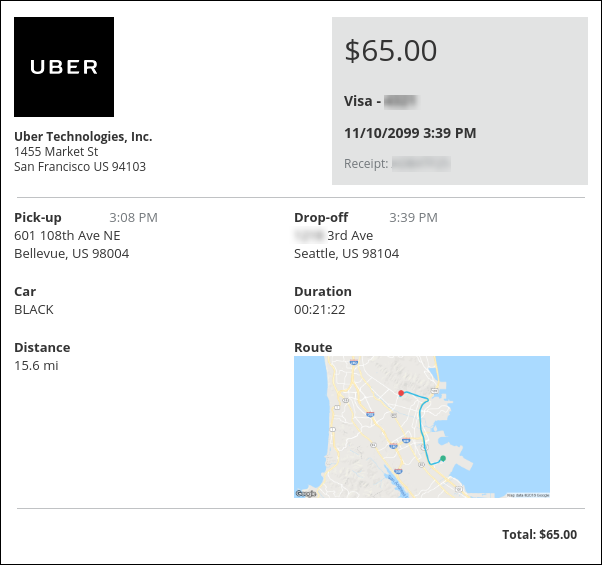

## Contents

* [New MapUrl Field Added to Receipts v4 API](#v4receipts)
* [Trip Approval API Decommissioned](#trip-approval)
* [Payment Request API Updated](#pr-update)
* [Purchase Order Receipts API Updated](#po-receipts)

## New MapUrl Field Added to Receipts v4 API

A new field, MapUrl, has been added to the Ground Transportation Receipt schema of the [Receipts v4](/api-reference/receipts/v4.get-started.html) API. This field contains a link to an image on Google Maps of the trip, if provided by the ground transportation supplier.

### What the User Sees

If the ground transportation provider sends the MapUrl to SAP Concur, the user will see a map image of the trip in the e-receipt window in Concur Expense.

### Business Purpose / Client Benefit

The new MapUrl field provides additional information about the ground transportation trip.

## Trip Approval API Retired

Concur has retired the Trip Approval API. This API provided 3rd parties with the ability to manage Concur Travel trip approvals (as required by Concur Travel rules and policy) in systems outside of Concur Travel. This API is inactive and is no longer supported. All trip approval functions within Concur Travel and Concur Request will continue to function as usual.  Only the external API endpoint is retired.

### Business Purpose / Client Benefit

This update removes an unused API.

## Payment Request API Updated

A new field, **Matched Purchase Order Receipts**, has been added to the GET method of the [Invoice Payment Request v3](/api-reference/invoice/v3.payment-request.html) API.

### Business Purpose / Client Benefit

The new Matched Purchase Order Receipts field returns an array of the PO goods receipt numbers that are matched to the invoice line in Concur. This information helps clients match the correct records in their external system when they post the invoices to the system.

## Purchase Order Receipts API Updated

Two new query parameters have been added to the GET and DELETE methods of the [Invoice v3 Purchase Order Receipts](/api-explorer/v3-0/PurchaseOrderReceipts.html) API, **Purchase Order Number** and **Line Item External ID**. These new parameters enable clients to better target the goods receipt records they want to retrieve or delete from the system. With the addition of these new parameters, the following query parameters are now available through the GET and DELETE methods:

* **Goods Receipts Number**: This pre-existing parameter can be used alone or in combination with one or both of the other parameters.
* **Purchase Order Number**: This new parameter can be used alone or in combination with one or both of the other parameters.
* **Line Item External ID**: This new parameter cannot be used alone. It must be used in combination with one or both of the other parameters.

**NOTE**: You must supply at least one query parameter when retrieving goods receipts through the GET or DELETE methods. The **Line Item External ID** must be used in combination with either the **Goods Receipt Number** or **Purchase Order Number** parameters. All three parameters can also be used in combination.

### Business Purpose / Client Benefit

These new API parameters provide more flexible and precise handling of goods receipt records through the [Invoice v3 Purchase Order Receipts](/api-explorer/v3-0/PurchaseOrderReceipts.html) API.
