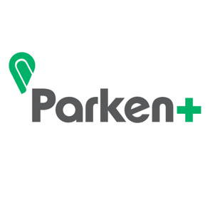

## Contents

* [Apps for Me / User Connection Apps Now Available](#apps-for-me-connection-now-available)
  * [Marcel](#marcel)
* [Apps for Me / User Connection Apps Coming Soon](#apps-for-me-connection-coming-soon)
  * [Parken+](#parken+)

## Apps for Me / User Connection Apps Now Available

### Marcel

Marcel is a chauffeured car service for your trips through Paris & the Ile-de-France. Marcel is a high-quality alternative to existing services for sustainable and responsible mobility.

With Marcel, companies get access to dedicated services to easily manage their employees' rides.

Business key advantages

* Adapted billing and flexible payment: allow your employees to book a ride without having to advance fees and offer to your employees the possibility to use Marcel services for personal uses
* Automatic delay recognition when employees book a driver from an airport or a train station: employees can inform their flight or train number directly from the application
* A guaranteed quality of service: our drivers are rated 4.8 / 5 by customers
* Fixed prices, priority access, dedicated business phone line, punctuality guaranteed
* Monthly figures reporting via a dedicated Enterprise interface, adaptable to the specific needs of the employees

Marcel key features
* Book a ride in advance or for immediate needs: enjoy 10% discount when you book 24h before
* Book one or several rides for someone else
* Requests made easy and faster with the “saved places”
* Recommend the use of our application with reward credit

Save time and simply connect your account to Concur Expense for easy expensing.

Marcel works with Expense for Concur Standard and Expense for Concur Professional. It will be available soon in the SAP Concur App Center under User Connections (formerly Apps for Me) at [https://www.concur.com/appcenter](https://www.concur.com/appcenter). For more information about Marcel, visit [https://www.marcel.cab/](https://www.marcel.cab/).

## Apps for Me / User Connection Apps Coming Soon

### Parken+

With more than 9,500 parking garages available in our parking inventory, Parken+ is the gold standard for finding, booking, and paying parking spots across major cities nationwide.

* See all the available parking spots near you with the click of a button.
* In-app navigation will guide you to any parking spot you desire.
* Book parking spots at any time.
* Pay for parking and save all your receipts in the app.

By connecting your Concur Expense account with Parken+, you can easily submit your expense receipts directly to SAP Concur. Save time & money by using Parken+!

Parken+ works with Expense for Concur Standard and Expense for Concur Professional. It will be available soon in the SAP Concur App Center under User Connections (formerly Apps for Me) at [https://www.concur.com/app-center](https://www.concur.com/app-center). For more information about the Parken+ integration, visit
[http://www.parken.plus/](http://www.parken.plus/).
