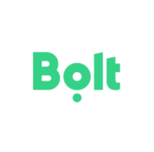

* [January](#january)
* [June](#june)

## January 2021

* [User Connection Apps Now Available](#user-connection-now-available-january)
  * [Virtuo](#virtuo-january)
* [User Connection Apps Coming Soon](#user-connection-coming-soon-january)

### User Connection Apps Now Available

### Virtuo

Connecting Virtuo for Business with Concur Expense means that every time you finish a rental that needs to be expensed, the rental information will automatically appear in your Concur Expense account with an attached e-receipt, enabling you to manage your expenses easily and efficiently.

Virtuo for Business is a platform through which employees can rent cleaned and sanitised cars through a human-less process, 24/7, from airports, train stations, and city centers. Virtuo for Business is here to ensure your safety and comfort when travelling as well as offering you lower prices.

If you have not yet created your Virtuo profile, you will need to ask your travel manager to send you an invitation in order for the Virtuo connection with Concur Expense to work.

Virtuo works with Expense for Concur Standard and Expense for Concur Professional. It is now available in the SAP Concur App Center under User Connections at [https://www.concur.com/app-center](https://www.concur.com/app-center). For more information about the Mobicity integration, visit [https://www.govirtuo.com/fr/register](https://www.govirtuo.com/fr/register).

## User Connection Apps Coming Soon

None.

## June 2021

* [User Connection Apps Now Available](#user-connection-now-available-june)
  * [Bolt](#bolt-june)
* [User Connection Apps Coming Soon](#user-connection-coming-soon-june)
  * [E-car](#ecar-june)

### User Connection Apps Now Available

### Bolt

Bolt Business Work Profile is a 100% free way to expense your business rides with Bolt. The Work Profile takes the hassle out of everyday transportation expense management, saves crucial time, and makes expense reporting a breeze.

Bolt Business has drivers available in 50+ countries and more than 150 cities globally, meaning that you can get fast, affordable service and streamline your expenses, no matter your location.

With a Bolt Business Work Profile:

  * Tax receipts for your work ride expenses are sent automatically to Concur Expense.
  * Your receipts are pre-filled with your company’s information after every Work Profile ride and sent to you in a monthly report.
  * You can easily switch between your Personal & Work Profiles in the Bolt app before ordering a ride — allowing you to separate work and pleasure.
  * You can edit your details (company information, email, payment information, etc.) at any time to ensure your invoices are always correct.

Connect your Bolt Business Work Profile today and get work ride receipts sent directly to Concur Expense for quick and easy expense management. Save time on transportation expense reporting with Bolt's 100% free, and easy-to-use tool.

Bolt works with Expense for Concur Standard and Expense for Concur Professional. It is now available in the SAP Concur App Center under User Connections at [https://www.concur.com/app-center](https://www.concur.com/app-center). For more information about the Bolt’s integration, visit [https://bolt.eu/](https://bolt.eu/).

## User Connection Apps Coming Soon

E-car is an integration platform for enterprise car services, covering the mainstream domestic car hailing resources in China like Didi, Shouqi, Caocao. Through the B2B payment model and e-receipt integration with Concur Expense, enterprises can simplify the car reimbursement process for enterprise employees. Through the E-car platform, enterprises can achieve cost control, car management compliance, and process optimization.

E-car covers a variety of channels to satisfy client's travel experience. The platform supports concurrent car hailing; when customers put an order, E-car can hail a ride under multiple platforms at the same time, greatly shortening the waiting time.

The travel plan enables enterprises to control bookings from multiple dimensions, such as time, cost, approval and location, to ensure policy compliance.

There is a flexible approval function on the mobile terminal that can send managers realtime reminders to complete the online approval.

Sensitive data like staff names, departments, and company names are encrypted and invisible to the third-party ride-hailing platforms, safeguarding information security.

E-car also provides accompanying guard service that sends trip information to an emergency contact every 10 minutes and will contact the police in an emergency, to ensure the safety of passengers.

In order to meet the varied needs of enterprises, E-car also sends personalized invoices to businesses, which provide customized reports in addition to regular account reporting.

To learn more about how your business can utilize E-car to manage your car service program, visit the E-car website using the link below. If your business already uses E-car, click the “Connect” button to enable the connection with Concur Expense and send your e-receipts and transaction details to your SAP Concur account automatically. 

E-car, let enterprises and employees fall in love with traveling.

E-car works with Expense for Concur Standard and Expense for Concur Professional. It will soon be available in the SAP Concur App Center under User Connections at [https://www.concur.com/app-center](https://www.concur.com/app-center). For more information about the E-car integration, visit [http://www.yiqichuxing.net/](http://www.yiqichuxing.net/).
