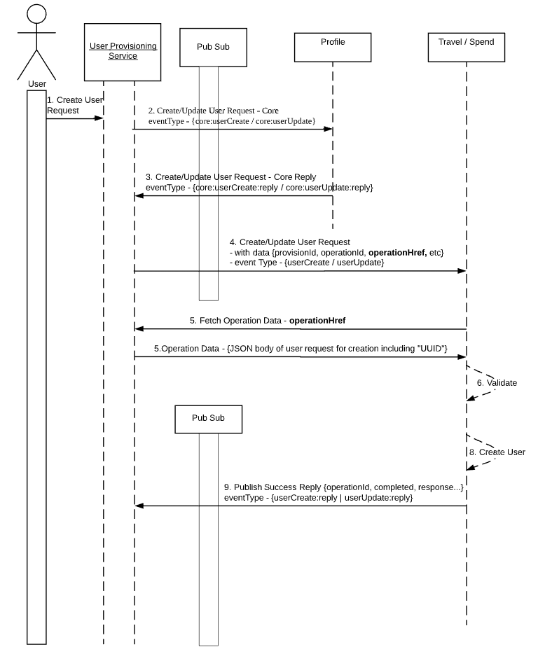



The User Provisioning Service allows callers to provision a user in the SAP Concur environment. Once a User is provisioned, the User identity is setup in Profile, Travel and Spend.

* [Products and Editions](#products-editions)
* [Scope Usage](#scope-usage)
* [Dependencies](#dependencies)
* [Access Token Usage](#access-token-usage)
* [Create a Provisioning Request](#create-provision-request)
* [Retrieve a Provisioning Request](#retrieve-provision-request)
* [Retrieve a Provisioning Request Status](#retrieve-provision-request-status)
* [Retrieve an Operation List in a Provisioning Request](#retrieve-operation-list-provision-request)
* [Retrieve an Operation](#retrieve-operation)
* [Retrieve an Operation Status](#retrieve-operation-status)
* [Schema](#schema)  
  * [Error](#schema-error)
  * [Definitions](#definitions)

## <a name="process-flow"></a>Process Flow



## <a name="products-editions"></a>Products and Editions

* Concur Expense Professional Edition
* Concur Expense Standard Edition
* Concur Travel Professional Edition
* Concur Travel Standard Edition
* Concur Invoice Professional Edition
* Concur Invoice Standard Edition
* Concur Request Professional Edition
* Concur Request Standard Edition

## <a name="scope-usage"></a>Scope Usage

Name|Description|Endpoint
---|---|---
`user.provision.write`|Provision a user.|POST, GET

## <a name="dependencies"></a>Dependencies

SAP Concur clients must purchase Concur Expense and Concur Travel in order to use this API. This API requires the Event Subscription Service and Identity APIs which are currently only available to approved early access partners. Please contact your SAP Concur representative for more information.

## <a name="access-token-usage"></a>Access Token Usage

This API supports both company level and user level access tokens.

## <a name="create-provision-request"></a>Create a Provisioning Request

Creates a provisioning request.

### Scopes

`user.provision.write` - Refer to [Scope Usage](#scope-usage) for full details.

### Request

#### URI

##### Template

```shell
https://{datacenterURI}/provisioning/v4/Bulk/
```

##### Parameters

Name|Type|Format|Description
---|---|---|---
`storeIdentifier`|`string`|-|**Required** Note required when applicable.
`purchaseDate`|`string`|-|Date of purchase.

#### Headers

#### Headers

* [RFC 7643 System for Cross-domain Identity Management: Core Schema](https://tools.ietf.org/html/rfc7643)
* [RFC 7644 System for Cross-domain Identity Management: Protocol](https://tools.ietf.org/html/rfc7644)
* `concur-correlationid` is a Concur specific custom header used for technical support in the form of a [RFC 4122 A Universally Unique IDentifier (UUID) URN Namespace](https://tools.ietf.org/html/rfc4122)

#### Payload

* None.

### Response

#### Status Codes

* [100 Continue](https://tools.ietf.org/html/rfc7231#section-6.2.1)
* [200 OK](https://tools.ietf.org/html/rfc7231#section-6.3.1)
* [201 Created](https://tools.ietf.org/html/rfc7231#section-6.3.2)
* [202 Accepted](https://tools.ietf.org/html/rfc7231#section-6.3.3)
* [400 Bad Request](https://tools.ietf.org/html/rfc7231#section-6.5.1)
* [401 Unauthorized](https://tools.ietf.org/html/rfc7235#section-3.1)
* [403 Forbidden](https://tools.ietf.org/html/rfc7231#section-6.5.3)
* [404 Not Found](https://tools.ietf.org/html/rfc7231#section-6.5.4)
* [405 Method Not Allowed](https://tools.ietf.org/html/rfc7231#section-6.5.5)
* [409 Conflict](https://tools.ietf.org/html/rfc7231#section-6.5.8)
* [413 Payload Too Large](https://tools.ietf.org/html/rfc7231#section-6.5.11)
* [415 Unsupported Media Type](https://tools.ietf.org/html/rfc7231#section-6.5.13)
* [429 Too Many Requests](https://tools.ietf.org/html/rfc6585#section-4)
* [500 Internal Server Error](https://tools.ietf.org/html/rfc7231#section-6.6.1)
* [501 Not Implemented](https://tools.ietf.org/html/rfc7231#section-6.6.2)
* [502 Bad Gateway](https://tools.ietf.org/html/rfc7231#section-6.6.3)
* [503 Service Unavailable](https://tools.ietf.org/html/rfc7231#section-6.6.4)
* [504 Gateway Timeout](https://tools.ietf.org/html/rfc7231#section-6.6.5)
* [508 Loop Detected](https://tools.ietf.org/html/rfc5842#section-7.2)

#### Headers

* `concur-correlationid` is a SAP Concur specific custom header used for technical support in the form of a [RFC 4122 A Universally Unique IDentifier (UUID) URN Namespace](https://tools.ietf.org/html/rfc4122)

#### Payload

* [Schema One](#schema-one)

### Example

#### Request

```shell
curl --request POST
--url https://rqa3.api.nonprod.cnqr.tech/provisioning/v1/provisions
--header 'Content-Type: application/json'
--header 'cache-control: no-cache'
--header 'concur-correlationid: Bing-provisioning-POST'
--data @user.json
```

#### Response

```shell
{
    "id": "b507ee9c-ce7b-4e9d-9b91-78fcff3f2926",
    "created": "2018-12-21T00:53:44.596+0000",
    "resourceType": "ProvisionRequest",
    "resourceSubType": "EnterpriseUser",
    "createdBy": null,
    "location": "https://provisioning.us-west-2.nonprod.cnqr.delivery/provisioning/v1/provisions/b507ee9c-ce7b-4e9d-9b91-78fcff3f2926"
}
```

## <a name="retrieve-provision-request"></a>Retrieve a Provisioning Request

Retrieves a provisioning request.

### Scopes

`user.provision.write` - Refer to [Scope Usage](#scope-usage) for full details.

### Request

#### URI

##### Template

```shell
https://{datacenterURI}/provisioning/v4/
```

##### Parameters

Name|Type|Format|Description
---|---|---|---
`storeIdentifier`|`string`|-|**Required** Note required when applicable.
`purchaseDate`|`string`|-|Date of purchase.

#### Headers

#### Headers

* [RFC 7643 System for Cross-domain Identity Management: Core Schema](https://tools.ietf.org/html/rfc7643)
* [RFC 7644 System for Cross-domain Identity Management: Protocol](https://tools.ietf.org/html/rfc7644)
* `concur-correlationid` is a Concur specific custom header used for technical support in the form of a [RFC 4122 A Universally Unique IDentifier (UUID) URN Namespace](https://tools.ietf.org/html/rfc4122)

#### Payload

* None.

### Response

#### Status Codes

* [100 Continue](https://tools.ietf.org/html/rfc7231#section-6.2.1)
* [200 OK](https://tools.ietf.org/html/rfc7231#section-6.3.1)
* [201 Created](https://tools.ietf.org/html/rfc7231#section-6.3.2)
* [202 Accepted](https://tools.ietf.org/html/rfc7231#section-6.3.3)
* [400 Bad Request](https://tools.ietf.org/html/rfc7231#section-6.5.1)
* [401 Unauthorized](https://tools.ietf.org/html/rfc7235#section-3.1)
* [403 Forbidden](https://tools.ietf.org/html/rfc7231#section-6.5.3)
* [404 Not Found](https://tools.ietf.org/html/rfc7231#section-6.5.4)
* [405 Method Not Allowed](https://tools.ietf.org/html/rfc7231#section-6.5.5)
* [409 Conflict](https://tools.ietf.org/html/rfc7231#section-6.5.8)
* [413 Payload Too Large](https://tools.ietf.org/html/rfc7231#section-6.5.11)
* [415 Unsupported Media Type](https://tools.ietf.org/html/rfc7231#section-6.5.13)
* [429 Too Many Requests](https://tools.ietf.org/html/rfc6585#section-4)
* [500 Internal Server Error](https://tools.ietf.org/html/rfc7231#section-6.6.1)
* [501 Not Implemented](https://tools.ietf.org/html/rfc7231#section-6.6.2)
* [502 Bad Gateway](https://tools.ietf.org/html/rfc7231#section-6.6.3)
* [503 Service Unavailable](https://tools.ietf.org/html/rfc7231#section-6.6.4)
* [504 Gateway Timeout](https://tools.ietf.org/html/rfc7231#section-6.6.5)
* [508 Loop Detected](https://tools.ietf.org/html/rfc5842#section-7.2)

#### Headers

* `concur-correlationid` is a SAP Concur specific custom header used for technical support in the form of a [RFC 4122 A Universally Unique IDentifier (UUID) URN Namespace](https://tools.ietf.org/html/rfc4122)

#### Payload

* [Schema One](#schema-one)

### Example

#### Request

```shell
curl --request GET
--url https://rqa3.api.nonprod.cnqr.tech/provisioning/v1/provisions/b507ee9c-ce7b-4e9d-9b91-78fcff3f2926
--header 'Content-Type: application/json'
--header 'cache-control: no-cache'
--header 'concur-correlationid: Bing-provisioning-GET'
```

#### Response

```shell
{
    "resourceSubType": "EnterpriseUser",
    "createdBy": null,
    "created": "2018-12-21T00:53:44.596+0000",
    "location": "https://provisioning.us-west-2.nonprod.cnqr.delivery/provisioning/v1/provisions/b507ee9c-ce7b-4e9d-9b91-78fcff3f2926",
    "resourceType": "ProvisionRequest",
    "originalRequest": {
        "schemas": [
            "urn:ietf:params:scim:api:messages:2.0:BulkRequest"
        ],
        "failOnErrors": 1,
        "Operations": [
            {
                "path": "/Users",
                "method": "POST",
                "data": {
                    "locale": "en_US",
                    "com:concur:extension:enterprise:spend:2.0:User": {
                        "reimbursementCurrency": "USD"
                    },
                    "password": "welcomeJohnDoe",
                    "displayName": "John Doe",
                    "name": {
                        "legalName": "Mr. John Doe",
                        "formatted": "Mr. John Doe",
                        "familyName": "Doe",
                        "givenName": "John",
                        "honorificPrefix": "Mr."
                    },
                    "dateOfBirth": "2000-01-01T00:00:00Z",
                    "com:concur:extension:enterprise:2.0:User": {
                        "companyId": "7c537096-c76f-4af4-a208-6a6a14c3caff",
                        "dataRetention": {
                            "isDoNotTouch": true
                        },
                        "jobTitle": "Demo User",
                        "orgUnit": "Sales",
                        "employeeNumber": "123456"
                    },
                    "active": true,
                    "gender": "Male",
                    "emails": [
                        {
                            "type": "Work",
                            "value": "john@doe.com"
                        }
                    ],
                    "userName": "joe.doe@test.com"
                }
            }
        ]
    }
}
```

## <a name="retrieve-provision-request-status"></a>Retrieve a Provisioning Request Status

Retrieves a provisioning request status.

### Scopes

`user.provision.write` - Refer to [Scope Usage](#scope-usage) for full details.

### Request

#### URI

##### Template

```shell
https://{datacenterURI}/provisioning/v4/Bulk/
```

##### Parameters

Name|Type|Format|Description
---|---|---|---
`storeIdentifier`|`string`|-|**Required** Note required when applicable.
`purchaseDate`|`string`|-|Date of purchase.

#### Headers

#### Headers

* [RFC 7643 System for Cross-domain Identity Management: Core Schema](https://tools.ietf.org/html/rfc7643)
* [RFC 7644 System for Cross-domain Identity Management: Protocol](https://tools.ietf.org/html/rfc7644)
* `concur-correlationid` is a Concur specific custom header used for technical support in the form of a [RFC 4122 A Universally Unique IDentifier (UUID) URN Namespace](https://tools.ietf.org/html/rfc4122)

#### Payload

* None.

### Response

#### Status Codes

* [100 Continue](https://tools.ietf.org/html/rfc7231#section-6.2.1)
* [200 OK](https://tools.ietf.org/html/rfc7231#section-6.3.1)
* [201 Created](https://tools.ietf.org/html/rfc7231#section-6.3.2)
* [202 Accepted](https://tools.ietf.org/html/rfc7231#section-6.3.3)
* [400 Bad Request](https://tools.ietf.org/html/rfc7231#section-6.5.1)
* [401 Unauthorized](https://tools.ietf.org/html/rfc7235#section-3.1)
* [403 Forbidden](https://tools.ietf.org/html/rfc7231#section-6.5.3)
* [404 Not Found](https://tools.ietf.org/html/rfc7231#section-6.5.4)
* [405 Method Not Allowed](https://tools.ietf.org/html/rfc7231#section-6.5.5)
* [409 Conflict](https://tools.ietf.org/html/rfc7231#section-6.5.8)
* [413 Payload Too Large](https://tools.ietf.org/html/rfc7231#section-6.5.11)
* [415 Unsupported Media Type](https://tools.ietf.org/html/rfc7231#section-6.5.13)
* [429 Too Many Requests](https://tools.ietf.org/html/rfc6585#section-4)
* [500 Internal Server Error](https://tools.ietf.org/html/rfc7231#section-6.6.1)
* [501 Not Implemented](https://tools.ietf.org/html/rfc7231#section-6.6.2)
* [502 Bad Gateway](https://tools.ietf.org/html/rfc7231#section-6.6.3)
* [503 Service Unavailable](https://tools.ietf.org/html/rfc7231#section-6.6.4)
* [504 Gateway Timeout](https://tools.ietf.org/html/rfc7231#section-6.6.5)
* [508 Loop Detected](https://tools.ietf.org/html/rfc5842#section-7.2)

#### Headers

* `concur-correlationid` is a SAP Concur specific custom header used for technical support in the form of a [RFC 4122 A Universally Unique IDentifier (UUID) URN Namespace](https://tools.ietf.org/html/rfc4122)

#### Payload

* [Schema One](#schema-one)

### Example

#### Request

```shell
curl --request GET
--url https://rqa3.api.nonprod.cnqr.tech/provisioning/v1/provisions/b507ee9c-ce7b-4e9d-9b91-78fcff3f2926/status
--header 'Content-Type: application/json'
--header 'cache-control: no-cache'
--header 'concur-correlationid: Bing-provisioning-ReqStatus'
```

#### Response

```shell
{
    "completed": false,
    "status": [
        {
            "operationId": "1",
            "completed": false,
            "extensions": {
                "com:concur:core:2.0:User": {
                    "messages": [],
                    "completed": true,
                    "status": "success"
                },
                "com:concur:extension:enterprise:travel:2.0:User": {
                    "messages": [],
                    "completed": false,
                    "status": "pending"
                },
                "com:concur:extension:enterprise:2.0:User": {
                    "messages": [],
                    "completed": true,
                    "status": "success"
                },
                "com:concur:extension:enterprise:spend:2.0:User": {
                    "messages": [],
                    "completed": false,
                    "status": "pending"
                }
            }
        }
    ]
}
```

## <a name="retrieve-operation-list-provision-request"></a>Retrieve an Operation List in a Provisioning Request

Retrieves an operation list in a provisioning request.

### Scopes

`user.provision.write` - Refer to [Scope Usage](#scope-usage) for full details.

### Request

#### URI

##### Template

```shell
https://{datacenterURI}/provisioning/v4/Bulk/
```

##### Parameters

Name|Type|Format|Description
---|---|---|---
`storeIdentifier`|`string`|-|**Required** Note required when applicable.
`purchaseDate`|`string`|-|Date of purchase.

#### Headers

#### Headers

* [RFC 7643 System for Cross-domain Identity Management: Core Schema](https://tools.ietf.org/html/rfc7643)
* [RFC 7644 System for Cross-domain Identity Management: Protocol](https://tools.ietf.org/html/rfc7644)
* `concur-correlationid` is a Concur specific custom header used for technical support in the form of a [RFC 4122 A Universally Unique IDentifier (UUID) URN Namespace](https://tools.ietf.org/html/rfc4122)

#### Payload

* None.

### Response

#### Status Codes

* [100 Continue](https://tools.ietf.org/html/rfc7231#section-6.2.1)
* [200 OK](https://tools.ietf.org/html/rfc7231#section-6.3.1)
* [201 Created](https://tools.ietf.org/html/rfc7231#section-6.3.2)
* [202 Accepted](https://tools.ietf.org/html/rfc7231#section-6.3.3)
* [400 Bad Request](https://tools.ietf.org/html/rfc7231#section-6.5.1)
* [401 Unauthorized](https://tools.ietf.org/html/rfc7235#section-3.1)
* [403 Forbidden](https://tools.ietf.org/html/rfc7231#section-6.5.3)
* [404 Not Found](https://tools.ietf.org/html/rfc7231#section-6.5.4)
* [405 Method Not Allowed](https://tools.ietf.org/html/rfc7231#section-6.5.5)
* [409 Conflict](https://tools.ietf.org/html/rfc7231#section-6.5.8)
* [413 Payload Too Large](https://tools.ietf.org/html/rfc7231#section-6.5.11)
* [415 Unsupported Media Type](https://tools.ietf.org/html/rfc7231#section-6.5.13)
* [429 Too Many Requests](https://tools.ietf.org/html/rfc6585#section-4)
* [500 Internal Server Error](https://tools.ietf.org/html/rfc7231#section-6.6.1)
* [501 Not Implemented](https://tools.ietf.org/html/rfc7231#section-6.6.2)
* [502 Bad Gateway](https://tools.ietf.org/html/rfc7231#section-6.6.3)
* [503 Service Unavailable](https://tools.ietf.org/html/rfc7231#section-6.6.4)
* [504 Gateway Timeout](https://tools.ietf.org/html/rfc7231#section-6.6.5)
* [508 Loop Detected](https://tools.ietf.org/html/rfc5842#section-7.2)

#### Headers

* `concur-correlationid` is a SAP Concur specific custom header used for technical support in the form of a [RFC 4122 A Universally Unique IDentifier (UUID) URN Namespace](https://tools.ietf.org/html/rfc4122)

#### Payload

* [Schema One](#schema-one)

### Example

#### Request

```shell
curl --request GET
--url https://rqa3.api.nonprod.cnqr.tech/provisioning/v1/provisions/b507ee9c-ce7b-4e9d-9b91-78fcff3f2926/operations\ --header 'Content-Type: application/json'
--header 'cache-control: no-cache'
--header 'concur-correlationid: Bing-provisioning-GetOperations'
```

#### Response

```shell
[
    {
        "operationId": "1",
        "originalRequest": {
            "path": "/Users",
            "method": "POST",
            "data": {
                "locale": "en_US",
                "com:concur:extension:enterprise:spend:2.0:User": {
                    "reimbursementCurrency": "USD"
                },
                "password": "welcomeJohnDoe",
                "displayName": "John Doe",
                "name": {
                    "legalName": "Mr. John Doe",
                    "formatted": "Mr. John Doe",
                    "familyName": "Doe",
                    "givenName": "John",
                    "honorificPrefix": "Mr."
                },
                "dateOfBirth": "2000-01-01T00:00:00Z",
                "com:concur:extension:enterprise:2.0:User": {
                    "companyId": "7c537096-c76f-4af4-a208-6a6a14c3caff",
                    "dataRetention": {
                        "isDoNotTouch": true
                    },
                    "jobTitle": "Demo User",
                    "orgUnit": "Sales",
                    "employeeNumber": "123456"
                },
                "active": true,
                "gender": "Male",
                "emails": [
                    {
                        "type": "Work",
                        "value": "john@doe.com"
                    }
                ],
                "userName": "joe.doe@test.com"
            }
        }
    }
]
```

## <a name="retrieve-operation"></a>Retrieve an Operation

Retrieves an operation.

### Scopes

`user.provision.write` - Refer to [Scope Usage](#scope-usage) for full details.

### Request

#### URI

##### Template

```shell
https://{datacenterURI}/provisioning/v4/Bulk/
```

##### Parameters

Name|Type|Format|Description
---|---|---|---
`storeIdentifier`|`string`|-|**Required** Note required when applicable.
`purchaseDate`|`string`|-|Date of purchase.

#### Headers

#### Headers

* [RFC 7643 System for Cross-domain Identity Management: Core Schema](https://tools.ietf.org/html/rfc7643)
* [RFC 7644 System for Cross-domain Identity Management: Protocol](https://tools.ietf.org/html/rfc7644)
* `concur-correlationid` is a Concur specific custom header used for technical support in the form of a [RFC 4122 A Universally Unique IDentifier (UUID) URN Namespace](https://tools.ietf.org/html/rfc4122)

#### Payload

* None.

### Response

#### Status Codes

* [100 Continue](https://tools.ietf.org/html/rfc7231#section-6.2.1)
* [200 OK](https://tools.ietf.org/html/rfc7231#section-6.3.1)
* [201 Created](https://tools.ietf.org/html/rfc7231#section-6.3.2)
* [202 Accepted](https://tools.ietf.org/html/rfc7231#section-6.3.3)
* [400 Bad Request](https://tools.ietf.org/html/rfc7231#section-6.5.1)
* [401 Unauthorized](https://tools.ietf.org/html/rfc7235#section-3.1)
* [403 Forbidden](https://tools.ietf.org/html/rfc7231#section-6.5.3)
* [404 Not Found](https://tools.ietf.org/html/rfc7231#section-6.5.4)
* [405 Method Not Allowed](https://tools.ietf.org/html/rfc7231#section-6.5.5)
* [409 Conflict](https://tools.ietf.org/html/rfc7231#section-6.5.8)
* [413 Payload Too Large](https://tools.ietf.org/html/rfc7231#section-6.5.11)
* [415 Unsupported Media Type](https://tools.ietf.org/html/rfc7231#section-6.5.13)
* [429 Too Many Requests](https://tools.ietf.org/html/rfc6585#section-4)
* [500 Internal Server Error](https://tools.ietf.org/html/rfc7231#section-6.6.1)
* [501 Not Implemented](https://tools.ietf.org/html/rfc7231#section-6.6.2)
* [502 Bad Gateway](https://tools.ietf.org/html/rfc7231#section-6.6.3)
* [503 Service Unavailable](https://tools.ietf.org/html/rfc7231#section-6.6.4)
* [504 Gateway Timeout](https://tools.ietf.org/html/rfc7231#section-6.6.5)
* [508 Loop Detected](https://tools.ietf.org/html/rfc5842#section-7.2)

#### Headers

* `concur-correlationid` is a SAP Concur specific custom header used for technical support in the form of a [RFC 4122 A Universally Unique IDentifier (UUID) URN Namespace](https://tools.ietf.org/html/rfc4122)

#### Payload

* [Schema One](#schema-one)

### Example

#### Request

```shell
curl --request GET
--url https://rqa3.api.nonprod.cnqr.tech/provisioning/v1/provisions/b507ee9c-ce7b-4e9d-9b91-78fcff3f2926/operations/1
--header 'Content-Type: application/json'
--header 'cache-control: no-cache'
--header 'concur-correlationid: Bing-provisioning-GetOperation'
```

#### Response

```shell
{
    "location": "https://provisioning.us-west-2.nonprod.cnqr.delivery/provisioning/v1/provisions/b507ee9c-ce7b-4e9d-9b91-78fcff3f2926/operations/1",
    "userId": "a90b1a45-b666-44a8-9d1c-401dfb1e659f",
    "resourceType": "ProvisionOperation",
    "operationId": "1",
    "originalRequest": {
        "path": "/Users",
        "method": "POST",
        "data": {
            "locale": "en_US",
            "com:concur:extension:enterprise:spend:2.0:User": {
                "reimbursementCurrency": "USD"
            },
            "password": "welcomeJohnDoe",
            "displayName": "John Doe",
            "name": {
                "legalName": "Mr. John Doe",
                "formatted": "Mr. John Doe",
                "familyName": "Doe",
                "givenName": "John",
                "honorificPrefix": "Mr."
            },
            "dateOfBirth": "2000-01-01T00:00:00Z",
            "com:concur:extension:enterprise:2.0:User": {
                "companyId": "7c537096-c76f-4af4-a208-6a6a14c3caff",
                "dataRetention": {
                    "isDoNotTouch": true
                },
                "jobTitle": "Demo User",
                "orgUnit": "Sales",
                "employeeNumber": "123456"
            },
            "active": true,
            "gender": "Male",
            "emails": [
                {
                    "type": "Work",
                    "value": "john@doe.com"
                }
            ],
            "userName": "joe.doe@test.com"
        }
    }
}
```

## <a name="retrieve-operation-status"></a>Retrieve an Operation Status

Retrieves and operation status.

### Scopes

`user.provision.write` - Refer to [Scope Usage](#scope-usage) for full details.

### Request

#### URI

##### Template

```shell
https://{datacenterURI}/provisioning/v4/Bulk/
```

##### Parameters

Name|Type|Format|Description
---|---|---|---
`storeIdentifier`|`string`|-|**Required** Note required when applicable.
`purchaseDate`|`string`|-|Date of purchase.

#### Headers

#### Headers

* [RFC 7643 System for Cross-domain Identity Management: Core Schema](https://tools.ietf.org/html/rfc7643)
* [RFC 7644 System for Cross-domain Identity Management: Protocol](https://tools.ietf.org/html/rfc7644)
* `concur-correlationid` is a Concur specific custom header used for technical support in the form of a [RFC 4122 A Universally Unique IDentifier (UUID) URN Namespace](https://tools.ietf.org/html/rfc4122)

#### Payload

* None.

### Response

#### Status Codes

* [100 Continue](https://tools.ietf.org/html/rfc7231#section-6.2.1)
* [200 OK](https://tools.ietf.org/html/rfc7231#section-6.3.1)
* [201 Created](https://tools.ietf.org/html/rfc7231#section-6.3.2)
* [202 Accepted](https://tools.ietf.org/html/rfc7231#section-6.3.3)
* [400 Bad Request](https://tools.ietf.org/html/rfc7231#section-6.5.1)
* [401 Unauthorized](https://tools.ietf.org/html/rfc7235#section-3.1)
* [403 Forbidden](https://tools.ietf.org/html/rfc7231#section-6.5.3)
* [404 Not Found](https://tools.ietf.org/html/rfc7231#section-6.5.4)
* [405 Method Not Allowed](https://tools.ietf.org/html/rfc7231#section-6.5.5)
* [409 Conflict](https://tools.ietf.org/html/rfc7231#section-6.5.8)
* [413 Payload Too Large](https://tools.ietf.org/html/rfc7231#section-6.5.11)
* [415 Unsupported Media Type](https://tools.ietf.org/html/rfc7231#section-6.5.13)
* [429 Too Many Requests](https://tools.ietf.org/html/rfc6585#section-4)
* [500 Internal Server Error](https://tools.ietf.org/html/rfc7231#section-6.6.1)
* [501 Not Implemented](https://tools.ietf.org/html/rfc7231#section-6.6.2)
* [502 Bad Gateway](https://tools.ietf.org/html/rfc7231#section-6.6.3)
* [503 Service Unavailable](https://tools.ietf.org/html/rfc7231#section-6.6.4)
* [504 Gateway Timeout](https://tools.ietf.org/html/rfc7231#section-6.6.5)
* [508 Loop Detected](https://tools.ietf.org/html/rfc5842#section-7.2)

#### Headers

* `concur-correlationid` is a SAP Concur specific custom header used for technical support in the form of a [RFC 4122 A Universally Unique IDentifier (UUID) URN Namespace](https://tools.ietf.org/html/rfc4122)

#### Payload

* [Schema One](#schema-one)

### Example

#### Request

```shell
curl --request GET
--url https://rqa3.api.nonprod.cnqr.tech/provisioning/v1/provisions/b507ee9c-ce7b-4e9d-9b91-78fcff3f2926/operations/1/status
--header 'Content-Type: application/json'
--header 'cache-control: no-cache'
--header 'concur-correlationid: Bing-provisioning-getOperationStatus'
```

#### Response

```shell
{
    "completed": false,
    "extensions": {
        "com:concur:core:2.0:User": {
            "messages": [],
            "completed": true,
            "status": "success"
        },
        "com:concur:extension:enterprise:travel:2.0:User": {
            "messages": [],
            "completed": false,
            "status": "pending"
        },
        "com:concur:extension:enterprise:2.0:User": {
            "messages": [],
            "completed": true,
            "status": "success"
        },
        "com:concur:extension:enterprise:spend:2.0:User": {
            "messages": [],
            "completed": false,
            "status": "pending"
        }
    }
}
```

## <a name="schema"></a>Schema

### <a name="schema-one"></a>Schema One

Name|Type|Format|Description
---|---|---|---
`orderId`|`string`|-|**Required** A description including required status.
`orderMemo`|`string`|-|A description. This key is not required.
`transactionTimestamp`|`string`|[dateTime](#definition-dateTime)|A key linking to a definition for the format.
`arrayOfThings`|`array`|[Schema Two](#schema-two)|A key linking to another schema for the format.

### <a name="schema-two"></a>Schema Two

Name|Type|Format|Description
---|---|---|---
`orderDetailsId`|`string`|-|A description for the key.
`aKeyForEnum`|`number`|`enum`|The value must be one of these: `1`, `2` or `3`.

### <a name="schema-error"></a>Error

Name|Type|Format|Description
---|---|---|---
`errorCode`|`string`|-|**Required** Machine readable code associated with the error which is static and never localized. Examples: `dateTimeMissing`, `OutOfMem` and `invalidUser`. These could also be UUID4 (`a1d7bb3bb19348b0858687acc9e303ec`), number (`123456`) or a URI (`https://example.com/errors/invaliduser`) which ideally provides additional information when dereferenced. Whatever form is chosen it's worth noting contextual strings are helpful to developers reading the code.
`errorMessage`|`string`|-|**Required** Message associated with the error.
`dataPath`|`string`|-|Relative data path.
`schemaPath`|`string`|-|Relative schema path.
`errors`|`array`|[`error`](#schema-error)|An array of errors. Note: this points to this schema as errors can nest.

## <a name="definitions"></a>Definitions

Name|Type|Format|Description
---|---|---|---
<a name="definition-dateTime"></a>`dateTime`|`string`|-|DateTime of where the transaction happened in format specified in ISO 8601, using UTC + Offset. For example, 2016-04-22T12:20+0700 (12:20 PM in Pacific Time).
